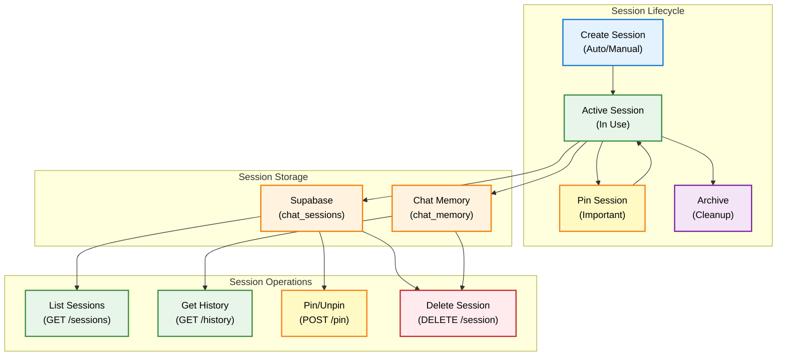
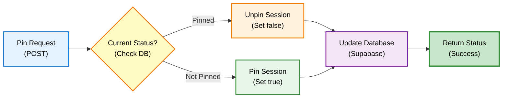
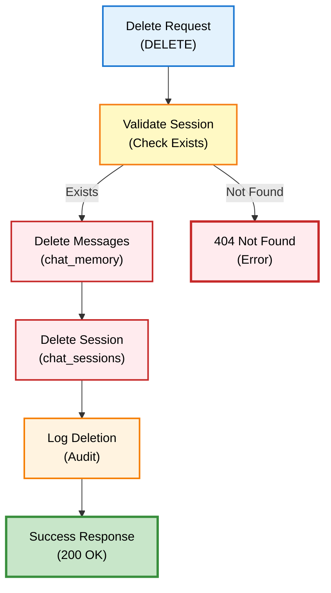

# Session Endpoints - API Reference

## Overview

Session endpoints mengelola conversation sessions, chat history, dan session lifecycle untuk DENAI. Setiap conversation memiliki session ID unik yang menyimpan context dan history.

## Base URL

```
Production: https://api.denai.company/v1
Development: http://localhost:8000
```

## Session Architecture



## Endpoints

### GET /sessions

Mengambil list semua sessions dengan pagination dan sorting.

#### Request

**Headers:**
```http
Content-Type: application/json
```

**Query Parameters:**

| Parameter | Type | Required | Default | Description |
|-----------|------|----------|---------|-------------|
| `limit` | integer | ❌ No | 30 | Maximum number of sessions to return |
| `offset` | integer | ❌ No | 0 | Number of sessions to skip (pagination) |

#### Response

**Success Response (200 OK):**

```json
[
  {
    "session_id": "550e8400-e29b-41d4-a716-446655440000",
    "title": "Pertanyaan tentang lembur",
    "pinned": true,
    "created_at": "2025-01-15T10:30:00Z"
  },
  {
    "session_id": "660e8400-e29b-41d4-a716-446655440001",
    "title": "📞 Call",
    "pinned": false,
    "created_at": "2025-01-15T09:15:00Z"
  },
  {
    "session_id": "770e8400-e29b-41d4-a716-446655440002",
    "title": "Aturan perjalanan dinas",
    "pinned": false,
    "created_at": "2025-01-14T14:20:00Z"
  }
]
```

**Response Fields:**

| Field | Type | Description |
|-------|------|-------------|
| `session_id` | string (UUID) | Unique session identifier |
| `title` | string | Session title (first question or auto-generated) |
| `pinned` | boolean | Whether session is pinned to top |
| `created_at` | string (ISO 8601) | Session creation timestamp |

**Sorting Order:**
1. Pinned sessions first (`pinned: true`)
2. Then by creation date (newest first)

#### Example Usage

=== "Python"

    ```python
    import requests
    
    url = "http://localhost:8000/sessions"
    
    # Get latest 10 sessions
    params = {"limit": 10}
    response = requests.get(url, params=params)
    
    if response.status_code == 200:
        sessions = response.json()
        for session in sessions:
            pin_icon = "📌" if session['pinned'] else ""
            print(f"{pin_icon} {session['title']}")
            print(f"   ID: {session['session_id'][:8]}...")
            print(f"   Created: {session['created_at']}")
    ```

=== "JavaScript"

    ```javascript
    const url = "http://localhost:8000/sessions?limit=10";
    
    fetch(url)
      .then(response => response.json())
      .then(sessions => {
        sessions.forEach(session => {
          const pinIcon = session.pinned ? "📌" : "";
          console.log(`${pinIcon} ${session.title}`);
          console.log(`   ID: ${session.session_id.substring(0, 8)}...`);
          console.log(`   Created: ${session.created_at}`);
        });
      });
    ```

=== "cURL"

    ```bash
    curl -X GET "http://localhost:8000/sessions?limit=10"
    ```

---

### GET /history/{session_id}

Mengambil chat history untuk specific session.

#### Request

**Path Parameters:**

| Parameter | Type | Required | Description |
|-----------|------|----------|-------------|
| `session_id` | string (UUID) | ✅ Yes | Session ID to retrieve history for |

**Query Parameters:**

| Parameter | Type | Required | Default | Description |
|-----------|------|----------|---------|-------------|
| `limit` | integer | ❌ No | 50 | Maximum number of messages to return |

#### Response

**Success Response (200 OK):**

```json
[
  {
    "role": "user",
    "message": "Berapa jam maksimal lembur per hari?",
    "created_at": "2025-01-15T10:30:15Z"
  },
  {
    "role": "assistant",
    "message": "<h3>Informasi Kerja Lembur</h3><p>Maksimal kerja lembur adalah 3 jam per hari untuk hari kerja normal.</p>",
    "created_at": "2025-01-15T10:30:18Z"
  },
  {
    "role": "user",
    "message": "Bagaimana dengan hari libur?",
    "created_at": "2025-01-15T10:31:20Z"
  },
  {
    "role": "assistant",
    "message": "<p>Untuk hari libur, maksimal lembur tetap 3 jam per hari, namun dengan tarif 2x gaji pokok per jam.</p>",
    "created_at": "2025-01-15T10:31:23Z"
  }
]
```

**Response Fields:**

| Field | Type | Description |
|-------|------|-------------|
| `role` | string | Message sender: "user" or "assistant" |
| `message` | string | Message content (HTML for assistant, plain text for user) |
| `created_at` | string (ISO 8601) | Message timestamp |

**History Order:**
- Chronological order (oldest first)
- Maintains conversation flow

#### Example Usage

=== "Python"

    ```python
    import requests
    
    session_id = "550e8400-e29b-41d4-a716-446655440000"
    url = f"http://localhost:8000/history/{session_id}"
    
    params = {"limit": 20}
    response = requests.get(url, params=params)
    
    if response.status_code == 200:
        history = response.json()
        for msg in history:
            sender = "👤" if msg['role'] == 'user' else "🤖"
            print(f"{sender} {msg['role'].upper()}")
            print(f"   {msg['message'][:100]}...")
            print(f"   {msg['created_at']}\n")
    ```

=== "JavaScript"

    ```javascript
    const sessionId = "550e8400-e29b-41d4-a716-446655440000";
    const url = `http://localhost:8000/history/${sessionId}?limit=20`;
    
    fetch(url)
      .then(response => response.json())
      .then(history => {
        history.forEach(msg => {
          const sender = msg.role === 'user' ? '👤' : '🤖';
          console.log(`${sender} ${msg.role.toUpperCase()}`);
          console.log(`   ${msg.message.substring(0, 100)}...`);
          console.log(`   ${msg.created_at}\n`);
        });
      });
    ```

=== "cURL"

    ```bash
    SESSION_ID="550e8400-e29b-41d4-a716-446655440000"
    curl -X GET "http://localhost:8000/history/$SESSION_ID?limit=20"
    ```

---

### POST /sessions/{session_id}/pin

Toggle pin status untuk session (pin/unpin).



#### Request

**Path Parameters:**

| Parameter | Type | Required | Description |
|-----------|------|----------|-------------|
| `session_id` | string (UUID) | ✅ Yes | Session ID to pin/unpin |

#### Response

**Success Response (200 OK):**

```json
{
  "success": true,
  "pinned": true
}
```

**Response Fields:**

| Field | Type | Description |
|-------|------|-------------|
| `success` | boolean | Whether operation succeeded |
| `pinned` | boolean | New pin status (true = pinned, false = unpinned) |

**Error Response (500 Internal Server Error):**

```json
{
  "error": "Failed to toggle pin status",
  "success": false
}
```

#### Example Usage

=== "Python"

    ```python
    import requests
    
    session_id = "550e8400-e29b-41d4-a716-446655440000"
    url = f"http://localhost:8000/sessions/{session_id}/pin"
    
    response = requests.post(url)
    
    if response.status_code == 200:
        data = response.json()
        status = "pinned" if data['pinned'] else "unpinned"
        print(f"Session {status} successfully")
    ```

=== "JavaScript"

    ```javascript
    const sessionId = "550e8400-e29b-41d4-a716-446655440000";
    const url = `http://localhost:8000/sessions/${sessionId}/pin`;
    
    fetch(url, { method: "POST" })
      .then(response => response.json())
      .then(data => {
        const status = data.pinned ? "pinned" : "unpinned";
        console.log(`Session ${status} successfully`);
      });
    ```

=== "cURL"

    ```bash
    SESSION_ID="550e8400-e29b-41d4-a716-446655440000"
    curl -X POST "http://localhost:8000/sessions/$SESSION_ID/pin"
    ```

---

### DELETE /sessions/{session_id}

Delete session dan semua message history.



#### Request

**Path Parameters:**

| Parameter | Type | Required | Description |
|-----------|------|----------|-------------|
| `session_id` | string (UUID) | ✅ Yes | Session ID to delete |

#### Response

**Success Response (200 OK):**

```json
{
  "success": true,
  "message": "Session deleted successfully"
}
```

**Error Response (404 Not Found):**

```json
{
  "error": "Session not found",
  "success": false
}
```

**Error Response (500 Internal Server Error):**

```json
{
  "error": "Failed to delete session: <error_message>",
  "success": false
}
```

#### Example Usage

=== "Python"

    ```python
    import requests
    
    session_id = "550e8400-e29b-41d4-a716-446655440000"
    url = f"http://localhost:8000/sessions/{session_id}"
    
    # Confirm deletion
    confirm = input(f"Delete session {session_id[:8]}...? (y/n): ")
    
    if confirm.lower() == 'y':
        response = requests.delete(url)
        
        if response.status_code == 200:
            print("Session deleted successfully")
        else:
            print(f"Error: {response.json()['error']}")
    ```

=== "JavaScript"

    ```javascript
    const sessionId = "550e8400-e29b-41d4-a716-446655440000";
    const url = `http://localhost:8000/sessions/${sessionId}`;
    
    // Confirm deletion
    if (confirm(`Delete session ${sessionId.substring(0, 8)}...?`)) {
      fetch(url, { method: "DELETE" })
        .then(response => response.json())
        .then(data => {
          if (data.success) {
            console.log("Session deleted successfully");
          } else {
            console.error("Error:", data.error);
          }
        });
    }
    ```

=== "cURL"

    ```bash
    SESSION_ID="550e8400-e29b-41d4-a716-446655440000"
    curl -X DELETE "http://localhost:8000/sessions/$SESSION_ID"
    ```

## Session Lifecycle

### Session Creation

```mermaid
sequenceDiagram
    participant U as User<br/>(Client)
    participant A as API<br/>(Endpoint)
    participant M as Memory<br/>(Supabase)
    
    U->>A: First message (no session_id)
    Note over U,A: New conversation
    
    A->>A: Generate UUID
    Note over A: Create session_id
    
    A->>M: Save session
    Note over A,M: chat_sessions table
    
    M-->>A: Confirm save
    
    A->>M: Save message
    Note over A,M: chat_memory table
    
    M-->>A: Confirm save
    
    A-->>U: Return response + session_id
    Note over A,U: Include session_id in response
    
    U->>A: Follow-up message (with session_id)
    Note over U,A: Continue conversation
    
    A->>M: Load history
    Note over A,M: Get context
    
    M-->>A: Return history
    
    A->>M: Save new messages
    
    A-->>U: Return response
    
    style U fill:#e3f2fd,stroke:#1976d2,stroke-width:2px,color:#000
    style A fill:#fff3e0,stroke:#f57c00,stroke-width:2px,color:#000
    style M fill:#f3e5f5,stroke:#7b1fa2,stroke-width:2px,color:#000
```

### Automatic Cleanup

**Cleanup Policy:**
- Sessions older than `SESSION_CLEANUP_DAYS` (default: 30 days)
- Unpinned sessions only (pinned sessions preserved)
- Run daily via cron job

**Configuration:**
```python
from app.config import SESSION_CLEANUP_DAYS

# Default: 30 days
SESSION_CLEANUP_DAYS = 30
```

**Cleanup Function:**
```python
from memory.memory_supabase import cleanup_old_sessions

# Run cleanup
cleanup_old_sessions(days=30)
```

## Data Models

### chat_sessions Table

| Column | Type | Nullable | Description |
|--------|------|----------|-------------|
| `session_id` | UUID | No | Primary key |
| `title` | TEXT | No | Session title |
| `pinned` | BOOLEAN | No | Pin status (default: false) |
| `created_at` | TIMESTAMP | No | Creation timestamp |

### chat_memory Table

| Column | Type | Nullable | Description |
|--------|------|----------|-------------|
| `id` | SERIAL | No | Primary key |
| `session_id` | UUID | No | Foreign key to chat_sessions |
| `role` | TEXT | No | Message role: "user" or "assistant" |
| `message` | TEXT | No | Message content |
| `created_at` | TIMESTAMP | No | Message timestamp |

## Best Practices

### DO's ✅

1. **Reuse session IDs** for conversation continuity
   ```python
   # Good: Maintain context
   session_id = create_session()
   for question in questions:
       ask(question, session_id=session_id)
   ```

2. **Pin important sessions** for easy access
   ```python
   # Good: Pin critical sessions
   if is_important(session):
       pin_session(session_id)
   ```

3. **Clean up old sessions** regularly
   ```python
   # Good: Scheduled cleanup
   cleanup_old_sessions(days=30)
   ```

### DON'Ts ❌

1. **Don't create orphaned sessions**
   ```python
   # Bad: New session for every message
   for question in questions:
       ask(question)  # Creates new session each time
   ```

2. **Don't store sensitive data** in session titles
   ```python
   # Bad: Sensitive info in title
   title = "Gaji John Doe: Rp 10,000,000"
   
   # Good: Generic title
   title = "Pertanyaan tentang kompensasi"
   ```

3. **Don't delete without confirmation**
   ```python
   # Bad: Direct delete
   delete_session(session_id)
   
   # Good: Confirm first
   if confirm("Delete session?"):
       delete_session(session_id)
   ```

## Testing

```python
import pytest
from fastapi.testclient import TestClient
from app.api import app

client = TestClient(app)

def test_list_sessions():
    """Test listing sessions"""
    response = client.get("/sessions?limit=10")
    assert response.status_code == 200
    sessions = response.json()
    assert isinstance(sessions, list)

def test_get_history():
    """Test getting session history"""
    # Create test session
    session_id = create_test_session()
    
    response = client.get(f"/history/{session_id}")
    assert response.status_code == 200
    history = response.json()
    assert isinstance(history, list)

def test_pin_session():
    """Test pinning session"""
    session_id = create_test_session()
    
    response = client.post(f"/sessions/{session_id}/pin")
    assert response.status_code == 200
    data = response.json()
    assert data["success"] == True
    assert "pinned" in data

def test_delete_session():
    """Test deleting session"""
    session_id = create_test_session()
    
    response = client.delete(f"/sessions/{session_id}")
    assert response.status_code == 200
    data = response.json()
    assert data["success"] == True
```

## Related Endpoints

- [Chat Endpoints](chat-endpoints.md) - Text-based interaction
- [Voice Endpoints](voice-endpoints.md) - Voice-based interaction
- [Status Endpoints](status-endpoints.md) - System status