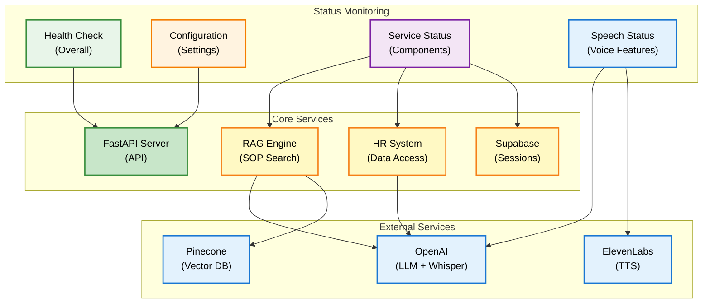
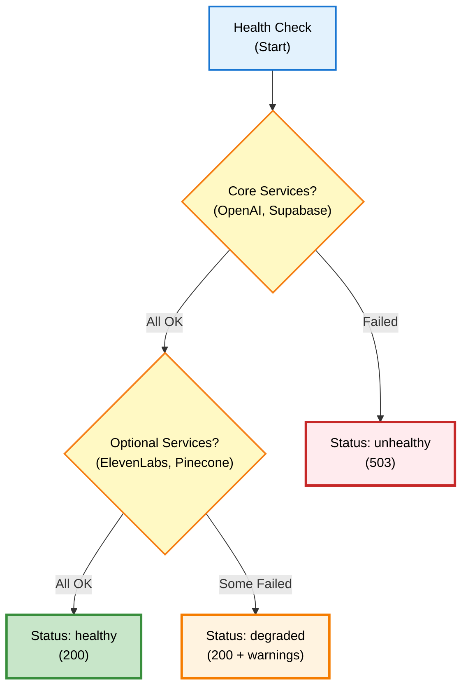
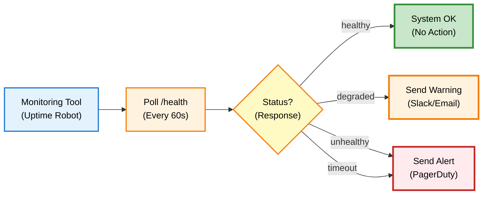

# Status Endpoints - API Reference

## Overview

Status endpoints menyediakan informasi tentang system health, configuration, service availability, dan monitoring untuk DENAI system.

## Base URL

```
Production: https://api.denai.company/v1
Development: http://localhost:8000
```

## System Status Architecture



## Endpoints

### GET /

Root endpoint dengan system information.

#### Request

**Headers:**
```http
Content-Type: application/json
```

#### Response

**Success Response (200 OK):**

```json
{
  "status": "active",
  "service": "DENAI - Natural TTS",
  "version": "6.2.0",
  "configuration": {
    "llm_model": "gpt-4o-mini",
    "tts_primary": "elevenlabs",
    "tts_fallback": "openai",
    "language": "id",
    "natural_tts": true
  },
  "improvements": [
    "✅ Balanced configuration (no over-engineering)",
    "✅ Grouped TTS settings for cleaner config",
    "✅ Mode-specific constants (call vs chat)",
    "✅ Essential feature flags only",
    "✅ Production-ready structure"
  ]
}
```

**Response Fields:**

| Field | Type | Description |
|-------|------|-------------|
| `status` | string | System status: "active", "degraded", "down" |
| `service` | string | Service name and description |
| `version` | string | Current system version |
| `configuration` | object | Current configuration settings |
| `improvements` | array | List of recent improvements/features |

#### Example Usage

=== "Python"

    ```python
    import requests
    
    url = "http://localhost:8000/"
    response = requests.get(url)
    
    if response.status_code == 200:
        data = response.json()
        print(f"Status: {data['status']}")
        print(f"Version: {data['version']}")
        print(f"LLM Model: {data['configuration']['llm_model']}")
    ```

=== "JavaScript"

    ```javascript
    const url = "http://localhost:8000/";
    
    fetch(url)
      .then(response => response.json())
      .then(data => {
        console.log("Status:", data.status);
        console.log("Version:", data.version);
        console.log("LLM Model:", data.configuration.llm_model);
      });
    ```

=== "cURL"

    ```bash
    curl -X GET http://localhost:8000/
    ```

---

### GET /health

Comprehensive health check untuk semua system components.

```mermaid
graph LR
    Request["Health Check<br/>(Request)"] --> API["API Server<br/>(Check)"]
    API --> Services["Core Services<br/>(Validate)"]
    Services --> External["External APIs<br/>(Test)"]
    External --> Status["Aggregate Status<br/>(Combine)"]
    Status --> Response["Health Response<br/>(JSON)"]
    
    style Request fill:#e3f2fd,stroke:#1976d2,stroke-width:2px,color:#000
    style API fill:#e8f5e9,stroke:#388e3c,stroke-width:2px,color:#000
    style Services fill:#fff9c4,stroke:#f57f17,stroke-width:2px,color:#000
    style External fill:#f3e5f5,stroke:#7b1fa2,stroke-width:2px,color:#000
    style Status fill:#fff3e0,stroke:#f57c00,stroke-width:2px,color:#000
    style Response fill:#c8e6c9,stroke:#388e3c,stroke-width:3px,color:#000
```



#### Request

**Headers:**
```http
Content-Type: application/json
```

#### Response

**Success Response (200 OK):**

```json
{
  "status": "healthy",
  "version": "6.2.0",
  "environment": "production",
  "features": [
    "🎤 Natural conversational TTS",
    "📱 HTML text output preserved",
    "🔊 Smart text cleaning for speech",
    "💰 Cost-optimized configuration",
    "📌 Session management",
    "⚙️ Balanced config (no over-engineering)"
  ],
  "config_status": {
    "openai_configured": true,
    "elevenlabs_configured": true,
    "model": "gpt-4o-mini",
    "tts_engines": "elevenlabs → openai",
    "natural_tts": true,
    "verbose_logging": false
  }
}
```

**Response Fields:**

| Field | Type | Description |
|-------|------|-------------|
| `status` | string | Overall health: "healthy", "degraded", "unhealthy" |
| `version` | string | System version |
| `environment` | string | Environment: "production", "development", "staging" |
| `features` | array | Active features list |
| `config_status` | object | Configuration validation status |

**Degraded Response (200 OK - Partial Failure):**

```json
{
  "status": "degraded",
  "version": "6.2.0",
  "environment": "production",
  "features": [
    "🎤 Natural conversational TTS",
    "📱 HTML text output preserved"
  ],
  "config_status": {
    "openai_configured": true,
    "elevenlabs_configured": false,
    "model": "gpt-4o-mini",
    "tts_engines": "openai → openai",
    "natural_tts": false,
    "verbose_logging": false
  },
  "warnings": [
    "⚠️ ElevenLabs not configured - using OpenAI TTS fallback"
  ]
}
```

**Unhealthy Response (503 Service Unavailable):**

```json
{
  "status": "unhealthy",
  "version": "6.2.0",
  "environment": "production",
  "errors": [
    "❌ OpenAI API key not configured",
    "❌ Supabase connection failed"
  ]
}
```

#### Health Status Levels



#### Example Usage

=== "Python"

    ```python
    import requests
    
    url = "http://localhost:8000/health"
    response = requests.get(url)
    
    if response.status_code == 200:
        data = response.json()
        print(f"Health Status: {data['status']}")
        
        if data['status'] == 'healthy':
            print("✅ All systems operational")
        elif data['status'] == 'degraded':
            print("⚠️ System degraded:")
            for warning in data.get('warnings', []):
                print(f"  {warning}")
        
        # Check specific features
        if data['config_status']['openai_configured']:
            print("✅ OpenAI configured")
        if data['config_status']['elevenlabs_configured']:
            print("✅ ElevenLabs configured")
    
    elif response.status_code == 503:
        print("❌ System unhealthy")
        data = response.json()
        for error in data.get('errors', []):
            print(f"  {error}")
    ```

=== "JavaScript"

    ```javascript
    const url = "http://localhost:8000/health";
    
    fetch(url)
      .then(response => {
        if (response.ok) {
          return response.json();
        } else if (response.status === 503) {
          return response.json();
        }
        throw new Error(`HTTP ${response.status}`);
      })
      .then(data => {
        console.log("Health Status:", data.status);
        
        if (data.status === 'healthy') {
          console.log("✅ All systems operational");
        } else if (data.status === 'degraded') {
          console.log("⚠️ System degraded");
          data.warnings?.forEach(w => console.log(`  ${w}`));
        } else {
          console.log("❌ System unhealthy");
          data.errors?.forEach(e => console.log(`  ${e}`));
        }
      });
    ```

=== "cURL"

    ```bash
    curl -X GET http://localhost:8000/health
    ```

---

### GET /speech/status

Detailed status untuk speech-related features (STT/TTS).

#### Request

**Headers:**
```http
Content-Type: application/json
```

#### Response

**Success Response (200 OK):**

```json
{
  "speech_recognition": {
    "available": true,
    "engine": "OpenAI Whisper",
    "language": "id",
    "model": "whisper-1"
  },
  "text_to_speech": {
    "available": true,
    "primary_engine": "elevenlabs",
    "fallback_engine": "openai",
    "voice_id": "iWydkXKoiVtvdn4vLKp9",
    "elevenlabs_model": "eleven_flash_v2_5",
    "openai_voice": "nova",
    "natural_speech": true
  },
  "ai_model": {
    "model": "gpt-4o-mini",
    "chat_temperature": 0.1,
    "call_temperature": 0.0,
    "max_tokens_chat": 2000,
    "max_tokens_call": 150
  }
}
```

**Response Structure:**

| Section | Description |
|---------|-------------|
| `speech_recognition` | STT configuration and status |
| `text_to_speech` | TTS engines and settings |
| `ai_model` | LLM configuration for different modes |

**Speech Recognition Fields:**

| Field | Type | Description |
|-------|------|-------------|
| `available` | boolean | Whether STT is available |
| `engine` | string | Speech recognition engine |
| `language` | string | Default language code |
| `model` | string | Whisper model version |

**Text-to-Speech Fields:**

| Field | Type | Description |
|-------|------|-------------|
| `available` | boolean | Whether TTS is available |
| `primary_engine` | string | Primary TTS engine |
| `fallback_engine` | string | Fallback TTS engine |
| `voice_id` | string | ElevenLabs voice ID |
| `elevenlabs_model` | string | ElevenLabs model version |
| `openai_voice` | string | OpenAI TTS voice |
| `natural_speech` | boolean | Natural speech enhancement |

#### Example Usage

=== "Python"

    ```python
    import requests
    
    url = "http://localhost:8000/speech/status"
    response = requests.get(url)
    
    if response.status_code == 200:
        data = response.json()
        
        # Check STT
        stt = data['speech_recognition']
        print(f"STT: {stt['engine']} ({'✅' if stt['available'] else '❌'})")
        
        # Check TTS
        tts = data['text_to_speech']
        print(f"TTS Primary: {tts['primary_engine']} ({'✅' if tts['available'] else '❌'})")
        print(f"TTS Fallback: {tts['fallback_engine']}")
        
        # Check AI Model
        ai = data['ai_model']
        print(f"LLM: {ai['model']}")
        print(f"Chat Mode: temp={ai['chat_temperature']}, max_tokens={ai['max_tokens_chat']}")
        print(f"Call Mode: temp={ai['call_temperature']}, max_tokens={ai['max_tokens_call']}")
    ```

=== "JavaScript"

    ```javascript
    const url = "http://localhost:8000/speech/status";
    
    fetch(url)
      .then(response => response.json())
      .then(data => {
        // Check STT
        const stt = data.speech_recognition;
        console.log(`STT: ${stt.engine} (${stt.available ? '✅' : '❌'})`);
        
        // Check TTS
        const tts = data.text_to_speech;
        console.log(`TTS Primary: ${tts.primary_engine} (${tts.available ? '✅' : '❌'})`);
        console.log(`TTS Fallback: ${tts.fallback_engine}`);
        
        // Check AI Model
        const ai = data.ai_model;
        console.log(`LLM: ${ai.model}`);
        console.log(`Chat Mode: temp=${ai.chat_temperature}, max_tokens=${ai.max_tokens_chat}`);
        console.log(`Call Mode: temp=${ai.call_temperature}, max_tokens=${ai.max_tokens_call}`);
      });
    ```

=== "cURL"

    ```bash
    curl -X GET http://localhost:8000/speech/status
    ```

---

### GET /user/role

Get current user role dan permissions.

#### Request

**Headers:**
```http
Content-Type: application/json
```

#### Response

**Success Response (200 OK):**

```json
{
  "role": "HR",
  "is_hr": true,
  "permissions": {
    "access_hr_data": true,
    "access_sop": true,
    "speech_features": true,
    "natural_tts": true
  }
}
```

**Response Fields:**

| Field | Type | Description |
|-------|------|-------------|
| `role` | string | User role: "Employee" or "HR" |
| `is_hr` | boolean | Whether user has HR privileges |
| `permissions` | object | Detailed permissions breakdown |

**Permissions Fields:**

| Permission | Description |
|------------|-------------|
| `access_hr_data` | Can access employee database |
| `access_sop` | Can search SOP documents |
| `speech_features` | Can use voice features |
| `natural_tts` | Natural TTS enhancement available |

#### Example Usage

=== "Python"

    ```python
    import requests
    
    url = "http://localhost:8000/user/role"
    response = requests.get(url)
    
    if response.status_code == 200:
        data = response.json()
        print(f"Role: {data['role']}")
        print(f"Is HR: {data['is_hr']}")
        
        perms = data['permissions']
        print("\nPermissions:")
        for perm, granted in perms.items():
            icon = "✅" if granted else "❌"
            print(f"  {icon} {perm}")
    ```

=== "JavaScript"

    ```javascript
    const url = "http://localhost:8000/user/role";
    
    fetch(url)
      .then(response => response.json())
      .then(data => {
        console.log("Role:", data.role);
        console.log("Is HR:", data.is_hr);
        
        console.log("\nPermissions:");
        Object.entries(data.permissions).forEach(([perm, granted]) => {
          const icon = granted ? '✅' : '❌';
          console.log(`  ${icon} ${perm}`);
        });
      });
    ```

=== "cURL"

    ```bash
    curl -X GET http://localhost:8000/user/role
    ```

---

### GET /config (Development Only)

Development-only endpoint untuk inspecting current configuration.

!!! warning "Development Only"
    This endpoint is only available when `ENVIRONMENT=development`. It returns 404 in production for security.

#### Request

**Headers:**
```http
Content-Type: application/json
```

#### Response

**Success Response (200 OK - Development):**

```json
{
  "model_config": {
    "llm_model": "gpt-4o-mini",
    "temperature": 0.1,
    "max_tokens": 2000
  },
  "speech_config": {
    "language": "id",
    "primary_tts": "elevenlabs",
    "fallback_tts": "openai",
    "elevenlabs_settings": {
      "model": "eleven_flash_v2_5",
      "stability": 0.6,
      "similarity_boost": 0.8,
      "style": 0.2,
      "use_speaker_boost": true
    },
    "openai_settings": {
      "voice": "nova",
      "speed": 0.95
    }
  },
  "timeout_config": {
    "default": 30,
    "call_mode": 15,
    "tts": 8
  },
  "mode_config": {
    "call_temperature": 0.0,
    "chat_temperature": 0.1,
    "call_max_tokens": 150,
    "chat_max_tokens": 2000
  },
  "feature_flags": {
    "natural_tts": true,
    "verbose_logging": false
  },
  "environment": "development"
}
```

**Not Found Response (404 - Production):**

```json
{
  "detail": "Not Found"
}
```

#### Example Usage (Development)

=== "Python"

    ```python
    import requests
    
    url = "http://localhost:8000/config"
    response = requests.get(url)
    
    if response.status_code == 200:
        config = response.json()
        
        print("Model Configuration:")
        for key, value in config['model_config'].items():
            print(f"  {key}: {value}")
        
        print("\nSpeech Configuration:")
        speech = config['speech_config']
        print(f"  Primary TTS: {speech['primary_tts']}")
        print(f"  Fallback TTS: {speech['fallback_tts']}")
        
        print("\nTimeout Configuration:")
        for key, value in config['timeout_config'].items():
            print(f"  {key}: {value}s")
    
    elif response.status_code == 404:
        print("Config endpoint not available in production")
    ```

## Monitoring & Alerting

### Health Check Integration



### Recommended Monitoring

**Uptime Monitoring:**
```yaml
endpoint: /health
interval: 60 seconds
timeout: 10 seconds
alert_on:
  - status: unhealthy
  - timeout: true
  - status_code: 503
```

**Performance Monitoring:**
```yaml
metrics:
  - response_time_p50
  - response_time_p95
  - response_time_p99
  - error_rate
  - request_rate
thresholds:
  response_time_p95: 2000ms
  error_rate: 1%
```

### Logging Configuration

```python
# Production logging
LOGGING_CONFIG = {
    "version": 1,
    "handlers": {
        "console": {
            "class": "logging.StreamHandler",
            "level": "INFO"
        },
        "file": {
            "class": "logging.handlers.RotatingFileHandler",
            "filename": "denai.log",
            "maxBytes": 10485760,  # 10MB
            "backupCount": 5,
            "level": "DEBUG"
        }
    },
    "root": {
        "level": "INFO",
        "handlers": ["console", "file"]
    }
}
```

## Best Practices

### DO's ✅

1. **Regular health checks**
   ```python
   # Good: Periodic monitoring
   import schedule
   
   def check_health():
       response = requests.get("http://localhost:8000/health")
       if response.json()['status'] != 'healthy':
           alert_team()
   
   schedule.every(1).minutes.do(check_health)
   ```

2. **Monitor degraded states**
   ```python
   # Good: Track warnings
   status = get_health()
   if status['status'] == 'degraded':
       log_warning(status.get('warnings'))
   ```

3. **Check before deployment**
   ```bash
   # Good: Pre-deployment check
   curl http://api/health | jq '.status'
   ```

### DON'Ts ❌

1. **Don't ignore degraded states**
   ```python
   # Bad: Only check for unhealthy
   if status != 'healthy':
       alert()  # Misses degraded
   
   # Good: Handle all states
   if status == 'unhealthy':
       critical_alert()
   elif status == 'degraded':
       warning_alert()
   ```

2. **Don't expose /config in production**
   ```python
   # Bad: Always available
   @app.get("/config")
   
   # Good: Development only
   if ENVIRONMENT == "development":
       @app.get("/config")
   ```

3. **Don't poll too frequently**
   ```python
   # Bad: Too frequent
   check_every_second()
   
   # Good: Reasonable interval
   check_every_minute()
   ```

## Testing

```python
import pytest
from fastapi.testclient import TestClient
from app.api import app

client = TestClient(app)

def test_root_endpoint():
    """Test root status endpoint"""
    response = client.get("/")
    assert response.status_code == 200
    data = response.json()
    assert data['status'] == 'active'
    assert 'version' in data

def test_health_endpoint():
    """Test health check endpoint"""
    response = client.get("/health")
    assert response.status_code in [200, 503]
    data = response.json()
    assert 'status' in data
    assert data['status'] in ['healthy', 'degraded', 'unhealthy']

def test_speech_status():
    """Test speech status endpoint"""
    response = client.get("/speech/status")
    assert response.status_code == 200
    data = response.json()
    assert 'speech_recognition' in data
    assert 'text_to_speech' in data
    assert 'ai_model' in data

def test_user_role():
    """Test user role endpoint"""
    response = client.get("/user/role")
    assert response.status_code == 200
    data = response.json()
    assert 'role' in data
    assert 'permissions' in data
    assert data['role'] in ['Employee', 'HR']
```

## Status Codes Summary

| Endpoint | Success | Degraded | Failure |
|----------|---------|----------|---------|
| `/` | 200 | 200 | 500 |
| `/health` | 200 (healthy) | 200 (degraded) | 503 (unhealthy) |
| `/speech/status` | 200 | 200 | 500 |
| `/user/role` | 200 | - | 500 |
| `/config` | 200 (dev) | - | 404 (prod) |

## Related Endpoints

- [Chat Endpoints](chat-endpoints.md) - Text-based interaction
- [Voice Endpoints](voice-endpoints.md) - Voice-based interaction
- [Session Endpoints](session-endpoints.md) - Session management