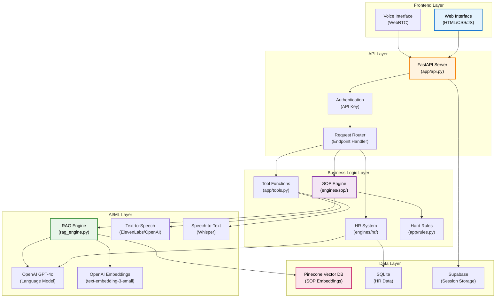
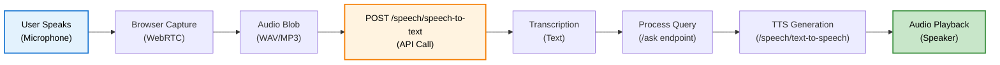
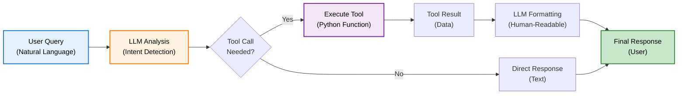
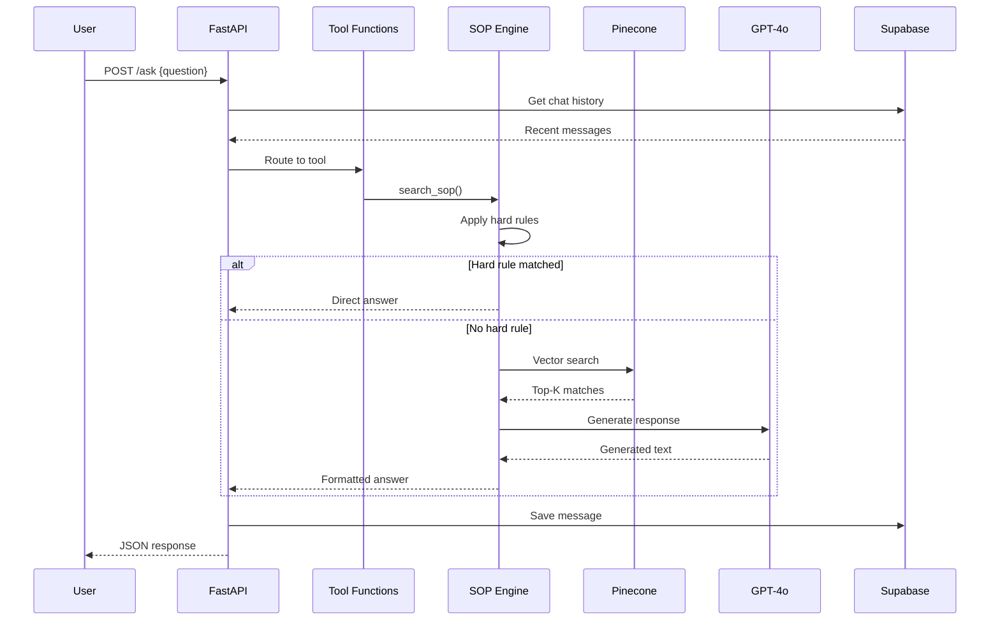

# Core Components

## Overview

DENAI dibangun dengan arsitektur modular yang memisahkan concerns ke dalam komponen-komponen independen. Setiap komponen memiliki tanggung jawab spesifik dan dapat dikembangkan secara terpisah.

## System Architecture Diagram



## 1. Frontend Layer

### Web Interface
**File**: `static/index.html`, `static/styles.css`, `static/script.js`

**Responsibilities**:
- Render chat UI dengan HTML/CSS
- Handle user input (text & voice)
- Display formatted responses (HTML rendering)
- Manage WebSocket connections untuk real-time updates
- Session management UI (pin/delete)

**Key Features**:
```javascript
// Example: Send chat message
async function sendMessage(question) {
    const response = await fetch('/ask', {
        method: 'POST',
        headers: {'Content-Type': 'application/json'},
        body: JSON.stringify({
            question: question,
            session_id: currentSessionId
        })
    });
    return await response.json();
}
```

**Technologies**:
- HTML5 untuk struktur
- CSS3 untuk styling (responsive)
- Vanilla JavaScript untuk interactivity
- WebRTC untuk audio streaming

### Voice Interface
**Integration**: WebRTC + Browser APIs

**Capabilities**:
- Microphone access via `getUserMedia()`
- Audio recording dengan MediaRecorder
- Real-time audio streaming
- Audio playback untuk TTS responses

**Flow**:


## 2. API Layer

### FastAPI Server
**File**: `app/api.py`

**Core Responsibilities**:
- Handle HTTP requests/responses
- Route requests ke appropriate handlers
- Manage CORS policies
- Error handling & logging
- Response formatting

**Key Endpoints**:
```python
# Text chat
@app.post("/ask")
async def ask_question(request: Request, req: QuestionRequest)

# Voice processing
@app.post("/call/process")
async def call_mode_natural(...)

# Speech services
@app.post("/speech/text-to-speech")
async def text_to_speech_natural(...)

@app.post("/speech/speech-to-text")
async def speech_to_text_optimized(...)

# Session management
@app.get("/sessions")
def list_sessions()

@app.post("/sessions/{session_id}/pin")
async def pin_session_endpoint(session_id: str)

@app.delete("/sessions/{session_id}")
async def delete_session_endpoint(session_id: str)
```

**Configuration**:
```python
# From app/config.py
LLM_MODEL = "gpt-4o-mini"
LLM_TEMPERATURE = 0.1
API_TIMEOUT_DEFAULT = 30
API_TIMEOUT_CALL_MODE = 15
```

### Authentication & Authorization
**File**: `app/rules.py`

**Role-Based Access**:
```python
def is_hr_allowed(user: dict) -> bool:
    """Check if user has HR access"""
    return user.get("role") == "HR"

# Usage in tools
if function_name in HR_TOOLS and not is_hr_allowed(user):
    return "🔒 Data karyawan hanya dapat diakses oleh tim HR."
```

**Security Layers**:
1. API key validation (environment-based)
2. Role verification per request
3. Rate limiting (configured in middleware)
4. SQL injection prevention (parameterized queries)

## 3. Business Logic Layer

### SOP Engine
**File**: `engines/sop/rag_engine.py`

**Core Functions**:

```python
def answer_question(question: str, session_id: str) -> str:
    """Main entry point for SOP queries"""
    
    # 1. Get conversation history
    history = get_recent_history(session_id)
    
    # 2. Rephrase with context
    standalone_question = rephrase_question_with_context(question, history)
    
    # 3. Infer document type (routing)
    doc_type = infer_doc_type(standalone_question)
    
    # 4. Retrieve relevant context
    matches = retrieve_context(standalone_question, doc_type=doc_type)
    
    # 5. Build anti-hallucination context
    context = build_context_anti_hallucination(matches)
    
    # 6. Generate response with LLM
    response = llm.invoke(prompt)
    
    return response
```

**Key Features**:

**1. Hard Rules System**
```python
# app/rules.py
def apply_hard_rules(question: str) -> Optional[str]:
    """Fast path for questions with definitive answers"""
    q = question.lower()
    
    # Rule: Only Band 5 can overtime
    match = re.search(r"band\s*(\d+)", q)
    if match and "lembur" in q:
        band = match.group(1)
        if band not in {"5"}:
            return "Hanya karyawan Band 5 yang berhak lembur."
    
    return None  # Continue to RAG
```

**2. Document Type Routing**
```python
# app/sop_router.py
def infer_doc_type(question: str) -> Optional[str]:
    """Auto-detect document type for filtered search"""
    # Uses cached keyword mapping
    # Returns: 'sop_lembur', 'sop_perjalanan_dinas', etc.
```

**3. Anti-Hallucination Prompting**
```python
prompt = f"""
ATURAN WAJIB:
1. SEMUA angka, nominal HARUS persis sama dengan dokumen
2. TIDAK boleh menyebutkan jabatan yang TIDAK ada dalam dokumen
3. Jika informasi tidak ada, katakan "tidak disebutkan dalam dokumen"
4. JANGAN tambahkan informasi dari pengetahuan umum

KONTEKS SOP:
{context}

PERTANYAAN:
{question}
"""
```

### HR System
**File**: `engines/hr/automatic_hr_system.py`

**Universal Database Architecture**:

```python
class EnhancedUniversalAutomaticHRSystem:
    def __init__(self, db_dir: str, openai_api_key: str):
        # Load ALL databases in folder
        self.connections = self._load_all_databases()
        
        # Auto-discover schema from ALL databases
        self.schema = self._discover_schema_automatically()
    
    def natural_language_to_sql(self, question: str, user_role: str) -> Dict:
        """Convert natural language to SQL"""
        # Build context with business intelligence
        schema_context = self._build_enhanced_universal_context()
        
        # LLM generates SQL
        response = self.openai_client.chat.completions.create(
            model="gpt-4o-mini",
            messages=[{"role": "user", "content": prompt}],
            temperature=0.1
        )
        
        return parsed_sql_result
```

**Auto Schema Discovery**:
```python
def _discover_schema_automatically(self) -> Dict:
    """Discover schema from any database structure"""
    
    for db_name, conn in self.connections.items():
        for table in tables:
            # Get column info
            cur.execute(f"PRAGMA table_info({table})")
            
            # Analyze each column
            for col in columns:
                purpose = self._analyze_column_purpose_enhanced(
                    col_name, col_type, sample_values
                )
                # Auto-detect: location, person_name, education, etc.
```

**Business Intelligence**:
- Auto-detect transfers (home_company != host_company)
- Flexible text matching (LIKE operator)
- Distribution analysis (GROUP BY)
- Smart value normalization

### Tool Functions
**File**: `app/tools.py`

**Tool Registry**:
```python
TOOL_FUNCTIONS = {
    "search_sop": search_sop,
    "search_hr_data": search_hr_data,
}

HR_TOOLS = ["search_hr_data"]  # Requires authorization

TOOLS_SCHEMA = [
    {
        "type": "function",
        "function": {
            "name": "search_sop",
            "description": "Search company SOP documents",
            "parameters": {...}
        }
    },
    # ... more tools
]
```

**Tool Execution Flow**:


## 4. AI/ML Layer

### RAG Engine Components

**1. Vector Search (Pinecone)**
```python
# Retrieve context from vector database
def retrieve_context(query: str, top_k: int = 10, doc_type: Optional[str] = None):
    # Generate query embedding
    query_vector = embedder.embed_query(query)
    
    # Search Pinecone
    res = index.query(
        vector=query_vector,
        top_k=top_k,
        include_metadata=True,
        filter={"doc_type": doc_type} if doc_type else None
    )
    
    return res.matches
```

**2. LLM Integration**
```python
# OpenAI GPT-4o-mini configuration
llm = ChatOpenAI(
    api_key=OPENAI_API_KEY,
    model="gpt-4o-mini",
    temperature=0.0,  # Zero for consistency
    max_tokens=2000
)
```

**3. Text-to-Speech**
```python
async def generate_tts_audio(text: str):
    """Generate TTS with fallback strategy"""
    
    # Try ElevenLabs first (premium)
    if ELEVENLABS_API_KEY:
        try:
            response = requests.post(
                f"https://api.elevenlabs.io/v1/text-to-speech/{VOICE_ID}",
                json={"text": text, "voice_settings": {...}}
            )
            if response.status_code == 200:
                return response.content, "elevenlabs"
        except:
            pass
    
    # Fallback to OpenAI TTS
    response = await client.audio.speech.create(
        model="tts-1",
        voice="nova",
        input=text
    )
    return response.content, "openai"
```

**4. Speech-to-Text**
```python
async def process_stt(audio_file_obj) -> str:
    """Transcribe audio with Whisper"""
    
    transcript_response = await asyncio.to_thread(
        client.audio.transcriptions.create,
        model="whisper-1",
        file=audio_file_obj,
        language="id",  # Indonesian
        response_format="text"
    )
    
    return transcript_response.strip()
```

### HTML Cleaning for TTS
```python
def clean_text_for_tts(html_text: str) -> str:
    """Clean HTML for natural speech"""
    
    # Remove headers and formatting
    text = re.sub(r'<h3>.*?</h3>', '', text)
    text = re.sub(r'<[^>]*>', ' ', text)
    
    # Remove emojis
    for emoji in ['✅', '❌', '🔒', '⏰', '❓']:
        text = text.replace(emoji, '')
    
    # Remove document references
    text = re.sub(r'Rujukan Dokumen.*', '', text)
    
    return text.strip()
```

## 5. Data Layer

### Pinecone Vector Database

**Configuration**:
```python
pc = Pinecone(api_key=PINECONE_API_KEY)
index = pc.Index(PINECONE_INDEX)  # "denai-sop"

# Embedding model
embedder = OpenAIEmbeddings(
    model="text-embedding-3-small",  # 1536 dimensions
    api_key=OPENAI_API_KEY
)
```

**Data Structure**:
```python
{
    "id": "sop_lembur_SKD_Kerja_Lembur_123_2025-01-15",
    "values": [0.123, -0.456, ...],  # 1536-dim vector
    "metadata": {
        "category": "sop",
        "doc_type": "sop_lembur",
        "source_file": "SKD_Kerja_Lembur.pdf",
        "pasal": "Halaman 6",
        "page": 6,
        "text": "Maksimal kerja lembur adalah 3 jam per hari...",
        "content_type": "general"
    }
}
```

### SQLite (HR Data)

**Schema Auto-Generation**:
```python
# From universal_csv_ingestor_final.py
CREATE TABLE IF NOT EXISTS employees (
    id INTEGER PRIMARY KEY AUTOINCREMENT,
    employee_name TEXT,
    home_company TEXT,
    host_company TEXT,
    status_kontrak TEXT,
    education TEXT,
    band INTEGER,
    ingested_at TEXT,
    data_source TEXT
)
```

**Batch Processing**:
```python
# Memory-efficient ingestion
for batch_start in range(0, total_rows, BATCH_SIZE):
    batch_rows = []
    for row in df[batch_start:batch_end]:
        processed_row = process_value(row)
        batch_rows.append(processed_row)
    
    cursor.executemany(insert_sql, batch_rows)
```

### Supabase (Session Storage)

**Tables**:

```sql
-- Chat sessions
CREATE TABLE chat_sessions (
    session_id TEXT PRIMARY KEY,
    title TEXT NOT NULL,
    pinned BOOLEAN DEFAULT FALSE,
    created_at TIMESTAMP WITH TIME ZONE DEFAULT NOW()
);

-- Chat messages
CREATE TABLE chat_memory (
    id BIGSERIAL PRIMARY KEY,
    session_id TEXT REFERENCES chat_sessions(session_id) ON DELETE CASCADE,
    role TEXT NOT NULL,
    message TEXT NOT NULL,
    created_at TIMESTAMP WITH TIME ZONE DEFAULT NOW()
);
```

**Python Interface**:
```python
# memory/memory_supabase.py
def save_message(session_id: str, role: str, message: str):
    supabase.table("chat_memory").insert({
        "session_id": session_id,
        "role": role,
        "message": message
    }).execute()

def get_recent_history(session_id: str, limit: int = 6):
    res = supabase.table("chat_memory")\
        .select("role,message")\
        .eq("session_id", session_id)\
        .order("created_at", desc=True)\
        .limit(limit)\
        .execute()
    return list(reversed(res.data))
```

## Component Interactions

### Request Flow Example



## Performance Considerations

### Caching Strategies

**1. Router Cache**
```python
# cache/sop_doc_types.json
# Cached document type keywords for fast routing
{
    "version": "1.0",
    "keywords": {
        "sop_lembur": ["lembur", "overtime", "kerja"],
        "sop_perjalanan_dinas": ["perjalanan", "dinas", "travel"]
    }
}
```

**2. Schema Cache**
```python
# HR system caches database schema on startup
self.schema = self._discover_schema_automatically()
# Avoids repeated PRAGMA table_info calls
```

### Optimization Techniques

**Batch Processing**:
- PDF ingestion: 3 pages per batch
- CSV ingestion: 1000 rows per batch
- Reduces memory footprint

**Lazy Loading**:
- Router initialized only when first used
- Tools imported on-demand
- Reduces startup time

**Async Operations**:
```python
# Non-blocking I/O
async def run_chat_completion(...):
    return await asyncio.wait_for(
        asyncio.to_thread(client.chat.completions.create, ...),
        timeout=30
    )
```

## Next Steps

- **[Data Flow →](data-flow.md)**: Understanding component interactions
- **[Technology Stack →](tech-stack.md)**: Detailed tech specifications
- **[Developer Guide →](../developer/database-setup.md)**: Setup and customization

---

**Component architecture complete!** Ready to explore data flows →