# Data Flow

## Overview

Dokumen ini menjelaskan alur data lengkap dalam sistem DENAI, dari user input hingga response generation, mencakup semua skenario: text chat, voice interaction, SOP search, dan HR queries.

## 1. Text Chat Flow (SOP Search)

### Complete Request Flow


### Data Transformation

**1. Input Processing**
```python
# User Input
{
    "question": "Berapa jam maksimal lembur per hari?",
    "session_id": "abc123",
    "user_role": "Employee"
}

# After rephrasing with context
standalone_question = "Berapa jam maksimal kerja lembur per hari untuk karyawan?"
```

**2. Vector Search**
```python
# Query Vector (1536 dimensions)
query_vector = [0.123, -0.456, 0.789, ...]

# Pinecone Query
{
    "vector": query_vector,
    "top_k": 10,
    "include_metadata": True,
    "filter": {"doc_type": "sop_lembur"}
}

# Search Results
matches = [
    {
        "id": "sop_lembur_123",
        "score": 0.89,
        "metadata": {
            "text": "Maksimal kerja lembur adalah 3 jam per hari...",
            "source_file": "SKD_Kerja_Lembur.pdf",
            "page": 6
        }
    },
    # ... 4 more matches
]
```

**3. Context Building**
```python
context = """
DOKUMEN_1:
FILE: SKD_Kerja_Lembur.pdf
BAGIAN: Halaman 6
KONTEN_EKSPLISIT:
Maksimal kerja lembur adalah 3 jam per hari. Diperlukan persetujuan dari atasan minimal Band 1.
---

DOKUMEN_2:
FILE: SKD_Kerja_Lembur.pdf
BAGIAN: Halaman 7
KONTEN_EKSPLISIT:
Upah lembur dihitung 1.5x gaji pokok per jam untuk hari kerja normal.
---
"""
```

**4. LLM Prompt**
```python
prompt = f"""
ATURAN WAJIB:
1. SEMUA angka, nominal HARUS persis sama dengan dokumen
2. TIDAK boleh menyebutkan jabatan yang TIDAK ada dalam dokumen
3. Jika informasi tidak ada, katakan "tidak disebutkan dalam dokumen"

KONTEKS SOP:
{context}

PERTANYAAN:
{question}

JAWABAN NATURAL & AKURAT:
"""
```

**5. Response Formatting**
```python
# Raw LLM Output
raw_response = """
Maksimal kerja lembur adalah **3 jam per hari**. 

Ketentuan:
1. Persetujuan dari atasan minimal Band 1
2. Upah lembur dihitung 1.5x gaji pokok per jam
"""

# After cleanup_numbered_lists()
formatted_response = """
<h3>Informasi Kerja Lembur</h3>
<p>Maksimal kerja lembur adalah <strong>3 jam per hari</strong>.</p>

<h3>Ketentuan dan Syarat</h3>
<ul>
<li>Persetujuan dari atasan minimal Band 1</li>
<li>Upah lembur dihitung 1.5x gaji pokok per jam</li>
</ul>

<h3>Rujukan Dokumen</h3>
<ul>
<li><strong>Sumber:</strong> SKD_Kerja_Lembur.pdf</li>
<li><strong>Bagian:</strong> Halaman 6</li>
</ul>
"""
```

## 2. Voice Call Flow

### End-to-End Voice Processing


### Voice Data Transformations

**1. Audio Input**
```python
# Received from client
audio_file = {
    "filename": "recording.wav",
    "content": b'\x89PNG\r\n...',  # Binary audio data
    "content_type": "audio/wav"
}
```

**2. Transcription**
```python
# Whisper API Call
response = client.audio.transcriptions.create(
    model="whisper-1",
    file=audio_file_obj,
    language="id",  # Indonesian
    response_format="text"
)

# Result
transcript = "Berapa jam maksimal lembur per hari?"
```

**3. Text Cleaning for TTS**
```python
# Before cleaning
html_response = """
<h3>Informasi Kerja Lembur</h3>
<p>Maksimal kerja lembur adalah <strong>3 jam per hari</strong>. ✅</p>

<h3>Rujukan Dokumen</h3>
<ul>
<li><strong>Sumber:</strong> SKD_Kerja_Lembur.pdf</li>
</ul>
"""

# After clean_text_for_tts()
clean_text = "Maksimal kerja lembur adalah 3 jam per hari."

# Remove: HTML tags, emojis, document references
```

**4. TTS Generation**
```python
# ElevenLabs Request
{
    "text": "Maksimal kerja lembur adalah 3 jam per hari",
    "model_id": "eleven_flash_v2_5",
    "voice_settings": {
        "stability": 0.6,
        "similarity_boost": 0.8,
        "style": 0.2,
        "use_speaker_boost": true
    }
}

# Response
audio_bytes = b'\x00\x01\x02...'  # MP3 audio data
```

## 3. HR Query Flow

### Natural Language to SQL

```mermaid
sequenceDiagram
    participant U as User<br/>(HR Personnel)
    participant API as FastAPI<br/>(app/api.py)
    participant Tools as Tools<br/>(app/tools.py)
    participant HR as HR System<br/>(automatic_hr_system.py)
    participant LLM as GPT-4o<br/>(SQL Generation)
    participant DB as SQLite<br/>(HR Database)
    
    U->>API: POST /ask<br/>{"question": "Berapa karyawan S2 di Jakarta?"}
    
    API->>API: Check user_role
    alt Not HR Role
        API-->>U: 🔒 Access Denied
    else HR Role
        API->>Tools: route to search_hr_data
        
        Tools->>HR: natural_language_to_sql(question)
        
        HR->>HR: Build schema context
        Note over HR: Auto-discovered<br/>column mappings
        
        HR->>LLM: Generate SQL query
        Note over HR,LLM: Prompt with schema<br/>+ business intelligence
        
        LLM-->>HR: SQL query string
        Note over LLM: SELECT COUNT(*)<br/>FROM employees<br/>WHERE education LIKE '%S2%'<br/>AND location LIKE '%Jakarta%'
        
        HR->>HR: Validate SQL safety
        Note over HR: Check for:<br/>- DROP/DELETE/UPDATE<br/>- SQL injection<br/>- Dangerous patterns
        
        alt SQL Safe
            HR->>DB: Execute query (read-only)
            DB-->>HR: Query results
            
            HR->>HR: Format results
            Note over HR: Human-readable:<br/>"📊 Total: 45 orang"
            
            HR-->>Tools: Formatted result
            Tools-->>API: Response
            API-->>U: JSON response
        else SQL Unsafe
            HR-->>API: Error: Unsafe query
            API-->>U: Error response
        end
    end
```



### HR Data Transformations

**1. Question Analysis**
```python
# Input
question = "Berapa karyawan S2 di Jakarta?"

# Schema Context (auto-discovered)
schema = {
    "employees": {
        "employee_name": {"purpose": "person_name"},
        "education": {"purpose": "education"},
        "home_company": {"purpose": "location"},
        "host_company": {"purpose": "location"}
    }
}
```

**2. SQL Generation**
```python
# LLM Prompt
prompt = f"""
DATABASE SCHEMA:
{schema_context}

QUESTION: "{question}"

BUSINESS INTELLIGENCE:
- Use LIKE for text matching (flexible)
- Handle case variations automatically
- For education: S2, s2, Magister are equivalent

Generate SQL with flexible matching:
"""

# Generated SQL
sql_query = """
SELECT COUNT(*) as total
FROM employees
WHERE (education LIKE '%S2%' OR education = 'S2')
  AND (home_company LIKE '%Jakarta%' OR host_company LIKE '%Jakarta%')
"""
```

**3. Query Execution**
```python
# Execute with safety checks
cursor.execute(sql_query)
results = cursor.fetchall()

# Raw Result
[(45,)]

# Formatted Result
formatted = "📊 Total: 45 orang karyawan S2 di Jakarta"
```

**4. Complex Query Example**
```python
# Question: "Distribusi karyawan per band?"

# Generated SQL
sql = """
SELECT band, COUNT(*) as count
FROM employees
GROUP BY band
ORDER BY COUNT(*) DESC
"""

# Results
[(5, 123), (4, 456), (3, 456), (2, 199)]

# Formatted
"""
📊 Distribusi Karyawan per Band

• Band 5: 123 orang (10.0%)
• Band 4: 456 orang (37.0%)
• Band 3: 456 orang (37.0%)
• Band 2: 199 orang (16.1%)

Total: 1,234 karyawan
"""
```

## 4. Session Management Flow

### Session Lifecycle


### Session Data Flow

**1. Session Creation**
```python
# POST /ask (first message)
{
    "question": "Bagaimana prosedur lembur?",
    "session_id": null  # No session yet
}

# API generates UUID
session_id = str(uuid.uuid4())  # "abc123-def456-..."

# Save to Supabase
supabase.table("chat_sessions").insert({
    "session_id": session_id,
    "title": "Bagaimana prosedur lembur?",
    "pinned": false,
    "created_at": "2025-01-15T10:30:00Z"
}).execute()
```

**2. Message Storage**
```python
# Save user message
supabase.table("chat_memory").insert({
    "session_id": "abc123-def456",
    "role": "user",
    "message": "Bagaimana prosedur lembur?",
    "created_at": "2025-01-15T10:30:00Z"
}).execute()

# Save assistant response
supabase.table("chat_memory").insert({
    "session_id": "abc123-def456",
    "role": "assistant",
    "message": "<h3>Informasi Kerja Lembur</h3>...",
    "created_at": "2025-01-15T10:30:05Z"
}).execute()
```

**3. History Retrieval**
```python
# Get recent history (limit=6)
history = supabase.table("chat_memory")\
    .select("role,message")\
    .eq("session_id", "abc123-def456")\
    .order("created_at", desc=True)\
    .limit(6)\
    .execute()

# Result (reversed chronologically)
[
    {"role": "user", "message": "Bagaimana prosedur lembur?"},
    {"role": "assistant", "message": "<h3>...</h3>"},
    {"role": "user", "message": "Berapa biayanya?"},
    {"role": "assistant", "message": "<h3>...</h3>"}
]
```

**4. Pin/Unpin**
```python
# POST /sessions/abc123/pin
current_pinned = get_session_pin_status(session_id)  # false
new_pinned = not current_pinned  # true

supabase.table("chat_sessions")\
    .update({"pinned": true})\
    .eq("session_id", session_id)\
    .execute()

# Sessions list (pinned first)
supabase.table("chat_sessions")\
    .select("*")\
    .order("pinned", desc=True)\
    .order("created_at", desc=True)\
    .execute()
```

## 5. Document Ingestion Flow

### PDF to Vector Database


### Ingestion Data Pipeline

**1. Content Extraction**
```python
# Per page processing
with pdfplumber.open(pdf_path) as pdf:
    for page in pdf.pages:
        # Extract tables
        tables = page.extract_tables()
        
        # Extract text
        text = page.extract_text()
        
        # Analyze content
        if tables:
            table_str = format_table(tables[0])
            parsed_data, confidence = detect_table_type(table_str)
```

**2. Rule-Based Table Detection**
```python
# Example: Travel rate table
table_text = """
America | Washington | 150 | 200 | 250
Austria | Vienna     | 120 | 150 | 180
"""

# Auto-detect pattern
if confidence >= 0.7:
    formatted = [
        "BIAYA_PERJALANAN: America (Washington) - Band 1: 150 USD, Band 2: 200 USD, Band 3: 250 USD",
        "BIAYA_PERJALANAN: Austria (Vienna) - Band 1: 120 USD, Band 2: 150 USD, Band 3: 180 USD"
    ]
```

**3. Chunk Creation**
```python
# Enhanced chunk with metadata
chunk = {
    'text': f"DOKUMEN: SOP LEMBUR | FILE: SKD_Kerja_Lembur.pdf | KONTEN: {text}",
    'metadata': {
        "category": "sop",
        "doc_type": "sop_lembur",
        "source_file": "SKD_Kerja_Lembur.pdf",
        "page": 6,
        "text": text,  # Original text
        "content_type": "general"
    },
    'id': "sop_lembur_SKD_Kerja_Lembur_123_2025-01-15"
}
```

**4. Embedding & Upload**
```python
# Batch processing (memory efficient)
batch_chunks = [chunk1, chunk2, ..., chunk50]

# Generate embeddings
texts = [chunk['text'] for chunk in batch_chunks]
vectors = embedder.embed_documents(texts)  # 50 x 1536

# Prepare Pinecone payload
payload = []
for chunk, vector in zip(batch_chunks, vectors):
    payload.append({
        "id": chunk['id'],
        "values": vector,
        "metadata": chunk['metadata']
    })

# Upload batch
index.upsert(payload)
```

## Performance Optimization

### Caching Strategy


**Cache Types**:
1. **Router Cache**: Doc type keywords (file-based)
2. **Schema Cache**: HR database structure (memory)
3. **Session Cache**: Recent chat history (Supabase)

### Batch Processing

**Benefits**:
- Reduced API calls
- Lower memory footprint
- Better throughput

**Implementation**:
```python
# PDF ingestion: 3 pages per batch
for batch_start in range(0, total_pages, 3):
    batch_pages = pdf.pages[batch_start:batch_start+3]
    process_batch(batch_pages)

# CSV ingestion: 1000 rows per batch
for batch_start in range(0, total_rows, 1000):
    batch_rows = df[batch_start:batch_start+1000]
    insert_batch(batch_rows)
```

## Error Handling & Recovery

### Retry Strategy

```python
# TTS with fallback
try:
    # Try ElevenLabs
    audio = elevenlabs_tts(text)
except Exception:
    # Fallback to OpenAI
    audio = openai_tts(text)

# DB with timeout
try:
    result = await asyncio.wait_for(
        db_query(),
        timeout=30
    )
except asyncio.TimeoutError:
    return fallback_response()
```

### Graceful Degradation

**Priority**:
1. Return cached/fallback data
2. Return partial results
3. Return error message (last resort)

## Next Steps

- **[Technology Stack →](tech-stack.md)**: Detailed tech specifications
- **[API Reference →](../api/overview.md)**: API endpoint details
- **[Developer Guide →](../developer/rag-engine.md)**: Implementation guide

---

**Data flow complete!** Understanding how data moves through the system →