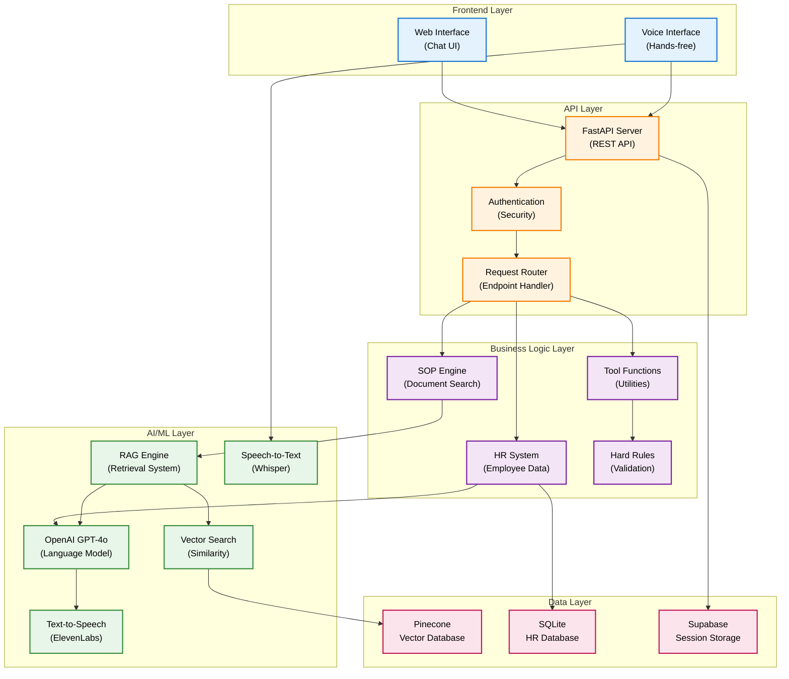
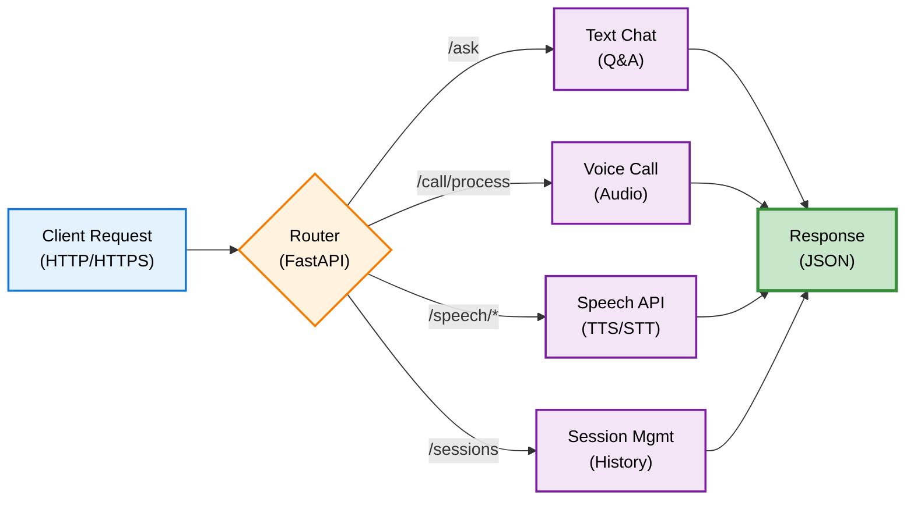
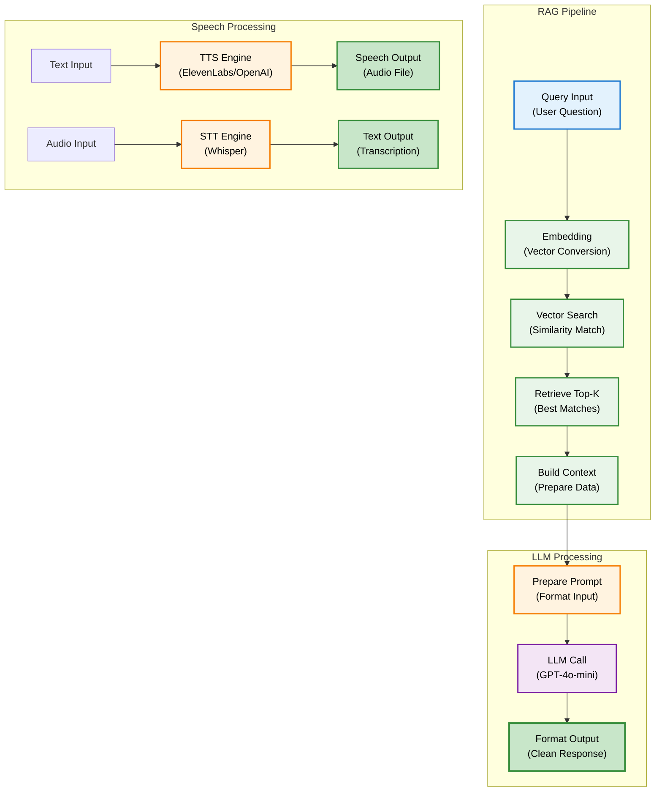
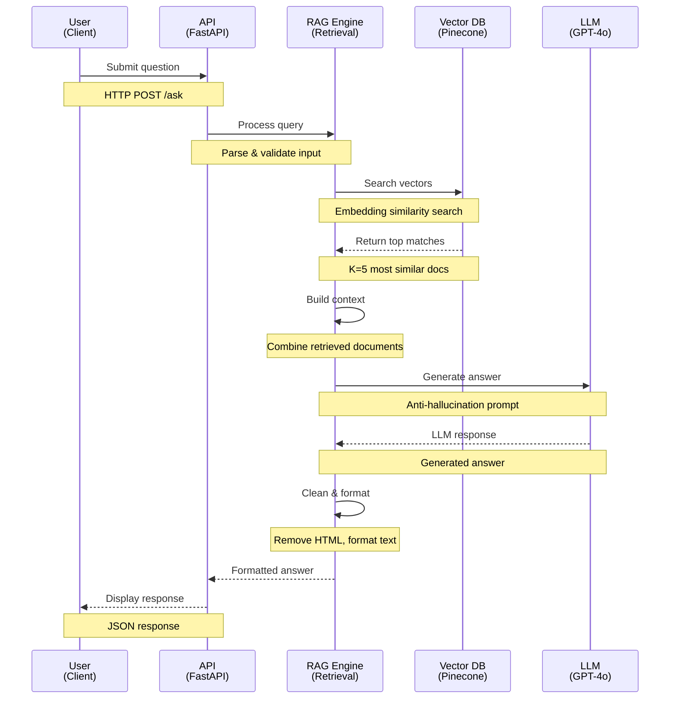
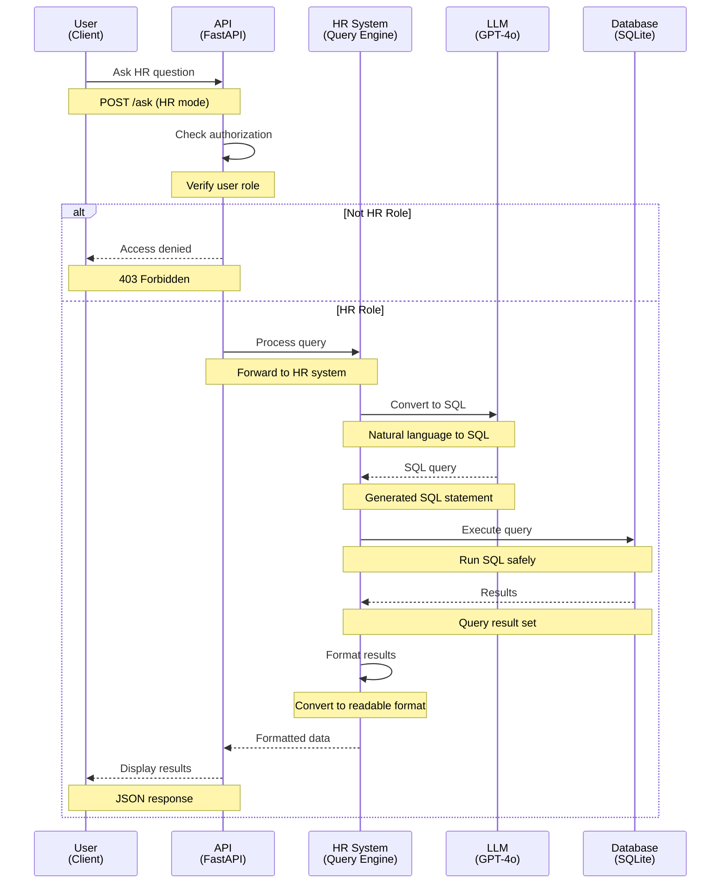
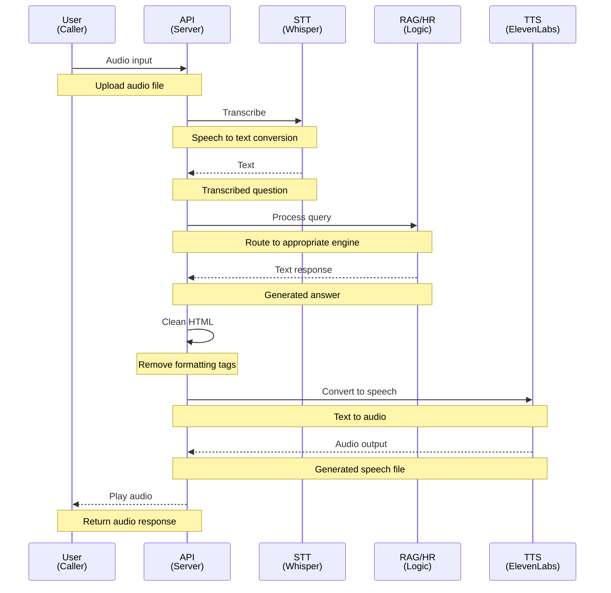
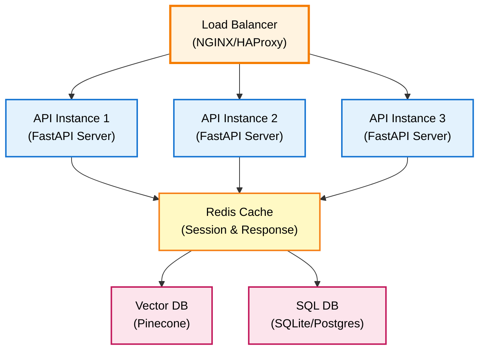
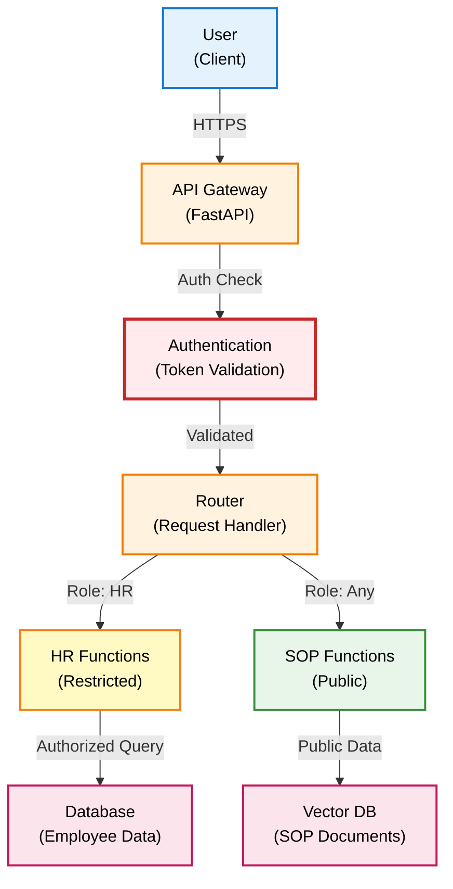
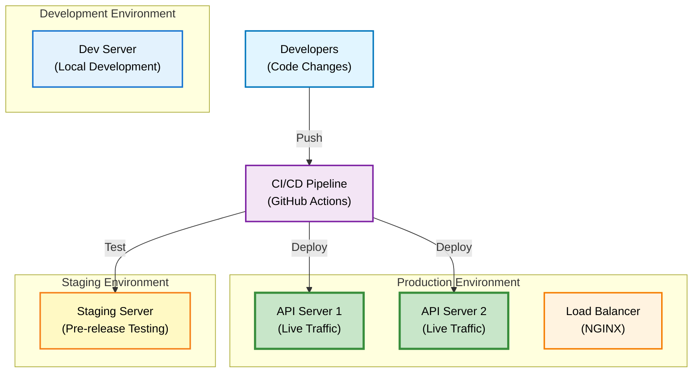

# Arsitektur Sistem DENAI

## Gambaran Umum

DENAI dirancang dengan arsitektur modular dan scalable yang memisahkan concern utama sistem menjadi komponen-komponen independen yang dapat dikembangkan dan di-maintain secara terpisah.

## Diagram Arsitektur High-Level



## Layer Architecture

### 1. Frontend Layer
Interface pengguna untuk berinteraksi dengan sistem.

**Komponen:**
- **Web Interface**: Chat UI berbasis web
- **Voice Interface**: Interface suara untuk hands-free operation

**Teknologi:**
- HTML5, CSS3, JavaScript
- WebRTC untuk audio streaming
- Responsive design

### 2. API Layer
Layer yang menangani semua HTTP requests dan routing.



**Endpoints:**
- `/ask` - Text-based question answering
- `/call/process` - Voice call processing
- `/speech/text-to-speech` - TTS conversion
- `/speech/speech-to-text` - STT conversion
- `/sessions` - Session management

### 3. Business Logic Layer
Core business logic dan tool orchestration.

**Komponen Utama:**

#### SOP Engine
```python
# Flow SOP Search
User Query → Hard Rules Check → RAG Engine → Vector Search 
→ Context Retrieval → LLM Processing → Formatted Response
```

**Fitur:**
- Anti-hallucination prompting
- Document type routing
- Context-aware retrieval
- HTML cleaning untuk TTS

#### HR System
```python
# Flow HR Query
User Query → Authorization Check → Schema Discovery 
→ Natural Language to SQL → Execute Query → Format Results
```

**Fitur:**
- Universal database support
- Automatic schema detection
- Business intelligence
- Role-based access control

### 4. AI/ML Layer
Layer yang menangani semua operasi AI dan machine learning.



**Komponen:**
- **RAG Engine**: Retrieval-Augmented Generation
- **LLM**: OpenAI GPT-4o-mini
- **Vector Search**: Pinecone similarity search
- **TTS**: ElevenLabs + OpenAI fallback
- **STT**: OpenAI Whisper

### 5. Data Layer
Persistent storage untuk berbagai jenis data.

**Databases:**

| Database | Purpose | Data Type |
|----------|---------|-----------|
| **Pinecone** | Vector storage | SOP embeddings |
| **SQLite** | HR data | Employee records |
| **Supabase** | Session data | Chat history |

## Data Flow

### SOP Query Flow



### HR Query Flow



### Voice Call Flow



## Scalability Considerations

### Horizontal Scaling


**Strategi:**
- Stateless API design
- Connection pooling
- Response caching
- Async processing

### Performance Optimization

**Current Optimizations:**
- Batch processing untuk ingestion
- Lazy loading untuk router
- Cached schema discovery
- Efficient HTML cleaning
- Timeout configuration per mode

**Metrics:**
- Average response time: < 2s
- Vector search: < 500ms
- LLM generation: < 1.5s
- TTS conversion: < 1s

## Security Architecture



**Security Layers:**
1. HTTPS/TLS encryption
2. API key authentication
3. Role-based access control (RBAC)
4. Rate limiting
5. Input validation
6. SQL injection prevention

## Configuration Management

### Environment-based Config

```python
# Config hierarchy
ENVIRONMENT = "production" | "development"

# Mode-specific constants
CALL_MODE_TEMPERATURE = 0.0  # Deterministic
CHAT_MODE_TEMPERATURE = 0.1  # Slightly creative
```

**Configuration Files:**
- `app/config.py` - Main configuration
- `.env` - Environment variables
- `cache/sop_doc_types.json` - Router cache

## Monitoring & Logging

### Logging Levels
```python
FEATURE_VERBOSE_LOGGING = True/False

LOG_LEVEL = "DEBUG" | "INFO" | "WARNING" | "ERROR"
```

### Metrics Tracked
- Request/response times
- Error rates
- Cache hit rates
- LLM token usage
- Database query performance

## Deployment Architecture



## Next Steps

- [Komponen Detail](components.md)
- [Tech Stack](tech-stack.md)
- [Data Flow Detail](data-flow.md)