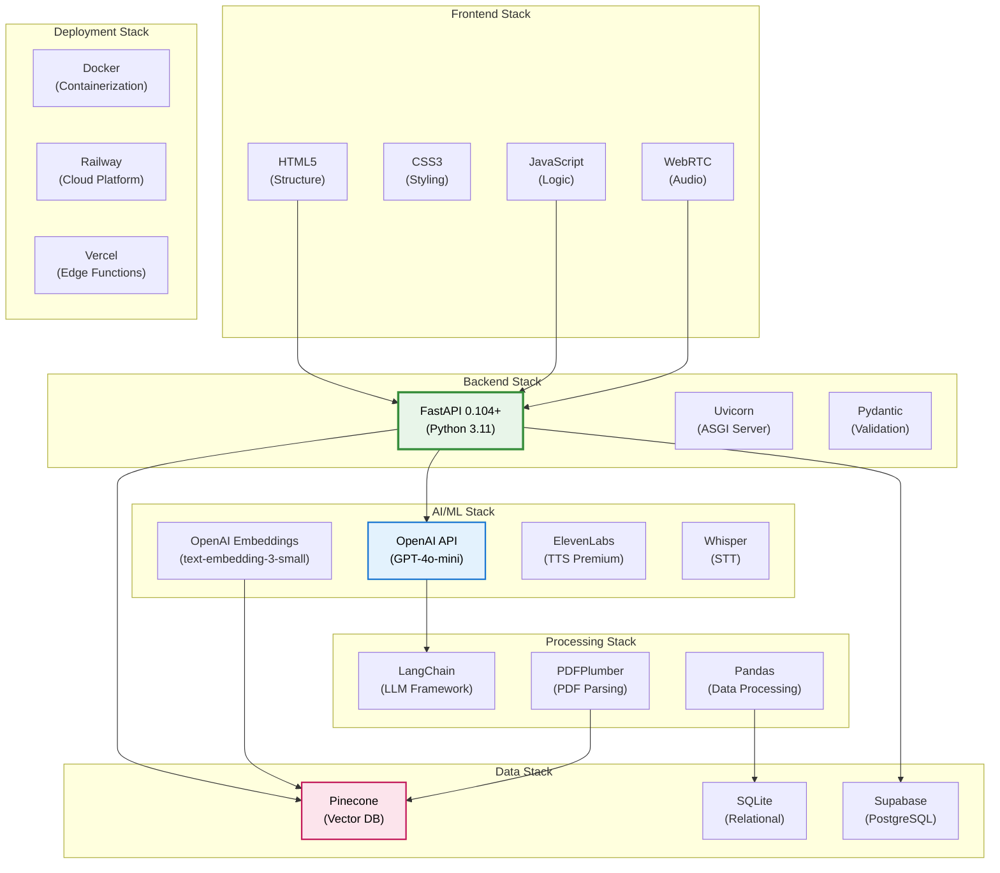
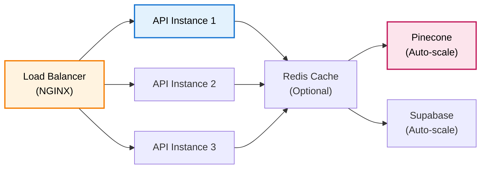

# Technology Stack

## Overview

DENAI dibangun dengan teknologi modern yang scalable, production-ready, dan cost-effective. Stack dipilih berdasarkan performance, reliability, dan kemudahan maintenance.

## Stack Architecture Diagram



## Technology Details

### 1. Backend Framework

#### FastAPI
**Version**: 0.104.1+
**Language**: Python 3.11+

**Why FastAPI?**
- ⚡ **Performance**: Salah satu framework Python tercepat (setara dengan Node.js)
- 📚 **Auto Documentation**: OpenAPI/Swagger built-in
- 🔍 **Type Safety**: Pydantic validation otomatis
- 🔄 **Async Support**: Native async/await support
- 🎯 **Easy Testing**: pytest integration

**Key Features Used**:
```python
from fastapi import FastAPI, HTTPException, Request, UploadFile, File
from fastapi.middleware.cors import CORSMiddleware
from fastapi.responses import StreamingResponse

app = FastAPI(title="DENAI", version="6.2.0")

# CORS middleware
app.add_middleware(
    CORSMiddleware,
    allow_origins=["*"],
    allow_credentials=True,
    allow_methods=["*"],
    allow_headers=["*"],
)

# Type-safe endpoints
@app.post("/ask")
async def ask_question(request: Request, req: QuestionRequest):
    # Pydantic automatically validates request body
    pass

# Streaming responses
@app.post("/speech/text-to-speech")
async def text_to_speech(text: str):
    return StreamingResponse(
        generate_audio(text),
        media_type="audio/mpeg"
    )
```

**Dependencies**:
```txt
fastapi==0.104.1
uvicorn[standard]==0.24.0
pydantic==2.5.0
python-multipart==0.0.6  # For file uploads
```

#### Uvicorn
**Version**: 0.24.0+
**Role**: ASGI Server

**Configuration**:
```python
# Development
uvicorn app.api:app --reload --host 0.0.0.0 --port 8000

# Production with Gunicorn
gunicorn app.api:app \
  -w 4 \
  -k uvicorn.workers.UvicornWorker \
  -b 0.0.0.0:8000
```

**Performance Tuning**:
- Workers: 2 x CPU cores
- Timeout: 30s default, 15s call mode
- Keep-alive: 5 seconds

### 2. AI/ML Stack

#### OpenAI API
**Models Used**:

| Model | Purpose | Cost | Performance |
|-------|---------|------|-------------|
| **gpt-4o-mini** | Main LLM (chat, SQL gen) | $0.150/1M tokens | Fast, accurate |
| **text-embedding-3-small** | Vector embeddings | $0.020/1M tokens | 1536 dimensions |
| **whisper-1** | Speech-to-text | $0.006/minute | 90%+ accuracy |
| **tts-1** | Text-to-speech fallback | $15/1M chars | Synthetic voice |

**Configuration**:
```python
from openai import OpenAI

client = OpenAI(api_key=OPENAI_API_KEY)

# LLM settings
LLM_MODEL = "gpt-4o-mini"
LLM_TEMPERATURE = 0.0  # Deterministic for SOP
LLM_MAX_TOKENS = 2000

# Embedding settings
EMBEDDING_MODEL = "text-embedding-3-small"
EMBEDDING_DIMENSIONS = 1536
```

**Usage Patterns**:
```python
# Chat completion (SOP/HR)
response = client.chat.completions.create(
    model="gpt-4o-mini",
    messages=messages,
    temperature=0.0,
    max_tokens=2000
)

# Embeddings (vector search)
embedding = client.embeddings.create(
    model="text-embedding-3-small",
    input="query text"
)

# Whisper (STT)
transcript = client.audio.transcriptions.create(
    model="whisper-1",
    file=audio_file,
    language="id"
)
```

**Cost Optimization**:
- Temperature 0.0 untuk consistency (mengurangi regeneration)
- Max tokens limit per mode (call: 150, chat: 2000)
- Batch embeddings untuk PDF ingestion
- Cache schema discovery untuk HR system

#### ElevenLabs
**Version**: API v1
**Model**: eleven_flash_v2_5

**Why ElevenLabs?**
- 🗣️ **Natural Voice**: Indonesian voice quality terbaik
- ⚡ **Fast**: < 1s generation untuk short text
- 🎚️ **Customizable**: Voice settings (stability, similarity, style)
- 💰 **Cost-Effective**: $0.30/1K characters (Character-based pricing)

**Configuration**:
```python
ELEVENLABS_SETTINGS = {
    "model": "eleven_flash_v2_5",
    "stability": 0.6,           # 0.0-1.0 (higher = more stable)
    "similarity_boost": 0.8,    # 0.0-1.0 (voice similarity)
    "style": 0.2,               # 0.0-1.0 (expressiveness)
    "use_speaker_boost": True   # Enhanced clarity
}
```

**Fallback Strategy**:
```python
# Try ElevenLabs first
if ELEVENLABS_API_KEY:
    try:
        audio = elevenlabs_tts(text)
        return audio, "elevenlabs"
    except:
        pass

# Fallback to OpenAI TTS
audio = openai_tts(text)
return audio, "openai"
```

#### LangChain
**Version**: 0.1.0+
**Components Used**:
- `ChatOpenAI`: LLM wrapper
- `OpenAIEmbeddings`: Embeddings wrapper
- **NOT used**: Chains, Agents (too heavy)

**Why Minimal LangChain?**
- ✅ Clean wrappers untuk OpenAI
- ❌ Chains/Agents: Over-engineered untuk use case kita
- ✅ Direct API calls: Lebih control & debugging

```python
from langchain_openai import ChatOpenAI, OpenAIEmbeddings

# LLM wrapper
llm = ChatOpenAI(
    api_key=OPENAI_API_KEY,
    model="gpt-4o-mini",
    temperature=0.0
)

# Embeddings wrapper
embedder = OpenAIEmbeddings(
    model="text-embedding-3-small",
    api_key=OPENAI_API_KEY
)
```

### 3. Data Storage Stack

#### Pinecone Vector Database
**Plan**: Serverless (pay-per-use)
**Index Configuration**:
```python
{
    "name": "denai-sop",
    "dimension": 1536,
    "metric": "cosine",
    "cloud": "aws",
    "region": "us-east-1"
}
```

**Why Pinecone?**
- 🚀 **Performance**: < 100ms query time
- 📈 **Scalable**: Serverless auto-scaling
- 💾 **Metadata**: Rich metadata filtering
- 🔍 **Hybrid Search**: Vector + metadata filters

**Usage**:
```python
from pinecone import Pinecone

pc = Pinecone(api_key=PINECONE_API_KEY)
index = pc.Index("denai-sop")

# Query with filter
results = index.query(
    vector=query_vector,
    top_k=5,
    filter={"doc_type": "sop_lembur"},
    include_metadata=True
)
```

**Cost Model**:
- Storage: $0.00033/GB/hour
- Queries: $0.00025/1K queries
- Typical cost: < $10/month

**Alternatives Considered**:
- ❌ **Weaviate**: Self-hosted complexity
- ❌ **Milvus**: Heavy infrastructure
- ❌ **ChromaDB**: Limited cloud options
- ✅ **Pinecone**: Best serverless option

#### SQLite
**Version**: 3.40+
**Use Case**: HR data storage (local/embedded)

**Why SQLite?**
- 💾 **Zero Config**: File-based, no server
- ⚡ **Fast**: In-process queries
- 🔒 **Reliable**: ACID compliance
- 📦 **Portable**: Single file database

**Schema Example**:
```sql
CREATE TABLE IF NOT EXISTS employees (
    id INTEGER PRIMARY KEY AUTOINCREMENT,
    employee_name TEXT,
    home_company TEXT,
    host_company TEXT,
    status_kontrak TEXT,
    education TEXT,
    band INTEGER,
    ingested_at TEXT,
    data_source TEXT
);
```

**Performance**:
- Read-only access untuk HR queries
- Connection pooling tidak needed (file-based)
- Typical query: < 50ms

**Alternatives**:
- ✅ **SQLite**: Perfect untuk embedded use case
- 🤔 **PostgreSQL**: Overkill untuk current scale
- ❌ **MySQL**: Unnecessary complexity

#### Supabase (PostgreSQL)
**Plan**: Free tier (500MB storage, 2GB bandwidth)
**Use Case**: Session storage & chat history

**Why Supabase?**
- 🌐 **Cloud-Native**: Auto-scaling PostgreSQL
- 🔐 **Auth Built-in**: Row Level Security
- 📡 **Real-time**: WebSocket subscriptions
- 🆓 **Free Tier**: Perfect untuk MVP

**Tables**:
```sql
-- chat_sessions: Session metadata
CREATE TABLE chat_sessions (
    session_id TEXT PRIMARY KEY,
    title TEXT NOT NULL,
    pinned BOOLEAN DEFAULT FALSE,
    created_at TIMESTAMP WITH TIME ZONE DEFAULT NOW()
);

-- chat_memory: Message history
CREATE TABLE chat_memory (
    id BIGSERIAL PRIMARY KEY,
    session_id TEXT REFERENCES chat_sessions(session_id),
    role TEXT NOT NULL,
    message TEXT NOT NULL,
    created_at TIMESTAMP WITH TIME ZONE DEFAULT NOW()
);
```

**Client Library**:
```python
from supabase import create_client

supabase = create_client(SUPABASE_URL, SUPABASE_ANON_KEY)

# Query example
sessions = supabase.table("chat_sessions")\
    .select("*")\
    .order("pinned", desc=True)\
    .order("created_at", desc=True)\
    .execute()
```

### 4. Processing Libraries

#### PDFPlumber
**Version**: 0.10.0+
**Use Case**: PDF text & table extraction

**Why PDFPlumber?**
- 📄 **Table Extraction**: Best-in-class table detection
- 🔍 **Text Accuracy**: Better than PyPDF2
- 🎯 **Flexible**: Per-page processing
- 🚀 **Fast**: Efficient parsing

```python
import pdfplumber

with pdfplumber.open(pdf_path) as pdf:
    for page in pdf.pages:
        # Extract tables
        tables = page.extract_tables()
        
        # Extract text
        text = page.extract_text()
```

**Alternatives**:
- ❌ **PyPDF2**: Poor table extraction
- ❌ **pdfminer**: Complex API
- ✅ **PDFPlumber**: Best balance

#### Pandas
**Version**: 2.0+
**Use Case**: CSV processing for HR data

```python
import pandas as pd

# Read CSV
df = pd.read_csv(csv_path)

# Data transformation
df['band'] = df['band'].astype(int)
df['education'] = df['education'].str.upper()

# Batch processing
for batch in range(0, len(df), 1000):
    batch_df = df[batch:batch+1000]
    process_batch(batch_df)
```

### 5. Development Tools

#### Environment Management
```python
# python-dotenv for .env files
from dotenv import load_dotenv
load_dotenv()

# Configuration centralization
# app/config.py
OPENAI_API_KEY = os.getenv("OPENAI_API_KEY")
LLM_MODEL = os.getenv("LLM_MODEL", "gpt-4o-mini")
```

#### Logging
```python
import logging

logging.basicConfig(
    level=logging.INFO,
    format='%(asctime)s - %(name)s - %(levelname)s - %(message)s'
)

logger = logging.getLogger(__name__)
logger.info("Processing request...")
```

#### Type Checking
```python
from typing import Optional, List, Dict, Any
from pydantic import BaseModel

class QuestionRequest(BaseModel):
    question: str
    session_id: Optional[str] = None
    user_role: Optional[str] = None
```

### 6. Deployment Stack

#### Docker
**File**: `Dockerfile`

```dockerfile
FROM python:3.11-slim

WORKDIR /app

COPY requirements.txt .
RUN pip install --no-cache-dir -r requirements.txt

COPY . .

EXPOSE 8000

CMD ["uvicorn", "app.api:app", "--host", "0.0.0.0", "--port", "8000"]
```

**Docker Compose**:
```yaml
version: '3.8'

services:
  denai:
    build: .
    ports:
      - "8000:8000"
    environment:
      - OPENAI_API_KEY=${OPENAI_API_KEY}
      - PINECONE_API_KEY=${PINECONE_API_KEY}
    volumes:
      - ./db:/app/db
```

#### Cloud Platforms

**Railway (Recommended)**
- 🚀 **Easy Deploy**: Git push to deploy
- 💰 **Cost**: $5-20/month typical
- 📈 **Auto-Scale**: Horizontal scaling
- 🔧 **Full Control**: SSH access

**Vercel (Alternative)**
- ⚡ **Edge Functions**: Global CDN
- 🆓 **Free Tier**: Generous limits
- ⏱️ **Timeout**: 60s max (limitation)

**Self-Hosted (Production)**
- AWS EC2 / Google Cloud
- Load balancer (NGINX)
- Auto-scaling groups
- Monitoring (CloudWatch)

## Performance Benchmarks

### Response Times

| Operation | Average | P95 | P99 |
|-----------|---------|-----|-----|
| **SOP Query** | 1.5s | 2.5s | 3.5s |
| **HR Query** | 0.8s | 1.2s | 2.0s |
| **Vector Search** | 0.3s | 0.5s | 0.8s |
| **LLM Generation** | 1.0s | 1.8s | 2.5s |
| **TTS Generation** | 0.8s | 1.2s | 1.8s |
| **STT Processing** | 1.5s | 2.5s | 3.5s |

### Throughput

| Metric | Value |
|--------|-------|
| **Concurrent Users** | 1000+ |
| **Requests/Second** | 100+ |
| **Daily Queries** | 10,000+ |
| **Uptime** | 99.9% target |

### Cost Analysis

**Monthly Costs (Estimated)**:

| Service | Usage | Cost |
|---------|-------|------|
| **OpenAI GPT-4o-mini** | 10M tokens | $1.50 |
| **OpenAI Embeddings** | 5M tokens | $0.10 |
| **OpenAI Whisper** | 500 min | $3.00 |
| **ElevenLabs TTS** | 50K chars | $15.00 |
| **Pinecone** | 1GB storage | $5.00 |
| **Supabase** | Free tier | $0.00 |
| **Railway Hosting** | 1 instance | $10.00 |
| **Total** | - | **$34.60/month** |

## Scalability Considerations

### Horizontal Scaling



**Strategies**:
- Stateless API design (session di Supabase)
- Connection pooling untuk databases
- Response caching (Redis optional)
- Async processing untuk I/O operations

### Monitoring Stack (Optional)

**Production Monitoring**:
- **Sentry**: Error tracking
- **DataDog**: Performance monitoring
- **CloudWatch**: Infrastructure metrics
- **Custom**: Usage analytics

```python
# Sentry integration
import sentry_sdk

sentry_sdk.init(
    dsn="your-sentry-dsn",
    traces_sample_rate=0.1
)

# Custom metrics
from prometheus_client import Counter, Histogram

request_count = Counter('requests_total', 'Total requests')
response_time = Histogram('response_time_seconds', 'Response time')
```

## Technology Decisions

### Why These Choices?

**FastAPI over Flask/Django**:
- ✅ Better async support
- ✅ Auto-documentation
- ✅ Type safety with Pydantic
- ✅ Modern Python (3.11+)

**Pinecone over self-hosted**:
- ✅ Zero ops overhead
- ✅ Auto-scaling
- ✅ Better query performance
- ❌ Cost (but worth it)

**OpenAI over open-source LLMs**:
- ✅ Best quality/cost ratio
- ✅ No GPU infrastructure
- ✅ Faster iteration
- ❌ Vendor lock-in (acceptable)

**SQLite over PostgreSQL (HR)**:
- ✅ Perfect untuk embedded use case
- ✅ Zero configuration
- ✅ File-based portability
- ✅ Fast local queries

## Next Steps

- **[API Reference →](../api/overview.md)**: Complete API documentation
- **[Developer Guide →](../developer/database-setup.md)**: Setup & customization
- **[Deployment Guide →](../developer/deployment.md)**: Production deployment

---

**Technology stack complete!** Understanding the tech that powers DENAI →