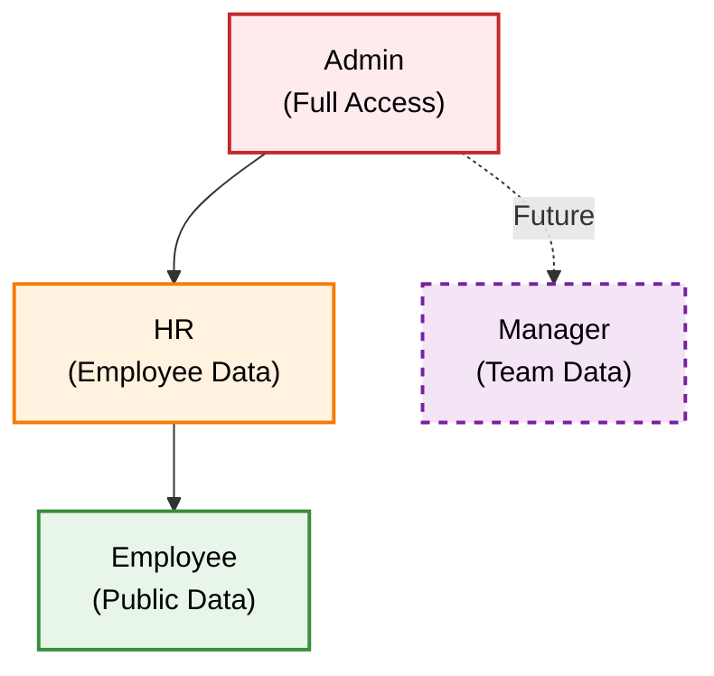
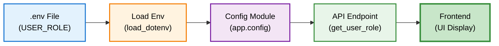
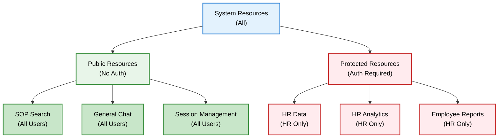
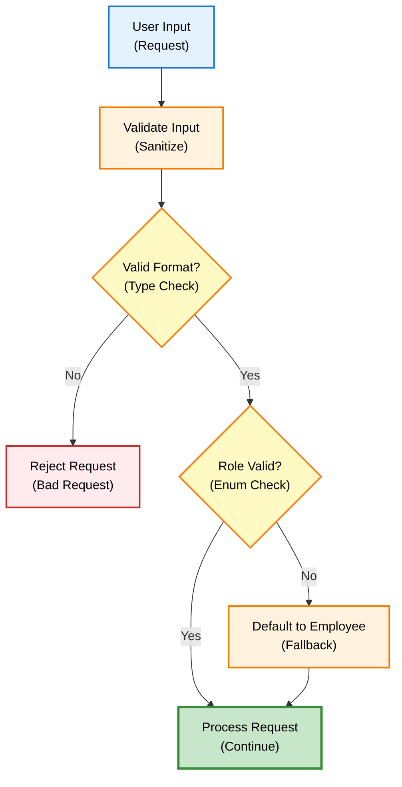

# Authentication - Developer Guide

## Overview

DENAI menggunakan **Role-Based Access Control (RBAC)** untuk mengatur akses ke fitur-fitur sensitif seperti HR data. System ini sederhana namun efektif untuk membedakan antara Employee dan HR personnel.

## Architecture

```mermaid
graph TB
    subgraph "User Layer"
        User["User Request<br/>(API Call)"]
        Role["User Role<br/>(Employee/HR)"]
    end
    
    subgraph "Authentication Layer"
        Env["Environment Config<br/>(USER_ROLE)"]
        Extract["Role Extraction<br/>(From Request)"]
        Validate["Role Validation<br/>(Check Format)"]
    end
    
    subgraph "Authorization Layer"
        Rules["Access Rules<br/>(is_hr_allowed)"]
        Check["Permission Check<br/>(Resource Access)"]
        Decision["Access Decision<br/>(Allow/Deny)"]
    end
    
    subgraph "Resource Layer"
        Public["Public Resources<br/>(SOP Search)"]
        Restricted["Restricted Resources<br/>(HR Data)"]
    end
    
    subgraph "Response Layer"
        Allow["Allow Access<br/>(Execute)"]
        Deny["Deny Access<br/>(🔒 Error)"]
    end
    
    User --> Extract
    Role --> Env
    Env --> Extract
    Extract --> Validate
    Validate --> Rules
    Rules --> Check
    Check --> Decision
    
    Decision -->|"Public"| Public
    Decision -->|"Restricted + Authorized"| Restricted
    Decision -->|"Restricted + Unauthorized"| Deny
    
    Public --> Allow
    Restricted --> Allow
    
    style User fill:#e3f2fd,stroke:#1976d2,stroke-width:2px,color:#000
    style Role fill:#e3f2fd,stroke:#1976d2,stroke-width:2px,color:#000
    style Env fill:#fff3e0,stroke:#f57c00,stroke-width:2px,color:#000
    style Extract fill:#fff3e0,stroke:#f57c00,stroke-width:2px,color:#000
    style Validate fill:#fff3e0,stroke:#f57c00,stroke-width:2px,color:#000
    style Rules fill:#ffebee,stroke:#c62828,stroke-width:2px,color:#000
    style Check fill:#ffebee,stroke:#c62828,stroke-width:2px,color:#000
    style Decision fill:#fff9c4,stroke:#f57f17,stroke-width:2px,color:#000
    style Public fill:#e8f5e9,stroke:#388e3c,stroke-width:2px,color:#000
    style Restricted fill:#ffebee,stroke:#c62828,stroke-width:2px,color:#000
    style Allow fill:#c8e6c9,stroke:#388e3c,stroke-width:3px,color:#000
    style Deny fill:#ffebee,stroke:#c62828,stroke-width:3px,color:#000
```



## Role-Based Access Control

### Role Hierarchy



**Current Roles:**

| Role | Access Level | Permissions |
|------|--------------|-------------|
| `Employee` | Public | SOP search, General queries |
| `HR` | Restricted | Employee data, HR analytics |

**Future Roles (Planned):**

| Role | Access Level | Permissions |
|------|--------------|-------------|
| `Manager` | Team | Team member data only |
| `Admin` | Full | System configuration, All data |

### Access Rules Implementation

```mermaid
sequenceDiagram
    participant R as Request<br/>(User)
    participant E as Endpoint<br/>(API)
    participant A as Auth<br/>(Rules)
    participant T as Tool<br/>(HR Data)
    participant D as Database<br/>(Employee DB)
    
    R->>E: Query employee data
    Note over R,E: "Berapa karyawan S2?"
    
    E->>E: Extract user_role
    Note over E: From request/env
    
    E->>A: Check authorization
    Note over E,A: is_hr_allowed(user)
    
    A->>A: Validate role
    Note over A: user.role == "HR"?
    
    alt Role = HR
        A-->>E: Authorized ✅
        E->>T: Execute search_hr_data
        T->>D: Query database
        D-->>T: Return results
        T-->>E: Formatted response
        E-->>R: Display data
    else Role = Employee
        A-->>E: Unauthorized ❌
        E-->>R: 🔒 Access Denied
        Note over E,R: HR data only for HR
    end
    
    style R fill:#e3f2fd,stroke:#1976d2,stroke-width:2px,color:#000
    style E fill:#fff3e0,stroke:#f57c00,stroke-width:2px,color:#000
    style A fill:#ffebee,stroke:#c62828,stroke-width:2px,color:#000
    style T fill:#e8f5e9,stroke:#388e3c,stroke-width:2px,color:#000
    style D fill:#f3e5f5,stroke:#7b1fa2,stroke-width:2px,color:#000
```

**Code Implementation:**

```python
# app/rules.py

def is_hr_allowed(user: dict) -> bool:
    """
    Rule akses HR Mode.
    Returns True jika user memiliki role HR.
    """
    return user.get("role") == "HR"

# Usage in API
user = {"role": user_role or "Employee"}
is_hr = is_hr_allowed(user)

if function_name in HR_TOOLS and not is_hr:
    return "🔒 Data karyawan hanya dapat diakses oleh tim HR."
```

## Configuration

### Environment Variables

```python
# .env file
USER_ROLE=Employee  # Default role
# USER_ROLE=HR      # For HR users

# app/config.py
import os
from dotenv import load_dotenv

load_dotenv()

DEFAULT_USER_ROLE = os.getenv("USER_ROLE", "Employee")
```

### Role Configuration Flow



## API Endpoints

### Get User Role

```python
@app.get("/user/role")
def get_user_role():
    """Get current user role and permissions"""
    role = os.getenv("USER_ROLE", "Employee")
    is_hr = role.upper() == "HR"
    
    return {
        "role": role,
        "is_hr": is_hr,
        "permissions": {
            "access_hr_data": is_hr,
            "access_sop": True,
            "speech_features": True,
            "natural_tts": FEATURE_NATURAL_TTS
        }
    }
```

**Response Example:**

```json
{
  "role": "HR",
  "is_hr": true,
  "permissions": {
    "access_hr_data": true,
    "access_sop": true,
    "speech_features": true,
    "natural_tts": true
  }
}
```

### Authorization in Tools

```mermaid
graph TB
    Tool["Tool Call<br/>(search_hr_data)"] --> Extract["Extract user_role<br/>(From Request)"]
    Extract --> Create["Create User Object<br/>(dict)"]
    Create --> Check{"Is HR Tool?<br/>(HR_TOOLS)"}
    
    Check -->|"Yes"| Validate["Validate Role<br/>(is_hr_allowed)"]
    Check -->|"No"| Execute["Execute Tool<br/>(No Auth)"]
    
    Validate -->|"Authorized"| Execute
    Validate -->|"Denied"| Block["Return Error<br/>(🔒 Access Denied)"]
    
    Execute --> Result["Return Result<br/>(Success)"]
    
    style Tool fill:#e3f2fd,stroke:#1976d2,stroke-width:2px,color:#000
    style Extract fill:#fff3e0,stroke:#f57c00,stroke-width:2px,color:#000
    style Create fill:#fff3e0,stroke:#f57c00,stroke-width:2px,color:#000
    style Check fill:#fff9c4,stroke:#f57f17,stroke-width:2px,color:#000
    style Validate fill:#ffebee,stroke:#c62828,stroke-width:2px,color:#000
    style Execute fill:#e8f5e9,stroke:#388e3c,stroke-width:2px,color:#000
    style Block fill:#ffebee,stroke:#c62828,stroke-width:2px,color:#000
    style Result fill:#c8e6c9,stroke:#388e3c,stroke-width:3px,color:#000
```



**Implementation:**

```python
# In handle_tool_execution
user = {"role": user_role or "Employee"}
is_hr = is_hr_allowed(user)

# Check HR authorization
if function_name in HR_TOOLS and not is_hr:
    return "🔒 Data karyawan hanya dapat diakses oleh tim HR."

# Execute tool
tool_result = TOOL_FUNCTIONS[function_name](**function_args)
```

## Protected Resources

### Resource Access Matrix



**Access Rules:**

| Resource | Employee | HR | Admin |
|----------|----------|-----|-------|
| SOP Search | ✅ | ✅ | ✅ |
| General Chat | ✅ | ✅ | ✅ |
| Session Mgmt | ✅ | ✅ | ✅ |
| HR Data | ❌ | ✅ | ✅ |
| HR Analytics | ❌ | ✅ | ✅ |
| Employee Reports | ❌ | ✅ | ✅ |
| System Config | ❌ | ❌ | ✅ |

### HR Tools List

```python
# app/tools.py

# Tools that require HR authorization
HR_TOOLS = ["search_hr_data"]

# Future: Add more HR-specific tools
# HR_TOOLS = [
#     "search_hr_data",
#     "generate_hr_report",
#     "employee_analytics",
#     "payroll_query"
# ]
```

## Security Best Practices

### Input Validation



**Implementation:**

```python
def validate_user_role(role: Optional[str]) -> str:
    """Validate and sanitize user role"""
    if not role:
        return "Employee"
    
    # Normalize
    role_clean = role.strip().title()
    
    # Validate against allowed roles
    if role_clean not in ["Employee", "HR", "Admin"]:
        logger.warning(f"Invalid role: {role}, defaulting to Employee")
        return "Employee"
    
    return role_clean

# Usage
user_role = validate_user_role(request.user_role)
```

### Logging and Monitoring

```python
import logging

logger = logging.getLogger(__name__)

# Log authorization attempts
def is_hr_allowed(user: dict) -> bool:
    role = user.get("role", "Unknown")
    is_authorized = role == "HR"
    
    logger.info(f"Auth check: role={role}, authorized={is_authorized}")
    
    if not is_authorized:
        logger.warning(f"Unauthorized access attempt by role: {role}")
    
    return is_authorized
```

## Error Handling

### Authorization Errors

```mermaid
graph TB
    Request["User Request<br/>(HR Data)"] --> Check{"Authorization?<br/>(Check Role)"}
    
    Check -->|"Authorized"| Execute["Execute Request<br/>(Success)"]
    Check -->|"Denied"| Error["Generate Error<br/>(User-friendly)"]
    
    Error --> Log["Log Attempt<br/>(Security Log)"]
    Log --> Response["Return Error Response<br/>(🔒 Access Denied)"]
    
    Execute --> Success["Return Result<br/>(Data)"]
    
    style Request fill:#e3f2fd,stroke:#1976d2,stroke-width:2px,color:#000
    style Check fill:#fff9c4,stroke:#f57f17,stroke-width:2px,color:#000
    style Execute fill:#e8f5e9,stroke:#388e3c,stroke-width:2px,color:#000
    style Error fill:#ffebee,stroke:#c62828,stroke-width:2px,color:#000
    style Log fill:#fff3e0,stroke:#f57c00,stroke-width:2px,color:#000
    style Response fill:#ffebee,stroke:#c62828,stroke-width:3px,color:#000
    style Success fill:#c8e6c9,stroke:#388e3c,stroke-width:3px,color:#000
```



**Error Messages:**

```python
# User-friendly error messages
AUTH_ERRORS = {
    "hr_data_denied": "🔒 Data karyawan hanya dapat diakses oleh tim HR.",
    "invalid_role": "⚠️ Role tidak valid. Menggunakan role default (Employee).",
    "missing_role": "⚠️ Role tidak ditemukan. Menggunakan role default (Employee).",
}

def get_auth_error(error_key: str) -> str:
    """Get user-friendly auth error message"""
    return AUTH_ERRORS.get(error_key, "❌ Authorization error")
```

## Testing

### Authorization Tests

```python
def test_authorization():
    """Test authorization rules"""
    
    # Test HR access
    hr_user = {"role": "HR"}
    assert is_hr_allowed(hr_user) == True
    
    # Test Employee access
    employee_user = {"role": "Employee"}
    assert is_hr_allowed(employee_user) == False
    
    # Test invalid role
    invalid_user = {"role": "InvalidRole"}
    assert is_hr_allowed(invalid_user) == False
    
    # Test missing role
    no_role_user = {}
    assert is_hr_allowed(no_role_user) == False
    
    print("✅ All authorization tests passed")

def test_tool_authorization():
    """Test tool-level authorization"""
    
    # HR tool with HR role
    result = search_hr_data("test query", user_role="HR")
    assert "🔒" not in result
    
    # HR tool with Employee role
    result = search_hr_data("test query", user_role="Employee")
    assert "🔒" in result
    
    print("✅ All tool authorization tests passed")
```

## Future Enhancements

### Token-Based Authentication

```mermaid
graph LR
    Login["User Login<br/>(Credentials)"] --> Auth["Auth Server<br/>(Validate)"]
    Auth --> Token["Generate JWT<br/>(Access Token)"]
    Token --> Store["Store Token<br/>(Session)"]
    Store --> Request["API Request<br/>(With Token)"]
    Request --> Verify["Verify Token<br/>(Signature)"]
    Verify --> Extract["Extract Claims<br/>(Role, Permissions)"]
    Extract --> Execute["Execute Request<br/>(Authorized)"]
    
    style Login fill:#e3f2fd,stroke:#1976d2,stroke-width:2px,color:#000
    style Auth fill:#fff3e0,stroke:#f57c00,stroke-width:2px,color:#000
    style Token fill:#f3e5f5,stroke:#7b1fa2,stroke-width:2px,color:#000
    style Store fill:#e8f5e9,stroke:#388e3c,stroke-width:2px,color:#000
    style Request fill:#fff9c4,stroke:#f57f17,stroke-width:2px,color:#000
    style Verify fill:#ffebee,stroke:#c62828,stroke-width:2px,color:#000
    style Extract fill:#fff3e0,stroke:#f57c00,stroke-width:2px,color:#000
    style Execute fill:#c8e6c9,stroke:#388e3c,stroke-width:3px,color:#000
```



### OAuth 2.0 Integration

```python
# Future implementation
from authlib.integrations.starlette_client import OAuth

oauth = OAuth()
oauth.register(
    name='company_sso',
    client_id='...',
    client_secret='...',
    server_metadata_url='...',
)

@app.get('/login')
async def login(request: Request):
    redirect_uri = request.url_for('auth_callback')
    return await oauth.company_sso.authorize_redirect(request, redirect_uri)
```

## Best Practices

### DO's ✅

1. **Always validate roles**
2. **Log authorization attempts**
3. **Use user-friendly error messages**
4. **Default to least privilege (Employee)**
5. **Keep authorization logic centralized**

### DON'Ts ❌

1. **Don't trust client-side role claims**
2. **Don't expose sensitive data in errors**
3. **Don't hardcode roles in multiple places**
4. **Don't skip authorization checks**
5. **Don't log sensitive user information**

## Next Steps

**Related Documentation:**
- [RAG Engine](../developer/rag-engine.md) – RAG implementation
- [Tool Integration](../developer/tool-integration.md) – Tool system
- [API Reference](../api/overview.md) – API endpoints overview

**Advanced Topics:**
- [Session Management](../features/session-management.md) – Session handling and lifecycle