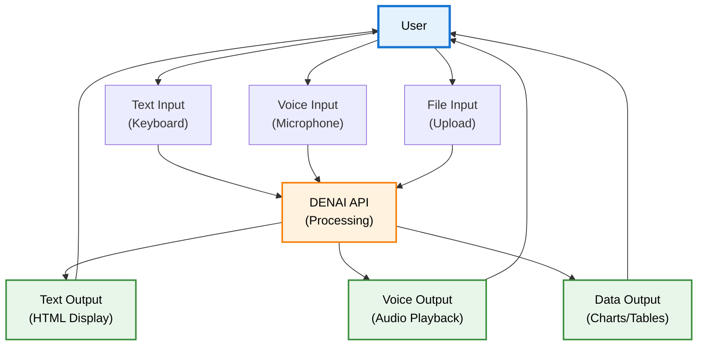
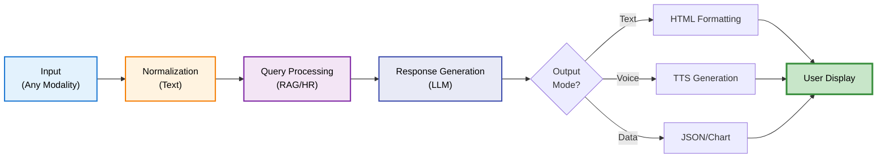
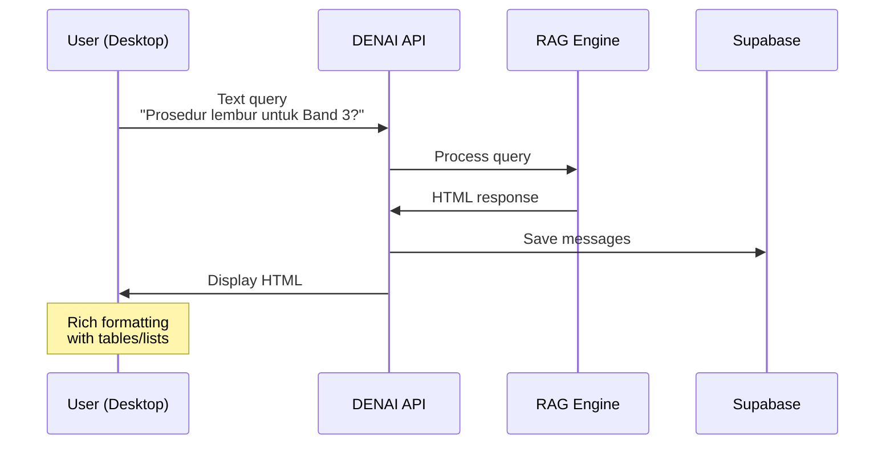
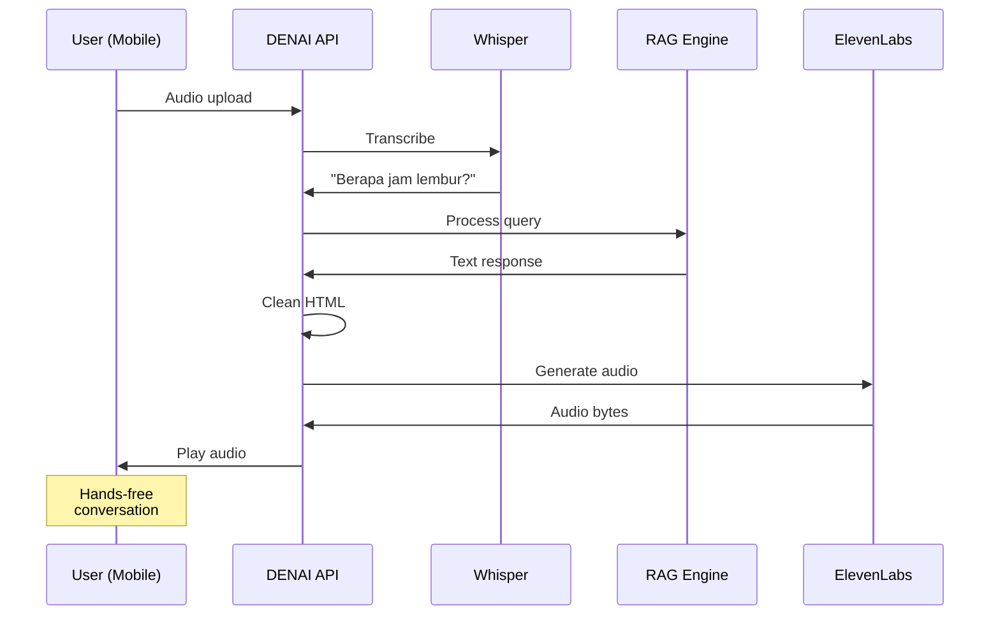
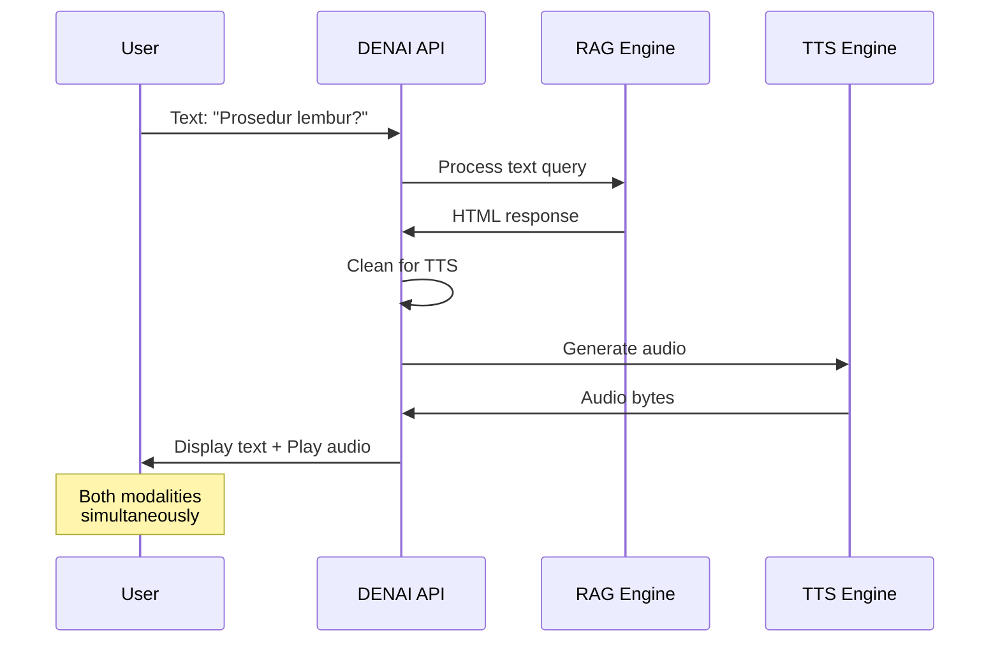
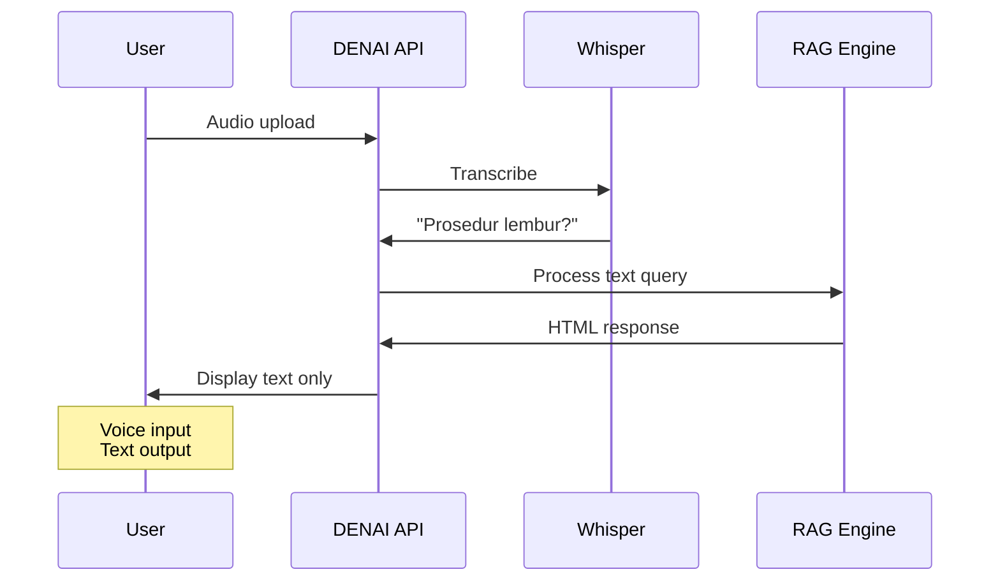
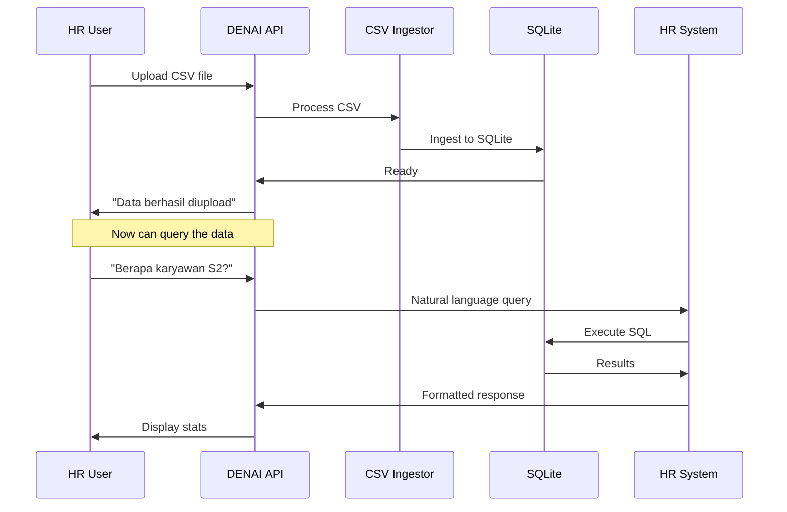
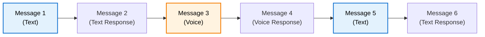

# Multi-Modal Support

## Overview

DENAI Multi-Modal Support memungkinkan interaksi melalui berbagai mode input/output secara seamless: text, voice, dan dokumen. Users dapat combine multiple modalities dalam satu conversation flow untuk pengalaman yang lebih flexible dan natural.

## Supported Modalities



### Input Modalities

| Modality | Technology | Use Case | Example |
|----------|------------|----------|---------|
| **Text** | Keyboard input | Desktop chat, complex queries | "Berapa total biaya perjalanan ke Jakarta untuk Band 2?" |
| **Voice** | WebRTC + Whisper | Hands-free, mobile, accessibility | Voice query while driving |
| **File Upload** | Multipart form | Document ingestion, data import | Upload CSV karyawan |

### Output Modalities

| Modality | Technology | Use Case | Example |
|----------|------------|----------|---------|
| **HTML** | Rich formatting | Detailed responses, tables | Formatted SOP answer dengan headers |
| **Audio** | ElevenLabs TTS | Voice responses, accessibility | Natural Indonesian voice response |
| **Structured Data** | JSON/Charts | Analytics, dashboards | HR distribution charts |

## Integration Architecture

### Unified Processing Pipeline



### Key Principle: Text as Universal Format

**All inputs normalize to text** for processing:

```python
# Voice → Text
audio_input → Whisper STT → text_query

# File → Text  
csv_upload → Parse data → text_query

# Text → Text
text_input → (no transformation) → text_query
```

**All outputs generated from text**:

```python
# Text response
text_response → HTML formatting → display

# Voice response
text_response → Clean HTML → TTS → audio

# Data response
text_response → Parse structure → JSON/chart
```

## Use Cases & Scenarios

### 1. Pure Text Chat

**Scenario**: Desktop user dengan complex query



**Implementation**:
```javascript
// Frontend
async function sendTextMessage(question) {
    const response = await fetch('/ask', {
        method: 'POST',
        body: JSON.stringify({
            question: question,
            session_id: currentSessionId
        })
    });
    
    const data = await response.json();
    displayHTMLResponse(data.answer);
}
```

### 2. Pure Voice Interaction

**Scenario**: Mobile user hands-free



**Implementation**:
```javascript
// Frontend voice flow
async function voiceQuery() {
    // 1. Record audio
    const audioBlob = await recordAudio();
    
    // 2. Send to call mode
    const formData = new FormData();
    formData.append('audio_file', audioBlob);
    formData.append('session_id', currentSessionId);
    
    const response = await fetch('/call/process', {
        method: 'POST',
        body: formData
    });
    
    // 3. Play audio response
    const audioResponse = await response.blob();
    playAudio(audioResponse);
}
```

### 3. Mixed Mode: Text Input → Voice Output

**Scenario**: User types question, wants voice answer (accessibility)



**Implementation**:
```javascript
async function sendWithVoiceResponse(question) {
    // 1. Send text query
    const textResponse = await fetch('/ask', {
        method: 'POST',
        body: JSON.stringify({question, session_id})
    });
    const data = await textResponse.json();
    
    // 2. Display text
    displayHTMLResponse(data.answer);
    
    // 3. Generate and play audio
    const audioResponse = await fetch('/speech/text-to-speech', {
        method: 'POST',
        body: `text=${encodeURIComponent(data.answer)}`
    });
    const audioBlob = await audioResponse.blob();
    playAudio(audioBlob);
}
```

### 4. Mixed Mode: Voice Input → Text Output

**Scenario**: User speaks query, prefers reading answer



**Implementation**:
```javascript
async function voiceToTextQuery() {
    // 1. Record and transcribe
    const audioBlob = await recordAudio();
    
    const formData = new FormData();
    formData.append('audio_file', audioBlob);
    
    const sttResponse = await fetch('/speech/speech-to-text', {
        method: 'POST',
        body: formData
    });
    const sttData = await sttResponse.json();
    
    // 2. Send transcript as text query
    const textResponse = await fetch('/ask', {
        method: 'POST',
        body: JSON.stringify({
            question: sttData.transcript,
            session_id: currentSessionId
        })
    });
    
    // 3. Display text response
    const data = await textResponse.json();
    displayHTMLResponse(data.answer);
}
```

### 5. File Upload + Text Interaction

**Scenario**: HR uploads CSV, queries with text



**Implementation**:
```python
# CSV upload endpoint
@app.post("/upload/csv")
async def upload_employee_csv(file: UploadFile = File(...)):
    # Save file temporarily
    file_path = f"temp/{file.filename}"
    with open(file_path, "wb") as f:
        f.write(await file.read())
    
    # Ingest to SQLite
    from universal_csv_ingestor_final import universal_ingest
    result = universal_ingest(file_path)
    
    return {
        "success": True,
        "rows_processed": result["successful"],
        "database": result["database_path"]
    }
```

## Session Continuity Across Modes

### Same Session, Different Modes

**Key Feature**: Maintain context when switching between modalities

```python
# Session tracks ALL interactions regardless of mode
session_id = "abc123"

# Text message
save_message(session_id, "user", "Prosedur lembur?")
save_message(session_id, "assistant", "<h3>Informasi...</h3>")

# Voice message (same session)
save_message(session_id, "user", "Berapa biayanya?")  # From STT
save_message(session_id, "assistant", "1.5x gaji pokok")  # For TTS

# All stored in same chat_memory table
```

**Example Flow**:



**Context Maintained**:
```python
# History includes both text and voice
history = get_recent_history(session_id)
# [
#   {"role": "user", "message": "Prosedur lembur?"},          # Text
#   {"role": "assistant", "message": "<h3>Info...</h3>"},     # Text
#   {"role": "user", "message": "Berapa biayanya?"},          # Voice
#   {"role": "assistant", "message": "1.5x gaji"},            # Voice
# ]
```

## API Endpoint Summary

### Multi-Modal Endpoints

| Endpoint | Input | Output | Use Case |
|----------|-------|--------|----------|
| `POST /ask` | Text | Text (HTML) | Standard text chat |
| `POST /call/process` | Audio | Audio | Full voice conversation |
| `POST /speech/speech-to-text` | Audio | Text | STT only |
| `POST /speech/text-to-speech` | Text | Audio | TTS only |
| `POST /upload/csv` | File | JSON | Data ingestion |

### Flexibility Matrix

| Input → Output | Text | Voice | Data |
|----------------|------|-------|------|
| **Text** | ✅ /ask | ✅ /ask + TTS | ✅ /ask (HR) |
| **Voice** | ✅ STT + /ask | ✅ /call/process | ✅ STT + /ask (HR) |
| **File** | ✅ Upload + /ask | ✅ Upload + /call | ✅ Upload (data) |

## Frontend Implementation

### Unified Chat Interface

```html
<!-- Single interface supporting all modes -->
<div class="chat-interface">
    <!-- Text input -->
    <div class="input-area">
        <input type="text" id="textInput" placeholder="Type your question...">
        <button onclick="sendText()">Send</button>
    </div>
    
    <!-- Voice controls -->
    <div class="voice-controls">
        <button onclick="startVoiceRecording()" id="voiceBtn">
            🎤 Voice
        </button>
        <button onclick="toggleAudioOutput()" id="audioToggle">
            🔊 Audio Output: ON
        </button>
    </div>
    
    <!-- File upload -->
    <div class="file-upload">
        <input type="file" id="fileInput" accept=".csv,.pdf">
        <button onclick="uploadFile()">📎 Upload</button>
    </div>
    
    <!-- Message display -->
    <div class="messages" id="messageDisplay">
        <!-- Messages appear here -->
    </div>
</div>
```

### JavaScript Controller

```javascript
// Unified message handler
async function sendMessage(content, mode = 'text') {
    let response;
    
    switch(mode) {
        case 'text':
            response = await sendTextMessage(content);
            break;
        case 'voice':
            response = await sendVoiceMessage(content);
            break;
        case 'file':
            response = await uploadFile(content);
            break;
    }
    
    // Display based on user preference
    if (audioOutputEnabled) {
        await playAudioResponse(response);
    } else {
        displayTextResponse(response);
    }
}

// Mode detection
function detectInputMode() {
    if (voiceRecording) return 'voice';
    if (fileSelected) return 'file';
    return 'text';
}
```

## Performance Considerations

### Latency by Modality

| Operation | Latency | Optimization |
|-----------|---------|--------------|
| **Text → Text** | ~1.5s | Direct processing |
| **Voice → Text** | ~3.0s | STT (1.5s) + Processing (1.5s) |
| **Text → Voice** | ~2.5s | Processing (1.5s) + TTS (1.0s) |
| **Voice → Voice** | ~4.0s | STT + Processing + TTS |
| **File → Ready** | Varies | Batch processing |

### Optimization Strategies

**1. Parallel Processing**
```python
# Process STT and load history in parallel
async def call_mode_optimized(audio_file):
    # Run STT and history loading concurrently
    transcript_task = asyncio.create_task(process_stt(audio_file))
    history_task = asyncio.create_task(get_recent_history(session_id))
    
    transcript, history = await asyncio.gather(transcript_task, history_task)
    
    # Continue with processing...
```

**2. Streaming Responses**
```python
# Stream audio immediately, don't wait for full generation
@app.post("/speech/text-to-speech")
async def text_to_speech(text: str):
    audio_content, engine = await generate_tts_audio(text)
    
    # Stream immediately
    return StreamingResponse(
        io.BytesIO(audio_content),
        media_type="audio/mpeg"
    )
```

**3. Caching**
```python
# Cache TTS for common phrases
TTS_CACHE = {}

async def generate_tts_cached(text: str):
    cache_key = hashlib.md5(text.encode()).hexdigest()
    
    if cache_key in TTS_CACHE:
        return TTS_CACHE[cache_key], "cache"
    
    audio = await generate_tts_audio(text)
    TTS_CACHE[cache_key] = audio
    
    return audio, "generated"
```

## Accessibility Features

### Multi-Modal Accessibility

**1. Visual Impairment**
- Voice input → Voice output
- Screen reader compatible HTML
- Audio descriptions for visual content

**2. Hearing Impairment**
- Text input → Text output
- Visual feedback for voice recording
- Transcripts for all audio

**3. Motor Impairment**
- Voice input (no typing needed)
- Large touch targets
- Keyboard shortcuts

**4. Cognitive Accessibility**
- Multiple input options
- Clear mode indicators
- Simple, consistent UI

## Best Practices

### For Developers

✅ **DO**:
- Normalize all inputs to text internally
- Support seamless mode switching
- Maintain session continuity across modes
- Provide fallback options for each mode
- Log mode usage for analytics
- Test cross-modal scenarios

❌ **DON'T**:
- Force users into single modality
- Lose context when switching modes
- Skip error handling per mode
- Ignore accessibility requirements
- Mix session IDs across modes

### For Users

✅ **DO**:
- Choose mode based on context (driving = voice)
- Use text for complex queries
- Use voice for hands-free scenarios
- Combine modes as needed
- Switch modes freely within session

❌ **DON'T**:
- Expect perfect STT in noisy environments
- Use voice for complex multi-step queries
- Upload large files without confirmation
- Switch modes too frequently (confusing)

## Future Enhancements

### Planned Multi-Modal Features

**1. Image Input**
- OCR for document scanning
- Visual question answering
- Chart/diagram analysis

**2. Video Input**
- Video transcription
- Visual context extraction
- Screen recording support

**3. Structured Output**
- Export to PDF/Excel
- Interactive dashboards
- Data visualization

**4. Real-Time Collaboration**
- Multi-user sessions
- Shared artifacts
- Live transcription

## Next Steps

- **[Voice Interface →](voice-interface.md)**: Deep dive into voice features
- **[Session Management →](session-management.md)**: Cross-modal session handling
- **[API Reference →](../api/overview.md)**: Complete API documentation

---

**Multi-modal support complete!** Flexible interaction across all modalities →