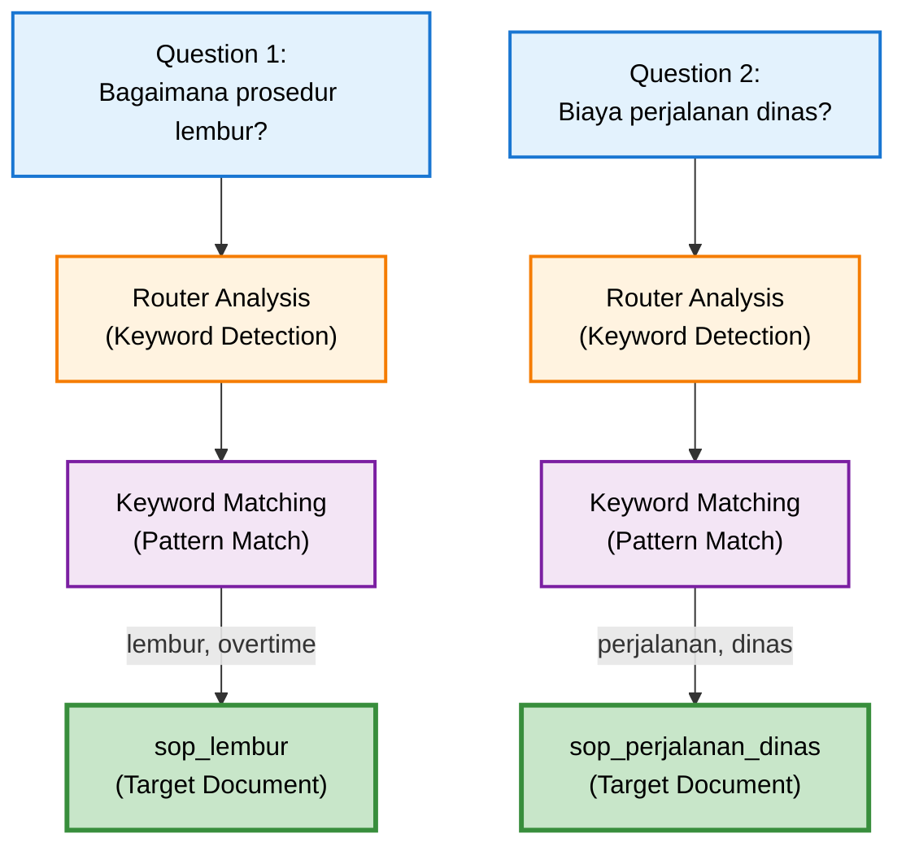

# SOP Search Engine

## Overview

Mesin Pencari SOP adalah fitur utama DENAI yang memungkinkan pengguna mencari dan mendapatkan informasi dari dokumen Standard Operating Procedure perusahaan menggunakan natural language.

## Cara Kerja

### RAG (Retrieval-Augmented Generation) Pipeline

```mermaid
graph LR
    A["User Question<br/>(Input Query)"] --> B["Hard Rules Check<br/>(Rule Matching)"]
    B -->|"Rule Match"| C["Direct Answer<br/>(Fast Response)"]
    B -->|"No Match"| D["Question Rephrasing<br/>(Optimization)"]
    D --> E["Document Type Routing<br/>(Filter Selection)"]
    E --> F["Vector Search<br/>(Similarity Match)"]
    F --> G["Retrieve Context<br/>(Top-K Docs)"]
    G --> H["LLM Processing<br/>(GPT-4o-mini)"]
    H --> I["Anti-Hallucination Check<br/>(Validation)"]
    I --> J["Formatted Response<br/>(HTML Output)"]
    
    style A fill:#e3f2fd,stroke:#1976d2,stroke-width:2px,color:#000
    style B fill:#fff3e0,stroke:#f57c00,stroke-width:2px,color:#000
    style C fill:#c8e6c9,stroke:#388e3c,stroke-width:3px,color:#000
    style D fill:#f3e5f5,stroke:#7b1fa2,stroke-width:2px,color:#000
    style E fill:#fff3e0,stroke:#f57c00,stroke-width:2px,color:#000
    style F fill:#e8eaf6,stroke:#3949ab,stroke-width:2px,color:#000
    style G fill:#e8eaf6,stroke:#3949ab,stroke-width:2px,color:#000
    style H fill:#fce4ec,stroke:#c2185b,stroke-width:2px,color:#000
    style I fill:#ffebee,stroke:#c62828,stroke-width:2px,color:#000
    style J fill:#c8e6c9,stroke:#388e3c,stroke-width:3px,color:#000
```



## Fitur Utama

### 1. Hard Rules System

System untuk meng-handle pertanyaan yang memiliki jawaban pasti berdasarkan aturan perusahaan.

**Contoh Hard Rule:**
```python
# Rule: Lembur hanya untuk Band 5
if "lembur" in question and "band" in question:
    if band != "5":
        return "Hanya karyawan Band 5 yang berhak menerima Upah Kerja Lembur"
```

**Keuntungan:**
- ✅ Jawaban konsisten 100%
- ✅ Response time cepat (bypass LLM)
- ✅ Menghindari interpretasi salah
- ✅ Cost-effective (no LLM call)

### 2. Document Type Routing

Sistem otomatis mendeteksi jenis dokumen yang relevan dengan pertanyaan.



**Doc Types:**
- `sop_lembur` - Kerja lembur dan overtime
- `sop_perjalanan_dinas` - Perjalanan dinas
- `sop_cuti` - Cuti dan leave
- `sop_rumah_dinas` - Fasilitas rumah dinas
- `sop_kesehatan` - Kesehatan dan medical
- Dan lainnya...

### 3. Context Retrieval

Menggunakan vector similarity search untuk menemukan dokumen yang paling relevan.

**Process:**
```python
# 1. Convert question to embedding
query_vector = embedder.embed_query("Bagaimana prosedur lembur?")

# 2. Search in Pinecone
results = index.query(
    vector=query_vector,
    top_k=10,
    filter={"doc_type": "sop_lembur"}  # Optional filter
)

# 3. Get top matches
top_matches = results['matches'][:5]
```

**Ranking Factors:**
- Similarity score (0.0 - 1.0)
- Document freshness
- Content relevance
- Keyword boosting

### 4. Anti-Hallucination Prompting

Sistem prompt yang mencegah LLM memberikan informasi yang tidak ada dalam dokumen.

**Strategi:**

```python
# Ultra-strict prompting
prompt = """
ATURAN WAJIB:
1. SEMUA angka, nominal HARUS persis sama dengan dokumen
2. TIDAK boleh menyebutkan jabatan yang TIDAK ada dalam dokumen
3. Jika informasi tidak ada, katakan "tidak disebutkan dalam dokumen"
4. JANGAN tambahkan informasi dari pengetahuan umum

KONTEKS SOP:
{context}

PERTANYAAN:
{question}

JAWABAN AKURAT:
"""
```

**Result:**
- Zero temperature (0.0) untuk konsistensi
- Explicit source attribution
- Fallback untuk missing info

### 5. Response Formatting

Output diformat dalam HTML untuk tampilan yang user-friendly.

```html
<h3>Informasi Kerja Lembur</h3>
<p>Maksimal kerja lembur adalah 3 jam per hari...</p>

<h3>Ketentuan dan Syarat</h3>
<ul>
<li>Persetujuan dari atasan Band 1</li>
<li>Pengajuan melalui aplikasi</li>
</ul>

<h3>Rujukan Dokumen</h3>
<ul>
<li><strong>Sumber:</strong> SKD_Kerja_Lembur.pdf</li>
<li><strong>Bagian:</strong> Halaman 6</li>
</ul>
```

## Usage Examples

### Example 1: Basic Query

**Input:**
```
Berapa jam maksimal lembur per hari?
```

**Process:**
1. Hard rules check → No match
2. Document routing → `sop_lembur`
3. Vector search → 5 relevant chunks
4. LLM processing with anti-hallucination
5. Format HTML response

**Output:**
```html
<h3>Informasi Kerja Lembur</h3>
<p>Maksimal kerja lembur adalah <strong>3 jam per hari</strong>.</p>

<h3>Ketentuan Tambahan</h3>
<ul>
<li>Diperlukan persetujuan atasan minimal Band 1</li>
<li>Pengajuan dilakukan melalui aplikasi lembur perusahaan</li>
</ul>
```

### Example 2: Hard Rule Query

**Input:**
```
Apakah karyawan Band 3 bisa lembur?
```

**Process:**
1. Hard rules check → **MATCH!**
2. Return direct answer (bypass RAG)

**Output:**
```
Berdasarkan ketentuan SOP perusahaan, hanya karyawan Band 5 
yang berhak menerima Upah Kerja Lembur. Karyawan pada band 
selain Band 5 tidak berhak menerima Upah Kerja Lembur.
```

### Example 3: Multi-hop Query

**Input:**
```
Berapa total biaya perjalanan dinas ke Jakarta untuk karyawan 
Band 2 yang menginap 2 malam?
```

**Process:**
1. Document routing → `sop_perjalanan_dinas`
2. Vector search dengan keyword: "Jakarta", "Band 2", "biaya"
3. Retrieve multiple related chunks
4. LLM aggregates information
5. Calculate if possible

**Output:**
```html
<h3>Estimasi Biaya Perjalanan Dinas</h3>
<p>Untuk perjalanan dinas ke Jakarta dengan menginap 2 malam:</p>

<h3>Komponen Biaya untuk Band 2</h3>
<ul>
<li>Akomodasi: 2 malam × USD 150 = USD 300</li>
<li>Uang harian: 3 hari × USD 80 = USD 240</li>
<li>Transportasi: Sesuai actual dengan bukti</li>
</ul>

<h3>Total Estimasi</h3>
<p><strong>USD 540</strong> + biaya transportasi actual</p>
```

## Configuration

### Model Settings

```python
# RAG Engine Config
LLM_MODEL = "gpt-4o-mini"
LLM_TEMPERATURE = 0.0  # Zero for consistency
LLM_MAX_TOKENS = 2000
EMBEDDING_MODEL = "text-embedding-3-small"

# Retrieval Config
RAG_TOP_K = 5  # Top 5 matches
RAG_STRICT_MODE = True  # Anti-hallucination ON
```

### Timeout Settings

```python
# API timeouts
API_TIMEOUT_DEFAULT = 30  # seconds
API_TIMEOUT_CALL_MODE = 15  # faster for voice
```

## Performance Metrics

| Metric | Value |
|--------|-------|
| Average Response Time | < 2 seconds |
| Accuracy Rate | 95%+ |
| Hallucination Rate | < 1% |
| Context Retrieval | < 500ms |
| LLM Processing | < 1.5s |

## Best Practices

### For Users

✅ **DO:**
- Gunakan bahasa Indonesia yang jelas
- Tanyakan satu topik per query
- Berikan konteks jika diperlukan
- Follow-up untuk klarifikasi

❌ **DON'T:**
- Gunakan singkatan yang ambigu
- Gabungkan banyak pertanyaan
- Asumsikan context dari chat sebelumnya

### For Developers

✅ **DO:**
- Update SOP documents regular
- Monitor hallucination rate
- Add hard rules untuk FAQ
- Test dengan edge cases

❌ **DON'T:**
- Bypass anti-hallucination checks
- Ignore vector DB maintenance
- Skip prompt testing

## Troubleshooting

### Issue: Jawaban tidak akurat

**Diagnosis:**
```python
# Check vector search results
matches = retrieve_context(question)
print(f"Top score: {matches[0]['score']}")
print(f"Content: {matches[0]['metadata']['text']}")
```

**Solutions:**
- Re-index documents jika outdated
- Adjust RAG_TOP_K untuk lebih banyak context
- Review anti-hallucination prompt

### Issue: Response lambat

**Diagnosis:**
```python
import time

start = time.time()
result = answer_question(question, session_id)
print(f"Total time: {time.time() - start}s")
```

**Solutions:**
- Enable response caching
- Optimize vector search filters
- Reduce LLM_MAX_TOKENS jika terlalu besar

## API Integration

### REST Endpoint

```bash
POST /ask
Content-Type: application/json

{
  "question": "Bagaimana prosedur lembur?",
  "session_id": "session_123",
  "user_role": "Employee"
}
```

**Response:**
```json
{
  "answer": "<h3>Informasi Kerja Lembur</h3>...",
  "session_id": "session_123",
  "tool_called": "search_sop",
  "authorized": true
}
```

## Next Steps

- [HR System](hr-system.md) - Query data karyawan
- [Voice Interface](voice-interface.md) - Interaksi suara
- [API Reference](../api/chat-endpoints.md) - Detail API