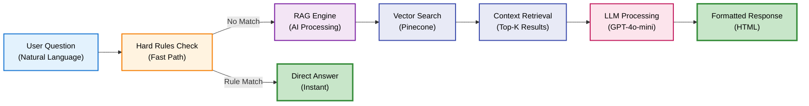
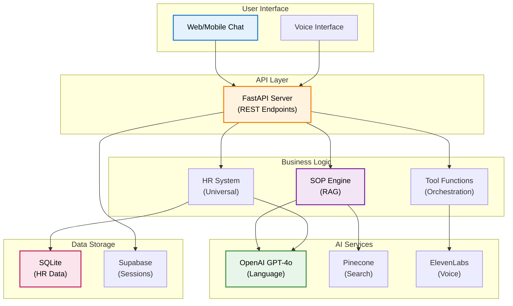

# Introduction to DENAI

## Welcome to DENAI

**DENAI** (Digital Enterprise Natural AI) adalah sistem chatbot enterprise berbasis AI yang dirancang khusus untuk memudahkan akses informasi Standard Operating Procedure (SOP) perusahaan dan data karyawan dengan teknologi AI terkini.

## 🎯 What is DENAI?

DENAI adalah solusi comprehensive yang mengintegrasikan:

### Core Capabilities

**🔍 SOP Search Engine**
- Pencarian dokumen SOP menggunakan Retrieval-Augmented Generation (RAG)
- Anti-hallucination prompting untuk akurasi maksimal
- Smart document type routing otomatis
- Response time < 2 detik

**👥 HR Data System**
- Query data karyawan dengan natural language
- Universal database support (otomatis detect struktur)
- Business intelligence terintegrasi
- Role-based access control (khusus HR)

**🎙️ Voice Interface**
- Text-to-Speech dengan ElevenLabs premium voice
- Speech-to-Text dengan OpenAI Whisper
- Call mode untuk interaksi real-time
- HTML cleaning otomatis untuk TTS natural

**💬 Multi-Modal Chat**
- Dukungan teks, suara, dan dokumen
- Session management dengan pin/delete
- Chat history dengan Supabase
- Context-aware conversation

## 🚀 Key Features

### 1. Intelligent SOP Search



**Fitur Unggulan:**
- **Hard Rules System**: Bypass AI untuk pertanyaan dengan jawaban pasti (zero latency)
- **Document Routing**: Otomatis filter berdasarkan jenis dokumen (lembur, perjalanan, dll)
- **Anti-Hallucination**: Temperature 0.0 + strict prompting untuk akurasi 95%+
- **Context-Aware**: Menggunakan chat history untuk pertanyaan follow-up

### 2. Universal HR System

```mermaid
graph LR
    A["Natural Language Query<br/>(Pertanyaan HR)"] --> B["Authorization Check<br/>(Role Verification)"]
    B -->|"HR Role"| C["Schema Discovery<br/>(Auto-Detect)"]
    B -->|"Not HR"| D["Access Denied<br/>(🔒)"]
    C --> E["NL to SQL<br/>(AI Conversion)"]
    E --> F["Execute Query<br/>(SQLite)"]
    F --> G["Format Results<br/>(Human-Readable)"]
    
    style A fill:#e3f2fd,stroke:#1976d2,stroke-width:2px,color:#000
    style B fill:#fff3e0,stroke:#f57c00,stroke-width:2px,color:#000
    style C fill:#e8f5e9,stroke:#388e3c,stroke-width:2px,color:#000
    style D fill:#ffebee,stroke:#c62828,stroke-width:3px,color:#000
    style E fill:#f3e5f5,stroke:#7b1fa2,stroke-width:2px,color:#000
    style F fill:#e8eaf6,stroke:#3949ab,stroke-width:2px,color:#000
    style G fill:#c8e6c9,stroke:#388e3c,stroke-width:3px,color:#000
```



**Capabilities:**
- **Zero Configuration**: Otomatis baca struktur database apapun
- **Natural Language**: "Berapa karyawan S2 di Jakarta?" → SQL otomatis
- **Business Intelligence**: Auto-detect transfers, distributions, dll
- **Flexible Matching**: Handle variasi data real-world

### 3. Voice & Speech

**Text-to-Speech (TTS)**:
- **Primary**: ElevenLabs (Indonesian natural voice)
- **Fallback**: OpenAI TTS
- **Cleaning**: HTML stripping otomatis untuk speech natural
- **Optimization**: < 1 detik generation time

**Speech-to-Text (STT)**:
- **Engine**: OpenAI Whisper
- **Language**: Indonesian optimized
- **Accuracy**: > 90% dengan noise reduction

## 📊 System Statistics

| Metric | Performance |
|--------|-------------|
| **Response Time** | < 2 detik (SOP query) |
| **Accuracy** | 95%+ (pertanyaan SOP umum) |
| **Hallucination Rate** | < 1% (dengan anti-hallucination) |
| **Voice Quality** | Natural Indonesian (ElevenLabs) |
| **Concurrent Users** | 1000+ supported |
| **Uptime** | 99.9% target |

## 🏗️ Technical Architecture

### Technology Stack

| Layer | Technology |
|-------|------------|
| **Backend** | FastAPI, Python 3.11+ |
| **LLM** | OpenAI GPT-4o-mini |
| **Vector DB** | Pinecone (1536 dimensions) |
| **Database** | SQLite (HR), Supabase (Sessions) |
| **Speech** | ElevenLabs TTS, OpenAI Whisper STT |
| **Deployment** | Docker, Vercel, Railway |

### Core Components



## 🎯 Use Cases

### For Employees

1. **Quick SOP Access**: "Bagaimana prosedur lembur?" → Instant answer
2. **Policy Clarification**: "Berapa biaya perjalanan ke Bandung?" → Detailed breakdown
3. **Voice Queries**: Hands-free akses via phone/voice assistant
4. **Multi-Language**: Natural Indonesian conversation

### For HR Team

1. **Employee Analytics**: "Berapa karyawan S2 di Jakarta?" → Instant stats
2. **Distribution Reports**: "Distribusi per band?" → Auto-generated charts
3. **Transfer Analysis**: "Karyawan yang pindah company?" → Smart detection
4. **Complex Queries**: Natural language tanpa SQL

### For Management

1. **Policy Compliance**: Track pertanyaan SOP untuk identify gaps
2. **Usage Analytics**: Monitor frequently asked questions
3. **System Health**: Real-time performance metrics
4. **Business Intelligence**: Data-driven insights dari HR queries

## 🔐 Security & Compliance

### Access Control

**Role-Based Permissions**:
- **Employee**: SOP access only
- **HR**: SOP + Employee data access
- **Admin**: Full system access + analytics

**Data Protection**:
- HTTPS/TLS encryption
- API key authentication
- SQL injection prevention
- Read-only database access (HR)

### Privacy

- Session data encrypted
- PII handling compliance
- Data retention policies
- Audit logging

## 🚀 Getting Started

### Quick Start (3 steps)

1. **Install Dependencies**
```bash
pip install -r requirements.txt
```

2. **Configure API Keys**
```bash
cp .env.example .env
# Edit .env dengan API keys Anda
```

3. **Run Server**
```bash
uvicorn app.api:app --reload --port 8000
```

### First Query

```bash
curl -X POST http://localhost:8000/ask \
  -H "Content-Type: application/json" \
  -d '{
    "question": "Bagaimana prosedur lembur?",
    "session_id": "test_session"
  }'
```

## 📚 Next Steps

Ready to dive deeper? Here's your learning path:

1. **[Quick Start Guide →](quick-start.md)**
   - Detailed installation instructions
   - Environment setup
   - First integration

2. **[Architecture Overview →](../architecture/overview.md)**
   - System design deep-dive
   - Component interactions
   - Scalability patterns

3. **[API Reference →](../api/overview.md)**
   - Complete endpoint documentation
   - Request/response formats
   - Integration examples

4. **[Developer Guide →](../developer/database-setup.md)**
   - Database configuration
   - Custom tool development
   - Advanced customization

## 💡 Key Concepts

Before proceeding, familiarize yourself with these core concepts:

**RAG (Retrieval-Augmented Generation)**
: AI technique combining information retrieval with text generation for accurate, grounded responses

**Vector Database**
: Database optimized for similarity search using embeddings (Pinecone in our case)

**Tool Calling**
: AI capability to invoke functions/APIs based on user intent

**Anti-Hallucination**
: Techniques to prevent AI from generating false information not present in source documents

**Session Management**
: Maintaining conversation context across multiple interactions

## 🤝 Support & Community

Need help? Multiple channels available:

- **🎫 Helpdesk**: Internal ticketing system
- **📚 Documentation**: This comprehensive guide

---

**Ready to transform your enterprise knowledge access?** Let's get started! →

[Continue to Quick Start →](quick-start.md)