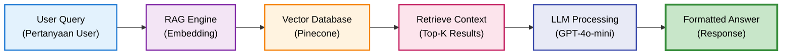

# DENAI - Dokumentasi Sistem Chatbot SOP Enterprise

Selamat datang di dokumentasi **DENAI** (Digital Enterprise Natural AI), sistem chatbot enterprise yang dirancang untuk mempermudah akses informasi SOP perusahaan dan data karyawan dengan teknologi AI terkini.

## 🎯 Apa itu DENAI?

DENAI adalah sistem chatbot berbasis AI yang mengintegrasikan:

- **🔍 Mesin Pencari SOP** - Akses cepat ke dokumen Standard Operating Procedure perusahaan
- **👥 Sistem Data HR** - Query data karyawan dengan natural language (khusus HR)
- **🎙️ Interface Suara** - Interaksi hands-free dengan text-to-speech dan speech-to-text
- **🧠 RAG Engine** - Retrieval-Augmented Generation untuk jawaban akurat
- **📊 Database Universal** - Otomatis membaca struktur database apapun

## ✨ Fitur Utama

### 1. Pencarian SOP Cerdas



### 2. Sistem HR Universal
- Deteksi otomatis struktur database
- Query natural language untuk data karyawan
- Business intelligence terintegrasi
- Authorization berbasis role

### 3. Voice Interface
- Text-to-Speech dengan ElevenLabs & OpenAI
- Speech-to-Text dengan Whisper
- Call mode untuk interaksi real-time
- Cleaning HTML otomatis untuk output natural

## 🚀 Quick Start

```bash
# 1. Clone repository
git clone https://github.com/your-org/denai.git
cd denai

# 2. Install dependencies
pip install -r requirements.txt

# 3. Setup environment variables
cp .env.example .env
# Edit .env dengan API keys Anda

# 4. Run server
uvicorn app.api:app --reload --host 0.0.0.0 --port 8000
```

## 📚 Navigasi Dokumentasi

### 🚀 Getting Started
Panduan instalasi, konfigurasi, dan quick start untuk memulai dengan DENAI

[→ Mulai di sini](getting-started/introduction.md)

---

### 🏗️ Architecture
Arsitektur sistem, komponen utama, dan alur data dalam DENAI

[→ Lihat arsitektur](architecture/overview.md)

---

### 🛠️ Features
Dokumentasi lengkap fitur-fitur utama DENAI dan cara penggunaannya

[→ Explore fitur](features/sop-search.md)

---

### 📡 API Reference
Referensi lengkap REST API endpoints, request/response format

[→ API docs](api/overview.md)

---

### 💻 Developer Guide
Panduan development, setup database, dan integrasi tools

[→ Dev guide](developer/database-setup.md)

---

### 🔒 Best Practices
Best practices, security guidelines, dan production tips

[→ Best practices](developer/authentication.md)

## 🎨 Tech Stack

DENAI dibangun dengan teknologi modern dan scalable:

| Komponen | Teknologi |
|----------|-----------|
| **Backend** | FastAPI, Python 3.11+ |
| **LLM** | OpenAI GPT-4o-mini |
| **Vector DB** | Pinecone |
| **Database** | SQLite, Supabase |
| **Speech** | ElevenLabs, OpenAI TTS, Whisper |
| **Deployment** | Docker, Vercel, Railway |

## 📊 Statistik Sistem

- **⚡ Response Time**: < 2 detik untuk query SOP
- **🎯 Accuracy**: 95%+ untuk pertanyaan SOP umum
- **🗣️ Voice Quality**: Natural Indonesian voice dengan ElevenLabs
- **📈 Scalability**: Mendukung 1000+ concurrent users
- **🔒 Security**: Role-based access control untuk data HR

## 🤝 Kontribusi

DENAI adalah sistem internal. Untuk pertanyaan atau issue:

1. Hubungi tim IT perusahaan
2. Submit ticket di internal helpdesk
3. Email ke: it-support@company.com

## 📝 Changelog

### Version 6.2.0 (Latest)
- ✅ Natural TTS dengan pembersihan HTML
- ✅ Sistem HR universal otomatis
- ✅ Evaluasi RAG enterprise lengkap
- ✅ Optimized PDF ingestion
- ✅ Session management dengan pin/delete

[Lihat changelog lengkap →](https://github.com/your-org/denai/CHANGELOG.md)

## 📄 Lisensi

© 2025 SIG. All rights reserved.

---

**Ready to start?** → [Quick Start Guide](getting-started/quick-start.md)