# DENAI Documentation

> **Digital Enterprise Natural AI**  
> Sistem Chatbot SOP Enterprise berbasis AI

Dokumentasi lengkap untuk **DENAI**, sistem chatbot AI yang memudahkan akses SOP perusahaan dan data karyawan secara cepat, aman, dan terstruktur.

---

## 🚀 Quick Links

- 📖 **[Dokumentasi Lengkap](https://denai-docs.vercel.app)**
- 🎯 **[Quick Start](https://denai-docs.vercel.app/getting-started/quick-start)**
- 🏗️ **[Architecture](https://denai-docs.vercel.app/architecture/overview)**
- 📚 **[API Reference](https://denai-docs.vercel.app/api/overview)**

---

## ✨ Fitur Utama

- 🔍 SOP Search Engine (RAG-powered)
- 👥 HR System Universal (auto schema detection)
- 🎙️ Voice Interface (STT & TTS)
- 💬 Multi-Modal Chat
- 🧠 Anti-Hallucination Prompting
- 🔒 Role-Based Access Control

---

## 📚 Struktur Dokumentasi

```

docs/
├── getting-started/     # Instalasi & setup
├── architecture/        # Arsitektur sistem
├── features/            # Dokumentasi fitur
├── api/                 # API reference
└── developer/           # Developer guide

````

---

## 🛠️ Tech Stack

- **Backend:** FastAPI, Python 3.11+
- **AI/ML:** GPT-4o-mini, Pinecone, Whisper
- **Database:** SQLite, Supabase
- **Speech:** ElevenLabs, OpenAI TTS
- **Deployment:** Docker, Vercel, Railway

---

## 🚀 Quick Start

```bash
git clone https://github.com/your-org/denai.git
cd denai

pip install -r requirements.txt

cp .env.example .env
# isi API key di .env

uvicorn app.api:app --reload
````

Server berjalan di:
👉 `http://localhost:8000`

---

## 📖 Documentation Development

### Local Development

```bash
pip install mkdocs-material
mkdocs serve
```

### Build Static Site

```bash
mkdocs build
```

### Deploy ke Vercel

```bash
npm i -g vercel
vercel
vercel --prod
```

---

## 🤝 Contributing

1. Fork repository
2. Buat branch baru

   ```bash
   git checkout -b feature/new-doc
   ```
3. Edit file di `docs/`
4. Test lokal

   ```bash
   mkdocs serve
   ```
5. Commit & push
6. Buat Pull Request

---

## 📝 Writing Guidelines

### Markdown Style

* Gunakan heading hierarchy (H1 → H2 → H3)
* Sertakan contoh kode
* Gunakan Mermaid untuk flow
* Gunakan admonition (`!!! note`, `!!! warning`)

---

### Mermaid Diagrams


---

### Code Blocks

```python
def example():
    return "Hello DENAI"
```

---

## 🎨 Documentation Theme

* **Theme:** Material for MkDocs
* **Primary Color:** Indigo
* **Accent Color:** Blue
* **Font:** Roboto / Roboto Mono
* **Dark Mode:** Supported

---

## 📊 Documentation Structure

```mermaid
graph TB
    Home["Home (Index)"] --> GS["Getting Started"]
    Home --> Arch["Architecture"]
    Home --> Feat["Features"]
    Home --> API["API Reference"]
    Home --> Dev["Developer Guide"]

    GS --> GS1["Introduction"]
    GS --> GS2["Installation"]
    GS --> GS3["Configuration"]

    Arch --> A1["System Overview"]
    Arch --> A2["Core Components"]
    Arch --> A3["Data Flow"]

    Feat --> F1["SOP Search"]
    Feat --> F2["HR System"]
    Feat --> F3["Voice Interface"]
    Feat --> F4["Multi-Modal"]

    API --> API1["Overview"]
    API --> API2["Chat Endpoints"]
    API --> API3["Voice Endpoints"]

    Dev --> D1["Database Setup"]
    Dev --> D2["CSV Ingestion"]
    Dev --> D3["RAG Engine"]
    Dev --> D4["Tool Integration"]
    Dev --> D5["Authentication"]

    style Home fill:#e3f2fd,stroke:#1976d2,stroke-width:3px,color:#000
```



---

## 🔗 Useful Links

* GitHub Repository
  [https://github.com/your-org/denai](https://github.com/your-org/denai)
* Documentation
  [https://denai-docs.vercel.app](https://denai-docs.vercel.app)
* MkDocs Material
  [https://squidfunk.github.io/mkdocs-material/](https://squidfunk.github.io/mkdocs-material/)
* Mermaid
  [https://mermaid.js.org/](https://mermaid.js.org/)

---

## 📄 License

© 2025 SIG. All rights reserved.

---

**Built using [MkDocs Material](https://squidfunk.github.io/mkdocs-material/)**