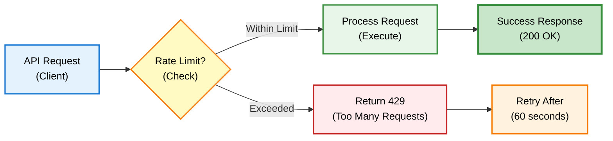
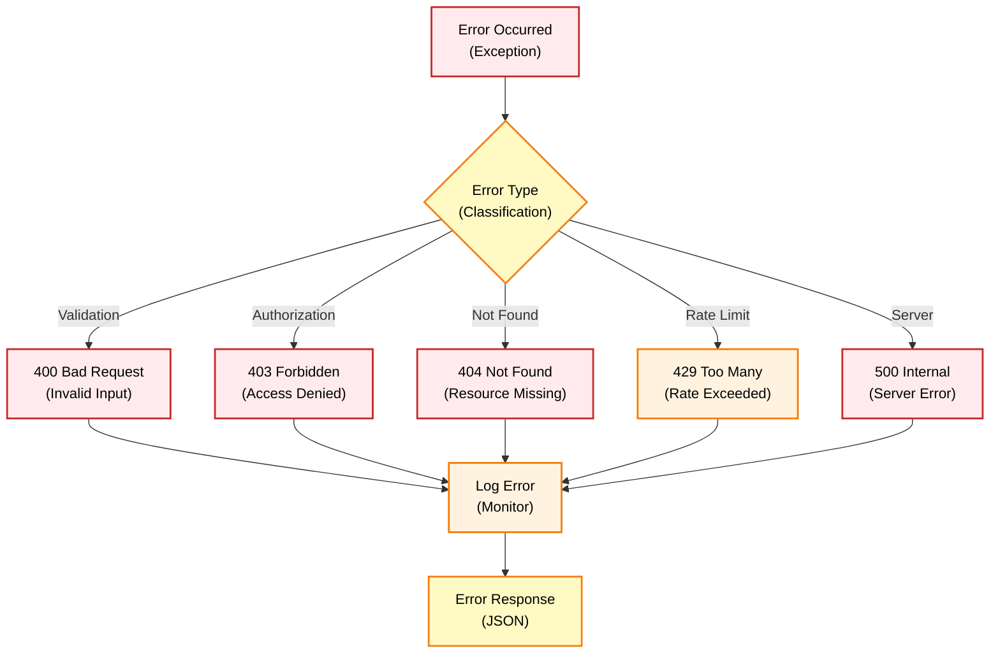

# Chat Endpoints - API Reference

## Overview

Chat endpoints menyediakan text-based conversational interface dengan DENAI. Endpoints ini mendukung SOP search, HR data queries, dan tool calling dengan intelligent routing.

## Base URL

```
Production: https://api.denai.company/v1
Development: http://localhost:8000
```

## Authentication

```http
Authorization: Bearer <your_api_key>
X-User-Role: Employee|HR
```

## Endpoints

### POST /ask

Submit text-based question untuk mendapatkan AI response.

```mermaid
sequenceDiagram
    participant C as Client<br/>(App)
    participant A as API<br/>(/ask)
    participant R as RAG<br/>(Engine)
    participant T as Tools<br/>(Functions)
    participant M as Memory<br/>(Supabase)
    
    C->>A: POST /ask
    Note over C,A: {question, session_id, user_role}
    
    A->>A: Validate input
    Note over A: Check required fields
    
    A->>M: Get history
    Note over A,M: Recent 4 messages
    
    M-->>A: Return history
    Note over M,A: Context for AI
    
    A->>R: Process question
    Note over A,R: RAG pipeline
    
    R->>R: Check hard rules
    Note over R: Policy enforcement
    
    alt Hard Rule Match
        R-->>A: Direct response
        Note over R,A: Policy answer
    else No Hard Rule
        R->>T: Analyze for tools
        Note over R,T: Function calling
        
        alt Tool Needed
            T->>T: Execute tool
            Note over T: SOP/HR search
            T-->>R: Tool result
        end
        
        R->>R: Generate response
        Note over R: LLM synthesis
        R-->>A: Final answer
    end
    
    A->>M: Save messages
    Note over A,M: User + Assistant
    
    A-->>C: Return response
    Note over A,C: HTML formatted
    
    style C fill:#e3f2fd,stroke:#1976d2,stroke-width:2px,color:#000
    style A fill:#fff3e0,stroke:#f57c00,stroke-width:2px,color:#000
    style R fill:#f3e5f5,stroke:#7b1fa2,stroke-width:2px,color:#000
    style T fill:#e8f5e9,stroke:#388e3c,stroke-width:2px,color:#000
    style M fill:#fff9c4,stroke:#f57f17,stroke-width:2px,color:#000
```

#### Request

**Headers:**
```http
Content-Type: application/json
X-User-Role: Employee
```

**Body:**
```json
{
  "question": "Bagaimana prosedur lembur untuk Band 3?",
  "session_id": "optional-session-id",
  "user_role": "Employee"
}
```

**Parameters:**

| Field | Type | Required | Description |
|-------|------|----------|-------------|
| `question` | string | ✅ Yes | User's question in natural language |
| `session_id` | string | ❌ No | Session ID for conversation context (auto-generated if not provided) |
| `user_role` | string | ❌ No | User role: "Employee" or "HR" (default: "Employee") |

#### Response

**Success Response (200 OK):**

```json
{
  "answer": "<h3>Informasi Kerja Lembur</h3><p>Berdasarkan ketentuan SOP perusahaan, hanya karyawan Band 5 yang berhak menerima Upah Kerja Lembur. Karyawan pada band selain Band 5 tidak berhak menerima Upah Kerja Lembur.</p><h3>Rujukan Dokumen</h3><ul><li><strong>Sumber:</strong> SKD_Kerja_Lembur.pdf</li><li><strong>Bagian:</strong> Halaman 6</li></ul>",
  "session_id": "550e8400-e29b-41d4-a716-446655440000",
  "tool_called": "search_sop",
  "authorized": true
}
```

**Response Fields:**

| Field | Type | Description |
|-------|------|-------------|
| `answer` | string | AI-generated response in HTML format |
| `session_id` | string | Session ID for conversation continuity |
| `tool_called` | string/null | Name of tool used (if any): "search_sop", "search_hr_data" |
| `authorized` | boolean | Whether user was authorized for the request |

**Error Response (400 Bad Request):**

```json
{
  "error": "Question is required",
  "session_id": "550e8400-e29b-41d4-a716-446655440000"
}
```

**Error Response (403 Forbidden):**

```json
{
  "answer": "🔒 Data karyawan hanya dapat diakses oleh tim HR.",
  "session_id": "550e8400-e29b-41d4-a716-446655440000",
  "tool_called": "search_hr_data",
  "authorized": false
}
```

**Error Response (500 Internal Server Error):**

```json
{
  "error": "Server error. Silakan coba lagi.",
  "session_id": "550e8400-e29b-41d4-a716-446655440000"
}
```

#### Example Usage

=== "Python"

    ```python
    import requests
    
    url = "http://localhost:8000/ask"
    
    payload = {
        "question": "Berapa jam maksimal lembur per hari?",
        "session_id": "my-session-123",
        "user_role": "Employee"
    }
    
    headers = {
        "Content-Type": "application/json",
        "X-User-Role": "Employee"
    }
    
    response = requests.post(url, json=payload, headers=headers)
    
    if response.status_code == 200:
        data = response.json()
        print(f"Answer: {data['answer']}")
        print(f"Session: {data['session_id']}")
        print(f"Tool Used: {data.get('tool_called')}")
    else:
        print(f"Error: {response.status_code}")
        print(response.json())
    ```

=== "JavaScript"

    ```javascript
    const url = "http://localhost:8000/ask";
    
    const payload = {
      question: "Berapa jam maksimal lembur per hari?",
      session_id: "my-session-123",
      user_role: "Employee"
    };
    
    fetch(url, {
      method: "POST",
      headers: {
        "Content-Type": "application/json",
        "X-User-Role": "Employee"
      },
      body: JSON.stringify(payload)
    })
    .then(response => response.json())
    .then(data => {
      console.log("Answer:", data.answer);
      console.log("Session:", data.session_id);
      console.log("Tool Used:", data.tool_called);
    })
    .catch(error => console.error("Error:", error));
    ```

=== "cURL"

    ```bash
    curl -X POST http://localhost:8000/ask \
      -H "Content-Type: application/json" \
      -H "X-User-Role: Employee" \
      -d '{
        "question": "Berapa jam maksimal lembur per hari?",
        "session_id": "my-session-123",
        "user_role": "Employee"
      }'
    ```

#### Response Formats

**SOP Search Response:**
```html
<h3>Informasi Kerja Lembur</h3>
<p>Maksimal kerja lembur adalah 3 jam per hari untuk hari kerja normal.</p>

<h3>Ketentuan dan Syarat</h3>
<ul>
<li>Persetujuan dari Atasan minimal Band 1 diperlukan</li>
<li>Maksimal 16 jam per bulan untuk karyawan Band 5</li>
<li>Upah lembur dibayar 1.5x gaji pokok per jam</li>
</ul>

<h3>Rujukan Dokumen</h3>
<ul>
<li><strong>Sumber:</strong> SKD_Kerja_Lembur.pdf</li>
<li><strong>Bagian:</strong> Halaman 6</li>
</ul>
```

**HR Data Response (HR Role):**
```
📊 **Distribusi Pendidikan Karyawan**

• S2: 145 orang (29.0%)
• S1: 280 orang (56.0%)
• D3: 75 orang (15.0%)

**Total: 500 orang**
```

**Authorization Denied Response:**
```
🔒 Data karyawan hanya dapat diakses oleh tim HR.
```

## Rate Limiting



**Limits:**
- 60 requests per minute per IP
- 1000 requests per hour per user

**Rate Limit Headers:**
```http
X-RateLimit-Limit: 60
X-RateLimit-Remaining: 45
X-RateLimit-Reset: 1640995200
```

**Rate Limit Exceeded Response (429):**
```json
{
  "error": "Rate limit exceeded",
  "retry_after": 60
}
```

## Error Handling

### Error Response Flow



### Error Codes

| Code | Error | Description | Action |
|------|-------|-------------|--------|
| `400` | Bad Request | Invalid request format or missing required fields | Check request payload |
| `403` | Forbidden | Insufficient permissions for resource | Verify user role |
| `404` | Not Found | Endpoint not found | Check API path |
| `429` | Too Many Requests | Rate limit exceeded | Wait and retry |
| `500` | Internal Server Error | Server error | Contact support |
| `503` | Service Unavailable | Service temporarily down | Retry later |

### Common Error Scenarios

**Missing Required Field:**
```json
{
  "error": "Question is required",
  "session_id": null
}
```

**Invalid Role:**
```json
{
  "error": "Invalid user role. Must be 'Employee' or 'HR'",
  "session_id": "550e8400-e29b-41d4-a716-446655440000"
}
```

**RAG Engine Error:**
```json
{
  "error": "Server error. Silakan coba lagi.",
  "session_id": "550e8400-e29b-41d4-a716-446655440000"
}
```

## Best Practices

### Request Optimization

```mermaid
graph LR
    Request["Optimize Request<br/>(Client)"] --> Reuse["Reuse session_id<br/>(Context)"]
    Reuse --> Short["Keep questions concise<br/>(Clarity)"]
    Short --> Role["Set correct user_role<br/>(Authorization)"]
    Role --> Handle["Handle errors gracefully<br/>(UX)"]
    Handle --> Cache["Cache responses<br/>(Performance)"]
    
    style Request fill:#e3f2fd,stroke:#1976d2,stroke-width:2px,color:#000
    style Reuse fill:#e8f5e9,stroke:#388e3c,stroke-width:2px,color:#000
    style Short fill:#e8f5e9,stroke:#388e3c,stroke-width:2px,color:#000
    style Role fill:#e8f5e9,stroke:#388e3c,stroke-width:2px,color:#000
    style Handle fill:#e8f5e9,stroke:#388e3c,stroke-width:2px,color:#000
    style Cache fill:#c8e6c9,stroke:#388e3c,stroke-width:3px,color:#000
```



### DO's ✅

1. **Reuse session IDs** for conversation continuity
   ```python
   # Good: Reuse session
   session_id = "user-123-session"
   for question in questions:
       response = ask(question, session_id=session_id)
   ```

2. **Set appropriate user role** for authorization
   ```python
   # Good: Explicit role
   response = ask("berapa karyawan?", user_role="HR")
   ```

3. **Handle errors gracefully**
   ```python
   # Good: Error handling
   try:
       response = ask(question)
   except requests.HTTPError as e:
       if e.response.status_code == 429:
           time.sleep(60)  # Wait for rate limit
           response = ask(question)
   ```

### DON'Ts ❌

1. **Don't create new session for every request**
   ```python
   # Bad: Creates orphaned sessions
   for question in questions:
       response = ask(question)  # New session each time
   ```

2. **Don't ignore authorization errors**
   ```python
   # Bad: No error handling
   response = ask("data karyawan", user_role="Employee")
   print(response['answer'])  # May be access denied
   ```

3. **Don't send extremely long questions**
   ```python
   # Bad: Too long
   question = "..." * 10000  # Exceeds token limits
   ```

## Testing

### Unit Test Example

```python
import pytest
from fastapi.testclient import TestClient
from app.api import app

client = TestClient(app)

def test_ask_endpoint_success():
    """Test successful ask request"""
    response = client.post("/ask", json={
        "question": "Apa itu DENAI?",
        "user_role": "Employee"
    })
    
    assert response.status_code == 200
    data = response.json()
    assert "answer" in data
    assert "session_id" in data
    assert len(data["answer"]) > 0

def test_ask_endpoint_missing_question():
    """Test missing question field"""
    response = client.post("/ask", json={
        "user_role": "Employee"
    })
    
    assert response.status_code == 400
    data = response.json()
    assert "error" in data

def test_ask_endpoint_hr_authorization():
    """Test HR authorization"""
    # Employee trying to access HR data
    response = client.post("/ask", json={
        "question": "berapa total karyawan?",
        "user_role": "Employee"
    })
    
    data = response.json()
    if data.get("tool_called") == "search_hr_data":
        assert data["authorized"] == False
        assert "🔒" in data["answer"]
```

## Related Endpoints

- [Voice Endpoints](voice-endpoints.md) - Voice-based interaction
- [Session Endpoints](session-endpoints.md) - Session management
- [Status Endpoints](status-endpoints.md) - System status