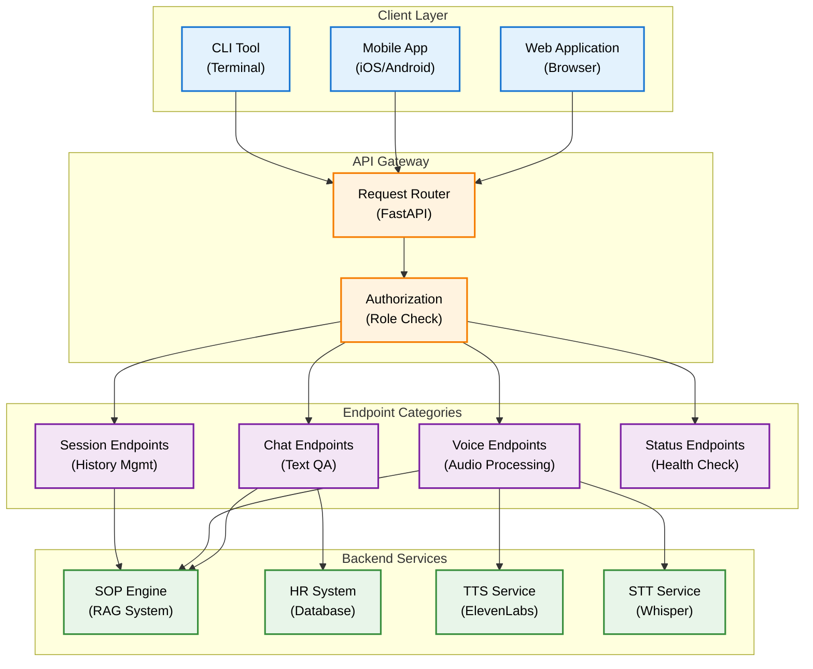
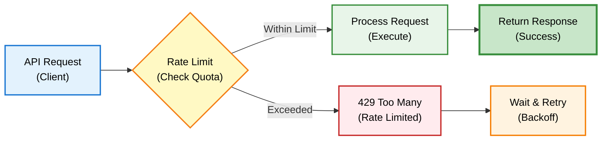

# API Reference - Overview

DENAI menyediakan RESTful API yang lengkap untuk integrasi dengan aplikasi Anda.

## Base URL

```
Production: https://denai.your-company.com
Development: http://localhost:8000
```

## Authentication

Saat ini DENAI menggunakan role-based authorization melalui `user_role` parameter.

```json
{
  "user_role": "Employee" | "HR"
}
```

**Planned:** API key authentication untuk production.

## API Architecture



## Endpoint Overview

### Chat Endpoints

| Endpoint | Method | Description | Auth Required |
|----------|--------|-------------|---------------|
| `/ask` | POST | Text-based question answering | Optional (role-based) |
| `/sessions` | GET | List all chat sessions | No |
| `/history/:id` | GET | Get chat history for session | No |
| `/sessions/:id/pin` | POST | Toggle pin status | No |
| `/sessions/:id` | DELETE | Delete session | No |

### Voice Endpoints

| Endpoint | Method | Description | Auth Required |
|----------|--------|-------------|---------------|
| `/speech/text-to-speech` | POST | Convert text to speech | No |
| `/speech/speech-to-text` | POST | Convert speech to text | No |
| `/call/process` | POST | Process voice call end-to-end | Optional (role-based) |
| `/speech/status` | GET | Get speech system status | No |

### Status Endpoints

| Endpoint | Method | Description | Auth Required |
|----------|--------|-------------|---------------|
| `/` | GET | Service info | No |
| `/health` | GET | Health check | No |
| `/user/role` | GET | Get user role info | No |

## Request Flow

### Standard Chat Request

```mermaid
sequenceDiagram
    participant C as Client<br/>(Application)
    participant A as API Gateway<br/>(FastAPI)
    participant R as Router<br/>(Tool Selection)
    participant E as Engine<br/>(SOP/HR)
    participant D as Database<br/>(Storage)
    
    C->>A: POST /ask
    Note over C,A: {"question": "...", "session_id": "..."}
    
    A->>A: Validate Input
    Note over A: Check required fields
    
    A->>R: Route Request
    Note over A,R: Determine tool to use
    
    alt SOP Query
        R->>E: search_sop()
        Note over R,E: RAG retrieval
    else HR Query
        R->>R: Check Authorization
        Note over R: Verify HR role
        alt Authorized
            R->>E: search_hr_data()
            Note over R,E: Database query
        else Unauthorized
            R-->>A: 403 Forbidden
            A-->>C: Error Response
        end
    end
    
    E->>D: Retrieve Data
    Note over E,D: Vector/SQL query
    
    D-->>E: Data Results
    E->>E: Process & Format
    Note over E: Generate response
    
    E-->>A: Formatted Answer
    A-->>C: JSON Response
    Note over A,C: {"answer": "...", "tool_called": "..."}
    
    style C fill:#e3f2fd,stroke:#1976d2,stroke-width:2px,color:#000
    style A fill:#fff3e0,stroke:#f57c00,stroke-width:2px,color:#000
    style R fill:#f3e5f5,stroke:#7b1fa2,stroke-width:2px,color:#000
    style E fill:#e8f5e9,stroke:#388e3c,stroke-width:2px,color:#000
    style D fill:#fce4ec,stroke:#c2185b,stroke-width:2px,color:#000
```

### Voice Call Request

```mermaid
sequenceDiagram
    participant C as Client<br/>(Application)
    participant A as API<br/>(Server)
    participant S as STT<br/>(Whisper)
    participant P as Processor<br/>(Engine)
    participant T as TTS<br/>(ElevenLabs)
    
    C->>A: POST /call/process
    Note over C,A: Upload audio file (WAV)
    
    A->>S: Transcribe Audio
    Note over A,S: Speech to text
    
    S-->>A: Text Transcript
    Note over S,A: Extracted question
    
    A->>P: Process Query
    Note over A,P: Route to SOP/HR
    
    P-->>A: Text Response
    Note over P,A: Generated answer
    
    A->>A: Clean HTML
    Note over A: Remove formatting
    
    A->>T: Generate Speech
    Note over A,T: Text to audio
    
    T-->>A: Audio File
    Note over T,A: MP3 output
    
    A-->>C: Return Audio
    Note over A,C: Stream/Download
    
    style C fill:#e3f2fd,stroke:#1976d2,stroke-width:2px,color:#000
    style A fill:#fff3e0,stroke:#f57c00,stroke-width:2px,color:#000
    style S fill:#e8f5e9,stroke:#388e3c,stroke-width:2px,color:#000
    style P fill:#f3e5f5,stroke:#7b1fa2,stroke-width:2px,color:#000
    style T fill:#e8f5e9,stroke:#388e3c,stroke-width:2px,color:#000
```

## Request/Response Format

### Standard Request

```json
{
  "question": "string",
  "session_id": "string (optional)",
  "user_role": "Employee | HR (optional, default: Employee)"
}
```

### Standard Response

```json
{
  "answer": "string (HTML formatted)",
  "session_id": "string",
  "tool_called": "search_sop | search_hr_data | null",
  "authorized": "boolean (optional)"
}
```

### Error Response

```json
{
  "error": "string",
  "detail": "string (optional)",
  "session_id": "string (optional)"
}
```

## HTTP Status Codes

| Code | Meaning | Use Case |
|------|---------|----------|
| 200 | Success | Request processed successfully |
| 400 | Bad Request | Invalid parameters or malformed request |
| 403 | Forbidden | Authorization required (HR access) |
| 404 | Not Found | Resource does not exist |
| 500 | Internal Server Error | Server-side processing error |
| 504 | Gateway Timeout | Request took too long to process |

## Response Headers

### Standard Headers

```http
Content-Type: application/json
Cache-Control: no-cache
X-Request-ID: uuid4
X-Response-Time: 1234ms
```

### Voice Response Headers

```http
Content-Type: audio/mpeg
Content-Disposition: attachment; filename=denai_natural.mp3
X-Voice: Indonesian-Natural
X-Engine: elevenlabs | openai
X-Natural-Speech: true
```

## Tool Calling System

DENAI menggunakan function calling untuk routing queries ke engine yang sesuai.

```mermaid
graph TB
    Q["User Question<br/>(Input)"] --> LLM["LLM Router<br/>(GPT-4o-mini)"]
    
    LLM --> Decision{Tool Selection<br/>(Classification)}
    
    Decision -->|"SOP Related"| T1["search_sop<br/>(Function Call)"]
    Decision -->|"HR Related"| T2["search_hr_data<br/>(Function Call)"]
    Decision -->|"General"| T3["Direct Answer<br/>(No Tool)"]
    
    T1 --> RAG["RAG Engine<br/>(Vector Search)"]
    T2 --> AuthCheck{"Authorization<br/>(Role Check)"}
    
    AuthCheck -->|"HR Role"| HR["HR System<br/>(SQL Query)"]
    AuthCheck -->|"Not HR"| Deny["Access Denied<br/>(403 Error)"]
    
    RAG --> Format["Format Response<br/>(Clean HTML)"]
    HR --> Format
    T3 --> Format
    
    Format --> Output["Final Answer<br/>(JSON Response)"]
    Deny --> Error["Error Response<br/>(JSON)"]
    
    style Q fill:#e3f2fd,stroke:#1976d2,stroke-width:2px,color:#000
    style LLM fill:#fff3e0,stroke:#f57c00,stroke-width:2px,color:#000
    style Decision fill:#fff9c4,stroke:#f57f17,stroke-width:2px,color:#000
    style T1 fill:#f3e5f5,stroke:#7b1fa2,stroke-width:2px,color:#000
    style T2 fill:#f3e5f5,stroke:#7b1fa2,stroke-width:2px,color:#000
    style T3 fill:#f3e5f5,stroke:#7b1fa2,stroke-width:2px,color:#000
    style RAG fill:#e8f5e9,stroke:#388e3c,stroke-width:2px,color:#000
    style AuthCheck fill:#fff9c4,stroke:#f57f17,stroke-width:2px,color:#000
    style HR fill:#e8f5e9,stroke:#388e3c,stroke-width:2px,color:#000
    style Deny fill:#ffebee,stroke:#c62828,stroke-width:2px,color:#000
    style Format fill:#fff3e0,stroke:#f57c00,stroke-width:2px,color:#000
    style Output fill:#c8e6c9,stroke:#388e3c,stroke-width:3px,color:#000
    style Error fill:#ffebee,stroke:#c62828,stroke-width:3px,color:#000
```

### Available Tools

#### Tool 1: search_sop

```json
{
  "name": "search_sop",
  "description": "Search company SOP documents",
  "parameters": {
    "question": "string (required)",
    "session_id": "string (auto-filled)"
  },
  "authorization": "All users",
  "response_format": "HTML formatted text"
}
```

**Use Cases:**
- Prosedur operasional
- Kebijakan perusahaan
- Panduan kerja
- Regulasi internal

#### Tool 2: search_hr_data

```json
{
  "name": "search_hr_data",
  "description": "Search employee database",
  "parameters": {
    "question": "string (required)",
    "user_role": "string (required)"
  },
  "authorization": "HR only",
  "response_format": "Structured data"
}
```

**Use Cases:**
- Data karyawan
- Statistik HR
- Analisis organisasi
- Laporan kepegawaian

## Client Examples

### Python

```python
import requests

# Text chat
response = requests.post(
    "http://localhost:8000/ask",
    json={
        "question": "Bagaimana prosedur lembur?",
        "session_id": "my_session",
        "user_role": "Employee"
    }
)

result = response.json()
print(result['answer'])
```

### JavaScript

```javascript
// Text chat
const response = await fetch('http://localhost:8000/ask', {
  method: 'POST',
  headers: {
    'Content-Type': 'application/json'
  },
  body: JSON.stringify({
    question: 'Bagaimana prosedur lembur?',
    session_id: 'my_session',
    user_role: 'Employee'
  })
});

const result = await response.json();
console.log(result.answer);
```

### cURL

```bash
# Text chat
curl -X POST http://localhost:8000/ask \
  -H "Content-Type: application/json" \
  -d '{
    "question": "Bagaimana prosedur lembur?",
    "session_id": "my_session",
    "user_role": "Employee"
  }'
```

## Rate Limiting



**Current Status:** No rate limiting (development)

**Planned Production Limits:**

| Tier | Per Minute | Per Hour | Burst Limit |
|------|------------|----------|-------------|
| **Free** | 20 requests | 200 requests | 5 requests/10s |
| **Standard** | 100 requests | 1000 requests | 20 requests/10s |
| **Premium** | 500 requests | 5000 requests | 50 requests/10s |

## API Versioning

**Current:** v1 (implicit, no version prefix)

**Future Strategy:**
- `/v1/ask` - Current stable version
- `/v2/ask` - Future breaking changes
- `/latest/ask` - Always redirects to newest

Breaking changes akan di-version untuk backward compatibility. Deprecated versions akan diberi notice 6 bulan sebelum dihapus.

## OpenAPI Specification

Full OpenAPI spec tersedia untuk automated client generation dan testing.

**Access Points:**
```
GET /openapi.json   # JSON format
GET /docs           # Swagger UI (Interactive)
GET /redoc          # ReDoc (Documentation)
```

**Benefits:**
- Auto-generate client libraries
- API testing dengan Postman/Insomnia
- Contract validation
- Schema documentation

## Webhooks (Planned)

Future feature untuk real-time notifications dan event streaming.

```json
{
  "event": "message.created",
  "session_id": "uuid",
  "message": {
    "role": "assistant",
    "content": "...",
    "timestamp": "2025-01-14T10:00:00Z"
  }
}
```

**Planned Events:**
- `message.created` - New message in session
- `session.created` - New chat session
- `session.completed` - Session ended
- `error.occurred` - Processing error

## Performance Metrics

| Metric | Target | Typical |
|--------|--------|---------|
| **Response Time** | < 2s | 1.2s |
| **Vector Search** | < 500ms | 300ms |
| **LLM Generation** | < 1.5s | 800ms |
| **TTS Conversion** | < 1s | 600ms |
| **STT Transcription** | < 800ms | 500ms |

## Next Steps

**Detailed Documentation:**
- [Chat Endpoints](chat-endpoints.md) - Complete chat API reference
- [Voice Endpoints](voice-endpoints.md) - Audio processing endpoints
- [Session Endpoints](session-endpoints.md) - History management API

**Integration Guides:**
- [Python SDK](../integration/python-sdk.md) - Official Python client
- [JavaScript SDK](../integration/javascript-sdk.md) - Official JS client
- [API Authentication](../developer/authentication.md) - Security setup