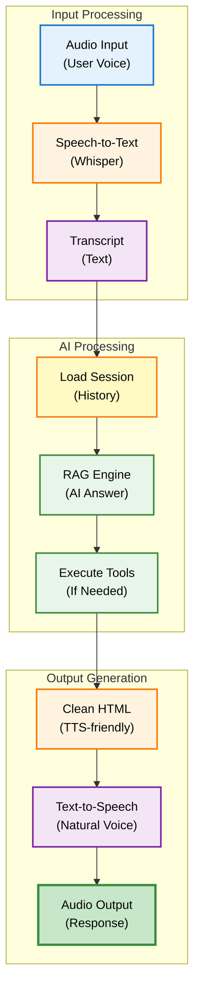

# Voice Endpoints - API Reference

## Overview

Voice endpoints menyediakan speech-to-text, text-to-speech, dan full call mode processing untuk voice-based interaction dengan DENAI.

## Base URL

```
Production: https://api.denai.company/v1
Development: http://localhost:8000
```

## Endpoints

### POST /speech/speech-to-text

Convert audio ke text menggunakan OpenAI Whisper.

```mermaid
sequenceDiagram
    participant C as Client<br/>(App)
    participant A as API<br/>(/speech-to-text)
    participant W as Whisper<br/>(OpenAI)
    
    C->>A: POST audio file
    Note over C,A: multipart/form-data
    
    A->>A: Validate audio
    Note over A: Check format & size
    
    A->>W: Transcribe audio
    Note over A,W: Whisper model
    
    W->>W: Process speech
    Note over W: Language: Indonesian
    
    W-->>A: Return transcript
    Note over W,A: Text output
    
    A-->>C: Return response
    Note over A,C: {transcript, confidence}
    
    style C fill:#e3f2fd,stroke:#1976d2,stroke-width:2px,color:#000
    style A fill:#fff3e0,stroke:#f57c00,stroke-width:2px,color:#000
    style W fill:#f3e5f5,stroke:#7b1fa2,stroke-width:2px,color:#000
```

#### Request

**Headers:**
```http
Content-Type: multipart/form-data
```

**Form Data:**

| Field | Type | Required | Description |
|-------|------|----------|-------------|
| `audio_file` | file | ✅ Yes | Audio file (WAV, MP3, M4A, WEBM) |

**Supported Audio Formats:**
- WAV (recommended)
- MP3
- M4A
- WEBM
- Maximum size: 25 MB

#### Response

**Success Response (200 OK):**

```json
{
  "transcript": "Berapa jam maksimal lembur per hari?",
  "language": "id",
  "confidence": "high",
  "status": "success",
  "engine": "whisper"
}
```

**Response Fields:**

| Field | Type | Description |
|-------|------|-------------|
| `transcript` | string | Transcribed text in Indonesian |
| `language` | string | Detected language code ("id" for Indonesian) |
| `confidence` | string | Confidence level: "high", "medium", "low" |
| `status` | string | Processing status: "success" or "error" |
| `engine` | string | Speech recognition engine used ("whisper") |

**Error Response (400 Bad Request):**

```json
{
  "error": "No audio file provided",
  "status": "error"
}
```

**Error Response (500 Internal Server Error):**

```json
{
  "error": "STT processing failed: <error_message>",
  "status": "error"
}
```

#### Example Usage

=== "Python"

    ```python
    import requests
    
    url = "http://localhost:8000/speech/speech-to-text"
    
    # Open audio file
    with open("audio.wav", "rb") as f:
        files = {"audio_file": ("audio.wav", f, "audio/wav")}
        response = requests.post(url, files=files)
    
    if response.status_code == 200:
        data = response.json()
        print(f"Transcript: {data['transcript']}")
        print(f"Confidence: {data['confidence']}")
    else:
        print(f"Error: {response.json()['error']}")
    ```

=== "JavaScript"

    ```javascript
    const url = "http://localhost:8000/speech/speech-to-text";
    
    const formData = new FormData();
    formData.append("audio_file", audioFile);
    
    fetch(url, {
      method: "POST",
      body: formData
    })
    .then(response => response.json())
    .then(data => {
      console.log("Transcript:", data.transcript);
      console.log("Confidence:", data.confidence);
    })
    .catch(error => console.error("Error:", error));
    ```

=== "cURL"

    ```bash
    curl -X POST http://localhost:8000/speech/speech-to-text \
      -F "audio_file=@audio.wav"
    ```

---

### POST /speech/text-to-speech

Convert text ke natural speech audio.

```mermaid
sequenceDiagram
    participant C as Client<br/>(App)
    participant A as API<br/>(/text-to-speech)
    participant E as ElevenLabs<br/>(Primary)
    participant O as OpenAI<br/>(Fallback)
    
    C->>A: POST text
    Note over C,A: text parameter
    
    A->>A: Clean HTML
    Note over A: Remove tags & emojis
    
    A->>E: Generate TTS
    Note over A,E: Natural voice
    
    alt ElevenLabs Success
        E-->>A: Audio stream
        Note over E,A: MP3 format
    else ElevenLabs Failed
        A->>O: Fallback TTS
        Note over A,O: OpenAI voice
        O-->>A: Audio stream
    end
    
    A-->>C: Stream audio
    Note over A,C: audio/mpeg
    
    style C fill:#e3f2fd,stroke:#1976d2,stroke-width:2px,color:#000
    style A fill:#fff3e0,stroke:#f57c00,stroke-width:2px,color:#000
    style E fill:#e8f5e9,stroke:#388e3c,stroke-width:2px,color:#000
    style O fill:#f3e5f5,stroke:#7b1fa2,stroke-width:2px,color:#000
```

#### Request

**Headers:**
```http
Content-Type: application/x-www-form-urlencoded
```

**Parameters:**

| Field | Type | Required | Description |
|-------|------|----------|-------------|
| `text` | string | ✅ Yes | Text to convert to speech |

**Text Cleaning:**
- HTML tags removed
- Emojis stripped (✅, ❌, 🔒, etc)
- Whitespace normalized
- Document references removed

#### Response

**Success Response (200 OK):**

Returns audio stream with headers:

```http
Content-Type: audio/mpeg
Content-Disposition: attachment; filename=denai_natural.mp3
Cache-Control: no-cache
X-Voice: Indonesian-Natural
X-Engine: elevenlabs
X-Natural-Speech: true
```

**Response Headers:**

| Header | Description |
|--------|-------------|
| `X-Voice` | Voice type used |
| `X-Engine` | TTS engine: "elevenlabs" or "openai" |
| `X-Natural-Speech` | Whether natural speech enhancement applied |

**Error Response (400 Bad Request):**

```json
{
  "error": "Text required",
  "status": "error"
}
```

**Error Response (500 Internal Server Error):**

```json
{
  "error": "TTS generation failed: <error_message>",
  "status": "error"
}
```

#### Example Usage

=== "Python"

    ```python
    import requests
    
    url = "http://localhost:8000/speech/text-to-speech"
    
    data = {
        "text": "Maksimal kerja lembur adalah 3 jam per hari."
    }
    
    response = requests.post(url, data=data, stream=True)
    
    if response.status_code == 200:
        # Save audio to file
        with open("output.mp3", "wb") as f:
            for chunk in response.iter_content(chunk_size=8192):
                f.write(chunk)
        
        print(f"Engine: {response.headers.get('X-Engine')}")
        print(f"Voice: {response.headers.get('X-Voice')}")
    else:
        print(f"Error: {response.status_code}")
    ```

=== "JavaScript"

    ```javascript
    const url = "http://localhost:8000/speech/text-to-speech";
    
    const formData = new URLSearchParams();
    formData.append("text", "Maksimal kerja lembur adalah 3 jam per hari.");
    
    fetch(url, {
      method: "POST",
      headers: {
        "Content-Type": "application/x-www-form-urlencoded"
      },
      body: formData
    })
    .then(response => {
      console.log("Engine:", response.headers.get("X-Engine"));
      return response.blob();
    })
    .then(blob => {
      const audioUrl = URL.createObjectURL(blob);
      const audio = new Audio(audioUrl);
      audio.play();
    })
    .catch(error => console.error("Error:", error));
    ```

=== "cURL"

    ```bash
    curl -X POST http://localhost:8000/speech/text-to-speech \
      -d "text=Maksimal kerja lembur adalah 3 jam per hari." \
      -o output.mp3
    ```

---

### POST /call/process

Full call mode processing: speech-to-text → AI processing → text-to-speech.



#### Request

**Headers:**
```http
Content-Type: multipart/form-data
X-User-Role: Employee|HR
```

**Form Data:**

| Field | Type | Required | Description |
|-------|------|----------|-------------|
| `audio_file` | file | ✅ Yes | Audio file containing user's speech |
| `session_id` | string | ❌ No | Session ID for context (auto-generated if not provided) |
| `user_role` | string | ❌ No | User role: "Employee" or "HR" (default: "Employee") |

#### Response

**Success Response (200 OK):**

Returns audio stream with headers:

```http
Content-Type: audio/mpeg
Cache-Control: no-cache
X-Session-ID: 550e8400-e29b-41d4-a716-446655440000
X-Voice: Indonesian-Natural
X-Engine: elevenlabs
X-Natural-TTS: true
```

**Response Headers:**

| Header | Description |
|--------|-------------|
| `X-Session-ID` | Session ID for conversation continuity |
| `X-Voice` | Voice type used |
| `X-Engine` | TTS engine used |
| `X-Natural-TTS` | Natural speech enhancement applied |

**Error Response (500 Internal Server Error):**

Returns fallback audio with error message:
```
"Maaf, terjadi gangguan."
```

#### Processing Flow

```mermaid
sequenceDiagram
    participant C as Client<br/>(Voice)
    participant A as API<br/>(/call/process)
    participant S as STT<br/>(Whisper)
    participant R as RAG<br/>(AI)
    participant T as TTS<br/>(Voice)
    participant M as Memory<br/>(DB)
    
    C->>A: Send audio
    Note over C,A: User's voice
    
    A->>S: Transcribe
    Note over A,S: Audio → Text
    
    S-->>A: Transcript
    Note over S,A: "Berapa jam lembur?"
    
    A->>M: Get history
    Note over A,M: Last 1 message
    
    M-->>A: Context
    
    A->>R: Process question
    Note over A,R: Call mode (concise)
    
    R->>R: Execute
    Note over R: Max 2 sentences
    
    R-->>A: Answer
    Note over R,A: Concise response
    
    A->>M: Save messages
    Note over A,M: User + Assistant
    
    A->>T: Generate TTS
    Note over A,T: Natural voice
    
    T-->>A: Audio stream
    
    A-->>C: Stream audio
    Note over A,C: AI voice response
    
    style C fill:#e3f2fd,stroke:#1976d2,stroke-width:2px,color:#000
    style A fill:#fff3e0,stroke:#f57c00,stroke-width:2px,color:#000
    style S fill:#f3e5f5,stroke:#7b1fa2,stroke-width:2px,color:#000
    style R fill:#e8f5e9,stroke:#388e3c,stroke-width:2px,color:#000
    style T fill:#f3e5f5,stroke:#7b1fa2,stroke-width:2px,color:#000
    style M fill:#fff9c4,stroke:#f57f17,stroke-width:2px,color:#000
```

#### Call Mode Optimizations

**Concise Responses:**
- Maximum 2 sentences for voice readability
- Reduced max tokens: 150 (vs 2000 for chat)
- Temperature: 0.0 for consistency
- Simplified prompts

**System Prompt (Call Mode):**
```
DENAI, asisten AI perusahaan. Mode panggilan.

Jawaban: RINGKAS, SOPAN, NATURAL (max 2 kalimat).

Tools:
🚀 search_sop - Kebijakan perusahaan  
🤖 search_hr_data - Data HR (HR only)
```

#### Example Usage

=== "Python"

    ```python
    import requests
    
    url = "http://localhost:8000/call/process"
    
    # Open audio file
    with open("question.wav", "rb") as f:
        files = {"audio_file": ("question.wav", f, "audio/wav")}
        data = {
            "session_id": "my-call-session",
            "user_role": "Employee"
        }
        
        response = requests.post(url, files=files, data=data, stream=True)
    
    if response.status_code == 200:
        # Save response audio
        with open("response.mp3", "wb") as f:
            for chunk in response.iter_content(chunk_size=8192):
                f.write(chunk)
        
        print(f"Session: {response.headers.get('X-Session-ID')}")
        print(f"Engine: {response.headers.get('X-Engine')}")
    else:
        print(f"Error: {response.status_code}")
    ```

=== "JavaScript"

    ```javascript
    const url = "http://localhost:8000/call/process";
    
    const formData = new FormData();
    formData.append("audio_file", audioFile);
    formData.append("session_id", "my-call-session");
    formData.append("user_role", "Employee");
    
    fetch(url, {
      method: "POST",
      body: formData
    })
    .then(response => {
      console.log("Session:", response.headers.get("X-Session-ID"));
      return response.blob();
    })
    .then(blob => {
      const audioUrl = URL.createObjectURL(blob);
      const audio = new Audio(audioUrl);
      audio.play();
    })
    .catch(error => console.error("Error:", error));
    ```

=== "cURL"

    ```bash
    curl -X POST http://localhost:8000/call/process \
      -F "audio_file=@question.wav" \
      -F "session_id=my-call-session" \
      -F "user_role=Employee" \
      -o response.mp3
    ```

## Audio Specifications

### Recommended Settings

**Input Audio (STT):**
- Format: WAV (PCM)
- Sample Rate: 16kHz or 44.1kHz
- Channels: Mono (preferred) or Stereo
- Bit Depth: 16-bit
- Max Duration: 60 seconds
- Max Size: 25 MB

**Output Audio (TTS):**
- Format: MP3
- Bitrate: 128 kbps
- Sample Rate: 24kHz (ElevenLabs) or 24kHz (OpenAI)
- Channels: Mono
- Quality: Natural, conversational

### TTS Engine Comparison

| Feature | ElevenLabs | OpenAI |
|---------|-----------|--------|
| Quality | ⭐⭐⭐⭐⭐ Natural | ⭐⭐⭐⭐ Good |
| Speed | Fast | Very Fast |
| Cost | Higher | Lower |
| Voices | Multiple Indonesian | Nova (generic) |
| Stability | 0.6 | N/A |
| Similarity | 0.8 | N/A |
| Style | 0.2 (expressive) | 0.95 speed |

### Clean Text Processing

**Removed Elements:**
```python
# HTML tags
<h3>, <p>, <ul>, <li>, etc.

# Emojis
✅, ❌, 🔒, ⏰, ❓, 🌐, 📞, 💰, 🎯, 🚀, 🤖

# Document references
Sumber: ...
Bagian: ...
Rujukan Dokumen: ...
```

**Example Transformation:**
```
Input (HTML):
<h3>Informasi Lembur</h3>
<p>Maksimal 3 jam per hari. ✅</p>
<p>Sumber: SKD_Kerja_Lembur.pdf</p>

Output (Clean):
Maksimal 3 jam per hari.
```

## Performance Metrics

### Latency Benchmarks

| Operation | Average | p95 | p99 |
|-----------|---------|-----|-----|
| Speech-to-Text | 1.2s | 2.0s | 3.5s |
| Text-to-Speech | 0.8s | 1.5s | 2.2s |
| Call Mode (Full) | 3.5s | 5.0s | 7.0s |

### Throughput

- STT: 100 requests/minute
- TTS: 200 requests/minute
- Call Mode: 60 requests/minute

## Best Practices

### DO's ✅

1. **Use appropriate audio format**
   ```python
   # Good: WAV format
   with open("audio.wav", "rb") as f:
       files = {"audio_file": f}
   ```

2. **Reuse session IDs for continuity**
   ```python
   # Good: Maintain conversation
   session_id = "user-123"
   for audio in audios:
       response = call_process(audio, session_id)
   ```

3. **Handle streaming responses**
   ```python
   # Good: Stream handling
   with response as r:
       for chunk in r.iter_content(8192):
           play_audio(chunk)
   ```

### DON'Ts ❌

1. **Don't send very long audio**
   ```python
   # Bad: Too long (>60s)
   audio = record(duration=300)  # 5 minutes
   ```

2. **Don't ignore audio quality**
   ```python
   # Bad: Low quality
   audio = record(sample_rate=8000)  # Too low
   ```

3. **Don't skip error handling**
   ```python
   # Bad: No error handling
   response = call_process(audio)
   play(response)  # May fail
   ```

## Testing

```python
import pytest
from fastapi.testclient import TestClient
from app.api import app

client = TestClient(app)

def test_speech_to_text():
    """Test STT endpoint"""
    with open("test_audio.wav", "rb") as f:
        response = client.post(
            "/speech/speech-to-text",
            files={"audio_file": f}
        )
    
    assert response.status_code == 200
    data = response.json()
    assert "transcript" in data
    assert data["language"] == "id"

def test_text_to_speech():
    """Test TTS endpoint"""
    response = client.post(
        "/speech/text-to-speech",
        data={"text": "Test audio"}
    )
    
    assert response.status_code == 200
    assert response.headers["content-type"] == "audio/mpeg"
    assert "X-Engine" in response.headers

def test_call_mode():
    """Test call mode endpoint"""
    with open("test_audio.wav", "rb") as f:
        response = client.post(
            "/call/process",
            files={"audio_file": f},
            data={"user_role": "Employee"}
        )
    
    assert response.status_code == 200
    assert "X-Session-ID" in response.headers
```

## Related Endpoints

- [Chat Endpoints](chat-endpoints.md) - Text-based interaction
- [Session Endpoints](session-endpoints.md) - Session management
- [Status Endpoints](status-endpoints.md) - System status