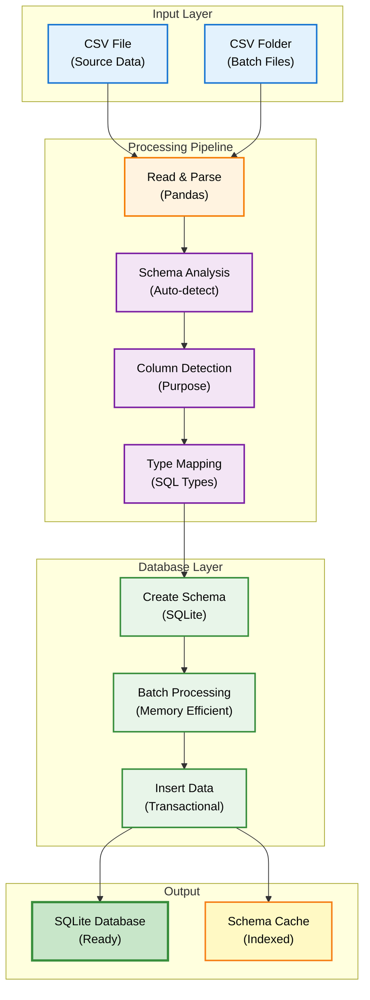
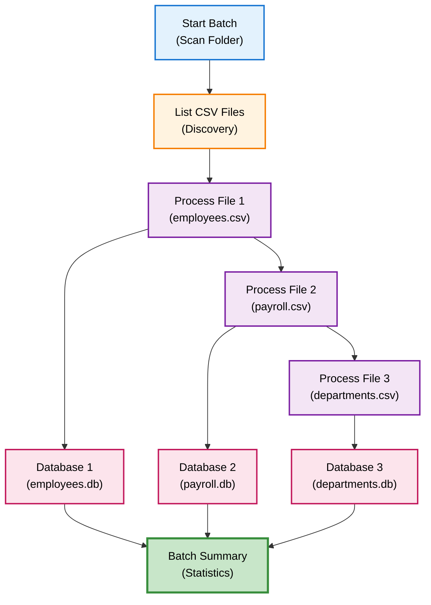
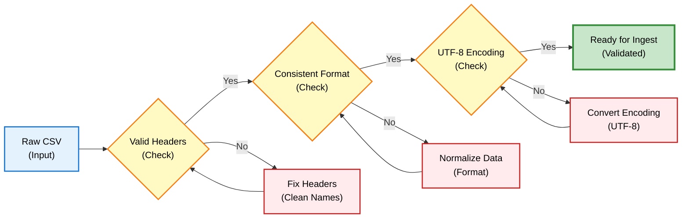
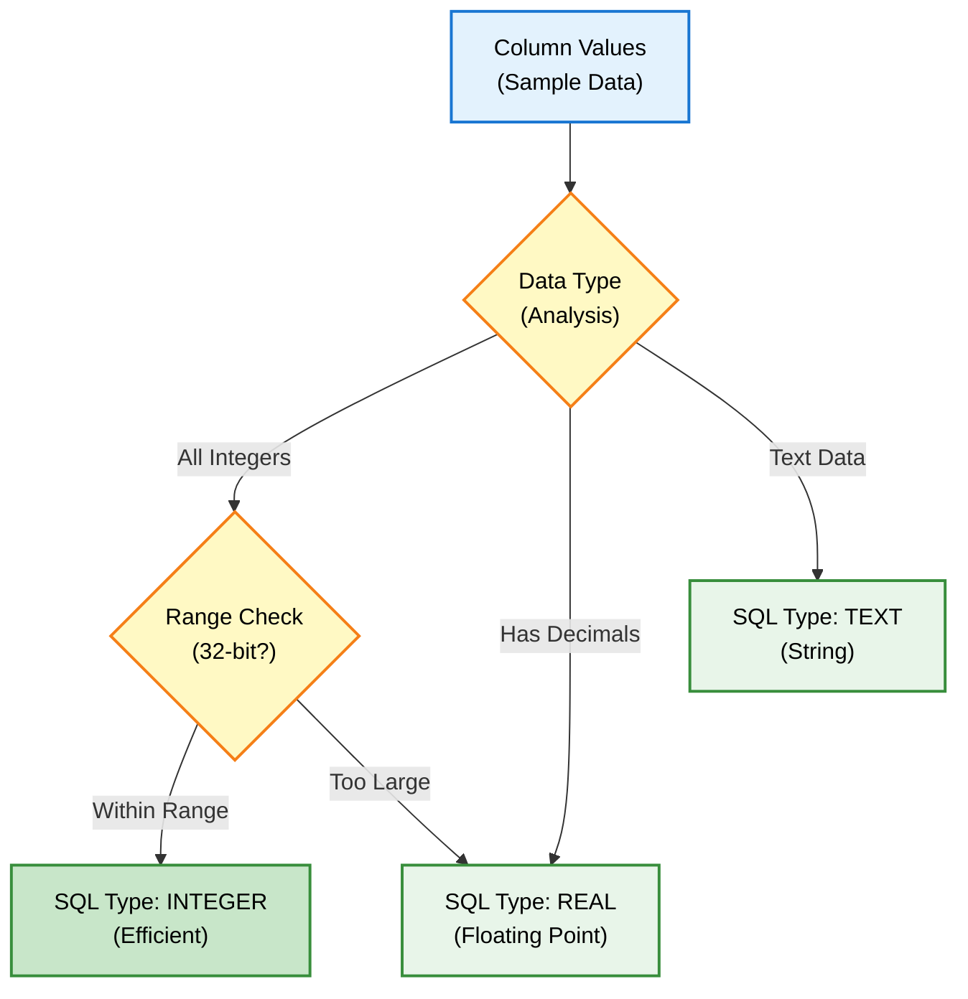
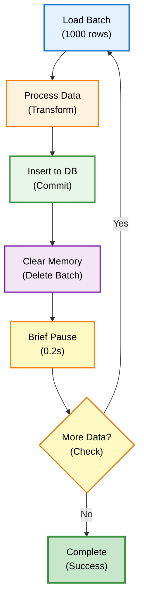
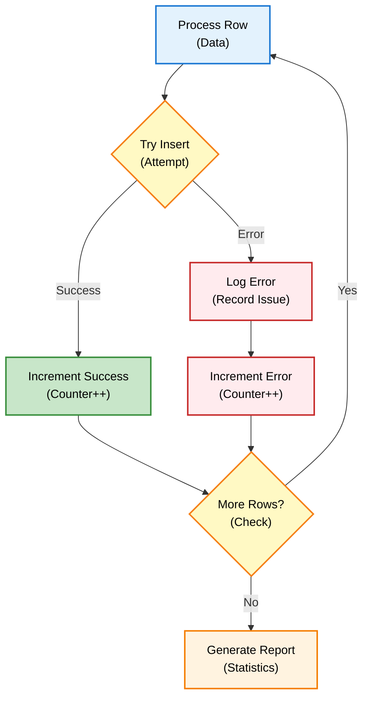
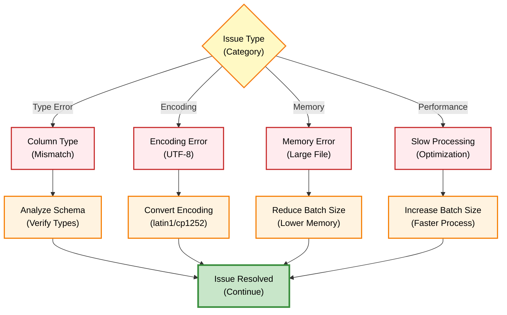

# CSV Ingestion - Developer Guide

## Overview

Sistem CSV Ingestion DENAI menggunakan **Universal Automatic Schema Detection** yang dapat membaca dan memproses struktur database apapun tanpa konfigurasi manual.

## Architecture



## Universal Schema Detection

### Automatic Column Analysis

System otomatis mendeteksi purpose setiap column berdasarkan name patterns, data patterns, dan business context.

```python
def _analyze_column_optimized(df, col_name):
    """
    Auto-detect column purpose from:
    - Column name patterns (regex matching)
    - Data patterns (value analysis)
    - Value samples (statistical inference)
    - Business context (domain knowledge)
    """
```

### Detection Pattern Mapping


### Supported Patterns

| Pattern | Purpose | SQL Type | Example |
|---------|---------|----------|---------|
| `name`, `nama`, `employee` | person_name | TEXT | John Doe |
| `company`, `location`, `office` | location | TEXT | Jakarta |
| `status`, `kontrak`, `contract` | status | TEXT | TETAP |
| `education`, `pendidikan` | education | TEXT | S2 |
| `band`, `level`, `grade` | job_level | INTEGER | 3 |
| `salary`, `gaji`, `biaya` | compensation | REAL | 5000000.00 |
| `date`, `time`, `created` | timestamp | TEXT | 2025-01-14 |

## Usage Guide

### Single File Ingestion

```bash
# Auto-naming (recommended)
python batch_csv_processor_final.py employees_2025.csv
```

**Process Flow:**

```mermaid
sequenceDiagram
    participant U as User<br/>(Command)
    participant S as Script<br/>(Processor)
    participant A as Analyzer<br/>(Schema)
    participant D as Database<br/>(SQLite)
    
    U->>S: Run script with CSV
    Note over U,S: python batch_csv_processor_final.py
    
    S->>A: Analyze structure
    Note over S,A: Parse CSV, detect schema
    
    A->>A: Detect columns
    Note over A: Pattern matching
    
    A->>A: Map SQL types
    Note over A: Type inference
    
    A-->>S: Schema definition
    Note over A,S: Column purposes + types
    
    S->>D: Create database
    Note over S,D: Generate table schema
    
    S->>D: Insert data (batches)
    Note over S,D: 1000 rows per batch
    
    D-->>S: Confirm completion
    Note over D,S: All rows inserted
    
    S-->>U: Display results
    Note over S,U: Database path + stats
    
    style U fill:#e3f2fd,stroke:#1976d2,stroke-width:2px,color:#000
    style S fill:#fff3e0,stroke:#f57c00,stroke-width:2px,color:#000
    style A fill:#f3e5f5,stroke:#7b1fa2,stroke-width:2px,color:#000
    style D fill:#fce4ec,stroke:#c2185b,stroke-width:2px,color:#000
```

**Output:**

```
📋 Analyzing: employees_2025.csv
   Total rows: 1234
   Columns: 8
   
🔍 Auto-detected schema:
   employee_name (TEXT) - person_name
   home_company (TEXT) - location
   status_kontrak (TEXT) - status
   education (TEXT) - education
   band (INTEGER) - job_level
   
💾 Database: db/employees_2025.db
📊 Table: employees
✅ Processed: 1234/1234 rows
```

### Batch Folder Processing

```bash
# Process all CSV files in folder
python batch_csv_processor_final.py --batch csv/

# Or specific folder
python batch_csv_processor_final.py --batch /path/to/csvs/
```

**Batch Processing Flow:**



**Output:**

```
📂 Batch processing CSV files in csv/...
✅ employees_2025.csv: 1234 rows → employees_2025.db
✅ payroll_jan.csv: 567 rows → payroll_jan.db
✅ departments.csv: 45 rows → departments.db

🎉 BATCH PROCESSING COMPLETE!
📊 Files processed: 3/3
⏱️  Total time: 12.5s
```

### Custom Configuration

```bash
# Custom batch size for large files
python universal_csv_ingestor_final.py large_data.csv db/custom.db 5000
```

## CSV Preparation

### Data Quality Best Practices



### Good CSV Example

```csv
employee_name,home_company,status_kontrak,education,band
John Doe,Jakarta,TETAP,S2,3
Jane Smith,Surabaya,KONTRAK,S1,2
```

**Features:**
- Clear column names
- Consistent data format
- No empty columns
- Proper encoding (UTF-8)

### Bad CSV Example

```csv
Name (With Spaces!),Company/Location,Status,Edu,#Band
John,Jakarta/Pusat,Permanent?,Master's,Three
```

**Issues:**
- Special characters in column names
- Inconsistent formats
- Mixed terminologies
- Non-numeric in numeric columns

### Column Naming Convention

```python
# Original column names transformed:
"Employee Name"     → "employee_name"
"Company/Location"  → "company_location"
"Status (Contract)" → "status_contract"
"Band Level #"      → "band_level"
```

**SQL-safe transformation rules:**
- Lowercase all characters
- Spaces → underscores
- Special characters removed
- Reserved words suffixed with `_col`

## Schema Generation

### Auto-generated Schema Example

```sql
CREATE TABLE IF NOT EXISTS employees (
    id INTEGER PRIMARY KEY AUTOINCREMENT,
    employee_name TEXT,  -- person_name: individual identification
    home_company TEXT,   -- location: work location
    host_company TEXT,   -- location: current assignment
    status_kontrak TEXT, -- status: contract classification
    education TEXT,      -- education: qualification level
    band INTEGER,        -- job_level: organizational level
    ingested_at TEXT,
    data_source TEXT
)
```

### Smart Type Detection Flow



**Detection Logic:**

```python
# INTEGER vs REAL detection
if all_values_are_whole_numbers and within_32bit_range:
    sql_type = "INTEGER"  # More efficient
else:
    sql_type = "REAL"     # Decimals or large numbers

# Example outputs:
band: 3                → INTEGER
salary: 5000000.50     → REAL
employee_id: 123456789 → INTEGER
```

## Data Processing

### Batch Processing Strategy

```mermaid
graph LR
    File["CSV File<br/>(10,000 rows)"] --> B1["Batch 1<br/>(0-999)"]
    B1 --> I1["Insert<br/>(Commit)"]
    I1 --> B2["Batch 2<br/>(1000-1999)"]
    B2 --> I2["Insert<br/>(Commit)"]
    I2 --> B3["Batch 3<br/>(2000-2999)"]
    B3 --> I3["Insert<br/>(Commit)"]
    I3 --> More["...<br/>(Continue)"]
    More --> Done["Complete<br/>(10,000 rows)"]
    
    style File fill:#e3f2fd,stroke:#1976d2,stroke-width:2px,color:#000
    style B1 fill:#fff3e0,stroke:#f57c00,stroke-width:2px,color:#000
    style B2 fill:#fff3e0,stroke:#f57c00,stroke-width:2px,color:#000
    style B3 fill:#fff3e0,stroke:#f57c00,stroke-width:2px,color:#000
    style I1 fill:#e8f5e9,stroke:#388e3c,stroke-width:2px,color:#000
    style I2 fill:#e8f5e9,stroke:#388e3c,stroke-width:2px,color:#000
    style I3 fill:#e8f5e9,stroke:#388e3c,stroke-width:2px,color:#000
    style More fill:#f3e5f5,stroke:#7b1fa2,stroke-width:2px,color:#000
    style Done fill:#c8e6c9,stroke:#388e3c,stroke-width:3px,color:#000
```



**Benefits:**
- Memory efficient for large files
- Progress tracking per batch
- Error recovery possible
- Scalable to millions of rows

### Value Normalization

```python
# Education normalization
"Magister" → "S2"
"S-2"      → "S2"
"s2"       → "S2"

# Status normalization
"Permanent" → "TETAP"
"Contract"  → "KONTRAK"
"PKWT"      → "KONTRAK"

# Compensation cleaning
"Rp 5.000.000"  → 5000000.00
"USD 1,500.50"  → 1500.50
```

## Performance Optimization

### Configurable Batch Size

```python
# Default: 1000 rows/batch (balanced)
OptimizedUniversalCSVIngestor(csv_path, batch_size=1000)

# For large files: increase batch size
OptimizedUniversalCSVIngestor(csv_path, batch_size=5000)

# For small memory: decrease batch size
OptimizedUniversalCSVIngestor(csv_path, batch_size=500)
```

### Memory Management Strategy



### Performance Metrics

| File Size | Rows | Time | Memory | Batch Size |
|-----------|------|------|--------|------------|
| 10 MB | 1,000 | 2s | 50 MB | 1000 |
| 100 MB | 10,000 | 15s | 150 MB | 1000 |
| 1 GB | 100,000 | 2m | 500 MB | 5000 |
| 10 GB | 1,000,000 | 25m | 800 MB | 10000 |

## Advanced Features

### Business Intelligence Integration

```python
# Auto-detect company transfers
if len(location_columns) >= 2:
    sql += "WHERE home_company != host_company"

# Auto-calculate distributions
sql = "SELECT education, COUNT(*) FROM employees GROUP BY education"
```

### Error Handling Flow



## Troubleshooting

### Common Issues



### Issue 1: Column Type Mismatch

**Error Message:**

```
Error: datatype mismatch
```

**Solution:**

```python
# Check column analysis
ingestor = OptimizedUniversalCSVIngestor(csv_path)
analysis = ingestor.analyze_csv_structure()

for col, info in analysis['columns'].items():
    print(f"{col}: {info['sql_type']} - {info['purpose']}")
```

### Issue 2: Encoding Error

**Error Message:**

```
Error: 'utf-8' codec can't decode byte
```

**Solution:**

```python
# Specify encoding
df = pd.read_csv(csv_path, encoding='latin1')
# or
df = pd.read_csv(csv_path, encoding='cp1252')
```

### Issue 3: Memory Error on Large Files

**Error Message:**

```
MemoryError: Unable to allocate array
```

**Solution:**

```bash
# Use smaller batch size
python universal_csv_ingestor_final.py large.csv db/large.db 500

# Or process in chunks
python -c "
import pandas as pd
chunks = pd.read_csv('large.csv', chunksize=1000)
for chunk in chunks:
    process_chunk(chunk)
"
```

## Integration Example

### Python Integration

```python
from universal_csv_ingestor_final import universal_ingest

# Simple ingestion
result = universal_ingest("employees.csv")

print(f"✅ Processed: {result['successful']} rows")
print(f"💾 Database: {result['database_path']}")
print(f"📋 Table: {result['table_name']}")

# Custom configuration
result = universal_ingest(
    csv_path="large_data.csv",
    db_path="db/custom.db",
    batch_size=5000
)
```

### API Integration (Planned)

```bash
# Future: Upload CSV via API
POST /api/ingest/csv
Content-Type: multipart/form-data

file: employees.csv
batch_size: 1000
```

## Best Practices

### For Large Files

```python
# 1. Increase batch size
batch_size = 5000

# 2. Enable verbose logging
FEATURE_VERBOSE_LOGGING = False  # Only errors

# 3. Process off-hours
# Run during low-traffic periods

# 4. Monitor progress
logger.info(f"Batch {i}/{total_batches}")
```

### For Multiple Files

```bash
# Use batch processor
python batch_csv_processor_final.py --batch csv/

# Or parallel processing (Linux/Mac)
ls csv/*.csv | xargs -P 4 -I {} python batch_csv_processor_final.py {}
```

### For Production

```python
# 1. Validate CSV first
ingestor = OptimizedUniversalCSVIngestor(csv_path)
analysis = ingestor.analyze_csv_structure()
assert analysis['total_rows'] > 0

# 2. Backup existing database
import shutil
shutil.copy('db/employees.db', 'db/employees.backup.db')

# 3. Ingest with error handling
try:
    result = universal_ingest(csv_path)
    assert result['errors'] == 0
except Exception as e:
    # Restore backup
    shutil.copy('db/employees.backup.db', 'db/employees.db')
    raise
```

## Next Steps

**Related Documentation:**
- [Database Setup](database-setup.md) - Setup database infrastructure
- [HR System Guide](../features/hr-system.md) - Query ingested data
- [API Reference](../api/overview.md) - API integration

**Advanced Topics:**
- [Schema Optimization](schema-optimization.md) - Improve query performance
- [Data Migration](data-migration.md) - Migrate existing databases
- [Monitoring & Logging](monitoring.md) - Track ingestion health