# Database Setup - Developer Guide

## Overview

DENAI menggunakan 3 jenis database dengan purpose yang berbeda untuk optimasi performa dan skalabilitas.

## Database Architecture

```mermaid
graph TB
    subgraph "Application Layer"
        API["FastAPI Server<br/>(REST API)"]
        RAG["RAG Engine<br/>(SOP Search)"]
        HR["HR System<br/>(NL Queries)"]
        Session["Session Manager<br/>(History)"]
    end
    
    subgraph "Database Layer"
        Pinecone["Pinecone<br/>(Vector DB)<br/>📊 SOP Embeddings"]
        SQLite["SQLite<br/>(Relational)<br/>👥 HR Data"]
        Supabase["Supabase<br/>(PostgreSQL)<br/>💬 Chat Sessions"]
    end
    
    API --> RAG
    API --> HR
    API --> Session
    
    RAG --> Pinecone
    HR --> SQLite
    Session --> Supabase
    
    style API fill:#e3f2fd,stroke:#1976d2,stroke-width:2px,color:#000
    style RAG fill:#f3e5f5,stroke:#7b1fa2,stroke-width:2px,color:#000
    style HR fill:#f3e5f5,stroke:#7b1fa2,stroke-width:2px,color:#000
    style Session fill:#f3e5f5,stroke:#7b1fa2,stroke-width:2px,color:#000
    style Pinecone fill:#fce4ec,stroke:#c2185b,stroke-width:3px,color:#000
    style SQLite fill:#fff9c4,stroke:#f57f17,stroke-width:3px,color:#000
    style Supabase fill:#e8f5e9,stroke:#388e3c,stroke-width:3px,color:#000
```



## Database Comparison

| Database | Type | Purpose | Size | Query Speed | Use Case |
|----------|------|---------|------|-------------|----------|
| **Pinecone** | Vector | SOP embeddings | ~500MB | Very Fast | Semantic search |
| **SQLite** | Relational | HR data | ~10-100MB | Fast | Structured queries |
| **Supabase** | PostgreSQL | Sessions | ~1-50MB | Medium | Real-time sync |

---

## 1. Pinecone (Vector Database)

### Purpose & Architecture


### Setup Process

#### Step 1: Create Pinecone Account

1. Go to [pinecone.io](https://pinecone.io)
2. Sign up for free tier (1 pod, 100K vectors)
3. Verify email and login

#### Step 2: Create Index

```python
from pinecone import Pinecone, ServerlessSpec

# Initialize client
pc = Pinecone(api_key="YOUR_API_KEY")

# Create index
pc.create_index(
    name="denai-sop",
    dimension=1536,  # text-embedding-3-small
    metric="cosine",
    spec=ServerlessSpec(
        cloud="aws",
        region="us-east-1"
    )
)
```

**Index Configuration:**


#### Step 3: Configure Environment

```ini
# .env file
PINECONE_API_KEY=pcsk_xxxxx
PINECONE_INDEX=denai-sop
PINECONE_ENVIRONMENT=us-east-1
```

#### Step 4: Verify Connection

```python
from pinecone import Pinecone

pc = Pinecone(api_key="YOUR_KEY")
index = pc.Index("denai-sop")

# Check index stats
stats = index.describe_index_stats()
print(f"Total vectors: {stats.total_vector_count}")
print(f"Dimensions: {stats.dimension}")
```

### Data Ingestion

```bash
# Place PDF files in documents/ folder
cp /path/to/sop/*.pdf documents/

# Run hybrid ingestion (optimized)
python ingest_docs.py
```

**Ingestion Flow:**

```mermaid
sequenceDiagram
    participant S as Script<br/>(ingest_docs.py)
    participant P as PDF Parser<br/>(pdfplumber)
    participant L as LLM<br/>(OpenAI)
    participant E as Embedder<br/>(OpenAI)
    participant V as Vector DB<br/>(Pinecone)
    
    S->>P: Read PDF
    P-->>S: Extracted text
    
    S->>S: Detect content type
    Note over S: Table, Flowchart, Text
    
    S->>L: Process special content
    Note over S,L: Rule-based + LLM fallback
    L-->>S: Structured data
    
    S->>E: Create embeddings
    Note over S,E: Batch: 100 vectors
    E-->>S: Vector arrays
    
    S->>V: Upsert vectors
    Note over S,V: With metadata
    V-->>S: Confirmation
    
    S->>S: Next batch
    
    style S fill:#fff3e0,stroke:#f57c00,stroke-width:2px,color:#000
    style P fill:#e3f2fd,stroke:#1976d2,stroke-width:2px,color:#000
    style L fill:#f3e5f5,stroke:#7b1fa2,stroke-width:2px,color:#000
    style E fill:#f3e5f5,stroke:#7b1fa2,stroke-width:2px,color:#000
    style V fill:#fce4ec,stroke:#c2185b,stroke-width:2px,color:#000
```

### Monitoring & Maintenance

```python
# Check index health
stats = index.describe_index_stats()
print(f"Namespaces: {stats.namespaces}")
print(f"Total vectors: {stats.total_vector_count}")
print(f"Index fullness: {stats.index_fullness}")

# List all indexes
indexes = pc.list_indexes()
for idx in indexes:
    print(f"Index: {idx.name}, Status: {idx.status}")
```

---

## 2. SQLite (HR Data Storage)

### Purpose & Architecture


### Auto-Creation from CSV

**Single File:**

```bash
# Auto-creates db/employees.db
python batch_csv_processor_final.py employees.csv
```

**Batch Processing:**

```bash
# Process all CSV files in folder
python batch_csv_processor_final.py --batch csv/
```

**Processing Flow:**


### Manual Setup (Advanced)

```python
import sqlite3

# Create database
conn = sqlite3.connect('db/employees.db')
cur = conn.cursor()

# Create table with proper schema
cur.execute('''
CREATE TABLE IF NOT EXISTS employees (
    id INTEGER PRIMARY KEY AUTOINCREMENT,
    employee_name TEXT NOT NULL,
    home_company TEXT,
    host_company TEXT,
    status_kontrak TEXT,
    education TEXT,
    band INTEGER,
    created_at TEXT DEFAULT CURRENT_TIMESTAMP
)
''')

# Create indexes for performance
cur.execute('CREATE INDEX idx_company ON employees(home_company)')
cur.execute('CREATE INDEX idx_band ON employees(band)')
cur.execute('CREATE INDEX idx_education ON employees(education)')

conn.commit()
conn.close()
```

### Database Schema Example


### Query Optimization

```python
# Add indexes for frequently queried columns
cur.execute('CREATE INDEX IF NOT EXISTS idx_status ON employees(status_kontrak)')

# Analyze query performance
cur.execute('EXPLAIN QUERY PLAN SELECT * FROM employees WHERE band = 3')
```

---

## 3. Supabase (Session Storage)

### Purpose & Architecture


### Setup Process

#### Step 1: Create Supabase Project

1. Go to [supabase.com](https://supabase.com)
2. Create new project
3. Choose region (closest to your users)
4. Wait for provisioning (~2 minutes)

#### Step 2: Create Database Tables

Go to SQL Editor and run:

```sql
-- Chat sessions table
CREATE TABLE IF NOT EXISTS chat_sessions (
    session_id TEXT PRIMARY KEY,
    title TEXT NOT NULL,
    pinned BOOLEAN DEFAULT FALSE,
    created_at TIMESTAMP WITH TIME ZONE DEFAULT NOW(),
    updated_at TIMESTAMP WITH TIME ZONE DEFAULT NOW()
);

-- Chat memory table  
CREATE TABLE IF NOT EXISTS chat_memory (
    id BIGSERIAL PRIMARY KEY,
    session_id TEXT REFERENCES chat_sessions(session_id) ON DELETE CASCADE,
    role TEXT NOT NULL CHECK (role IN ('user', 'assistant', 'system')),
    message TEXT NOT NULL,
    created_at TIMESTAMP WITH TIME ZONE DEFAULT NOW()
);

-- Indexes for performance
CREATE INDEX idx_chat_memory_session ON chat_memory(session_id);
CREATE INDEX idx_chat_memory_created ON chat_memory(created_at DESC);
CREATE INDEX idx_chat_sessions_pinned ON chat_sessions(pinned DESC, created_at DESC);
CREATE INDEX idx_chat_sessions_updated ON chat_sessions(updated_at DESC);

-- Enable Row Level Security
ALTER TABLE chat_sessions ENABLE ROW LEVEL SECURITY;
ALTER TABLE chat_memory ENABLE ROW LEVEL SECURITY;

-- Create policies (allow all for service role)
CREATE POLICY "Allow all for service role" ON chat_sessions
    FOR ALL USING (true);
    
CREATE POLICY "Allow all for service role" ON chat_memory
    FOR ALL USING (true);

-- Add trigger for updated_at
CREATE OR REPLACE FUNCTION update_updated_at_column()
RETURNS TRIGGER AS $$
BEGIN
    NEW.updated_at = NOW();
    RETURN NEW;
END;
$$ language 'plpgsql';

CREATE TRIGGER update_chat_sessions_updated_at 
    BEFORE UPDATE ON chat_sessions
    FOR EACH ROW
    EXECUTE FUNCTION update_updated_at_column();
```

**Table Relationships:**


#### Step 3: Get API Credentials

1. Go to Project Settings → API
2. Copy:
   - Project URL
   - `anon` public key
   - `service_role` secret key (for backend)

#### Step 4: Configure Environment

```ini
# .env file
SUPABASE_URL=https://xxxxx.supabase.co
SUPABASE_ANON_KEY=eyJhbGc...
SUPABASE_SERVICE_KEY=eyJhbGc...  # Optional, for admin operations
```

#### Step 5: Test Connection

```python
from supabase import create_client
import os

# Initialize client
supabase = create_client(
    os.getenv("SUPABASE_URL"),
    os.getenv("SUPABASE_ANON_KEY")
)

# Test connection
result = supabase.table("chat_sessions").select("*").limit(1).execute()
print(f"✅ Connected to Supabase: {len(result.data)} sessions")
```

### Usage Examples

**Create Session:**

```python
from memory.memory_supabase import save_session

session_id = "uuid-here"
save_session(session_id, "Discussion about overtime policy")
```

**Save Message:**

```python
from memory.memory_supabase import save_message

save_message(session_id, "user", "How many hours of overtime?")
save_message(session_id, "assistant", "Maximum 3 hours per day")
```

**Get History:**

```python
from memory.memory_supabase import get_recent_history

history = get_recent_history(session_id, limit=10)
for msg in history:
    print(f"{msg['role']}: {msg['message']}")
```

---

## Database Backup & Recovery

### Backup Strategy


### Backup Scripts

**SQLite Backup:**

```bash
#!/bin/bash
# backup_sqlite.sh

DATE=$(date +%Y%m%d_%H%M%S)
BACKUP_DIR="backups/sqlite"

mkdir -p $BACKUP_DIR

# Backup all databases
for db in db/*.db; do
    filename=$(basename "$db")
    cp "$db" "$BACKUP_DIR/${filename%.db}_$DATE.db"
done

echo "✅ SQLite backup complete: $BACKUP_DIR"
```

**Supabase Backup:**

```bash
# Use Supabase CLI
supabase db dump > backup_$(date +%Y%m%d).sql
```

**Pinecone Backup:**

```python
# Export vectors (for migration/backup)
import pinecone
from tqdm import tqdm

index = pinecone.Index("denai-sop")
stats = index.describe_index_stats()

# Fetch all vectors (paginated)
vectors = []
for ids in tqdm(fetch_all_ids()):  # Custom function to get IDs
    result = index.fetch(ids=ids)
    vectors.extend(result['vectors'].values())

# Save to file
import json
with open(f'backup_vectors_{date}.json', 'w') as f:
    json.dump(vectors, f)
```

---

## Troubleshooting

### Common Database Issues


### Health Check Scripts

```python
# check_databases.py
from pinecone import Pinecone
from supabase import create_client
import sqlite3
import os

def check_pinecone():
    try:
        pc = Pinecone(api_key=os.getenv("PINECONE_API_KEY"))
        index = pc.Index("denai-sop")
        stats = index.describe_index_stats()
        print(f"✅ Pinecone: {stats.total_vector_count} vectors")
        return True
    except Exception as e:
        print(f"❌ Pinecone error: {e}")
        return False

def check_sqlite():
    try:
        conn = sqlite3.connect('db/employees.db')
        cur = conn.cursor()
        cur.execute("SELECT COUNT(*) FROM employees")
        count = cur.fetchone()[0]
        print(f"✅ SQLite: {count} employees")
        return True
    except Exception as e:
        print(f"❌ SQLite error: {e}")
        return False

def check_supabase():
    try:
        supabase = create_client(
            os.getenv("SUPABASE_URL"),
            os.getenv("SUPABASE_ANON_KEY")
        )
        result = supabase.table("chat_sessions").select("count").execute()
        print(f"✅ Supabase: Connected")
        return True
    except Exception as e:
        print(f"❌ Supabase error: {e}")
        return False

# Run checks
if __name__ == "__main__":
    print("🔍 Database Health Check\n")
    pinecone_ok = check_pinecone()
    sqlite_ok = check_sqlite()
    supabase_ok = check_supabase()
    
    if all([pinecone_ok, sqlite_ok, supabase_ok]):
        print("\n✅ All databases healthy!")
    else:
        print("\n⚠️ Some databases have issues")
```

---

## Next Steps

**Related Documentation:**
- [CSV Ingestion Guide](csv-ingestion.md) - Load HR data
- [RAG Engine](rag-engine.md) - Work with vector database
- [API Reference](../api/overview.md) - Database API endpoints