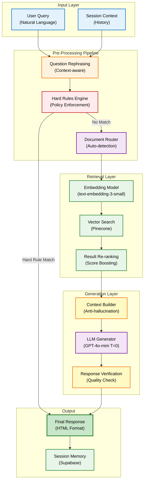
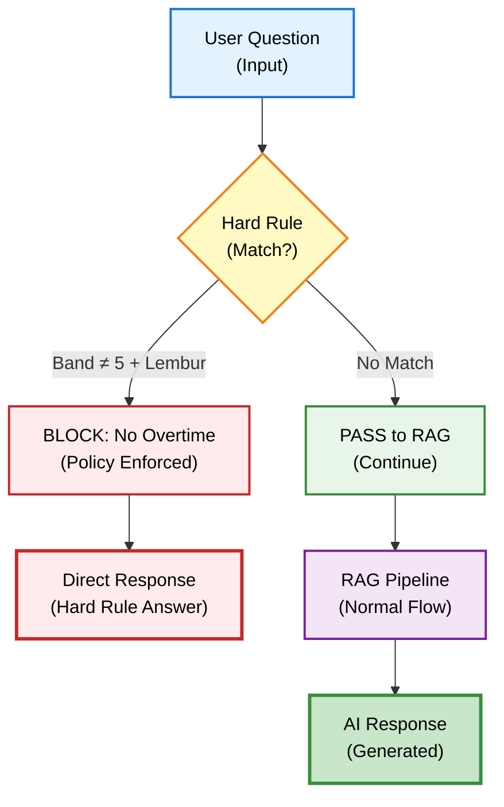
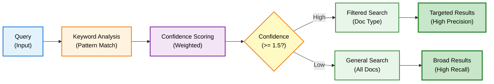
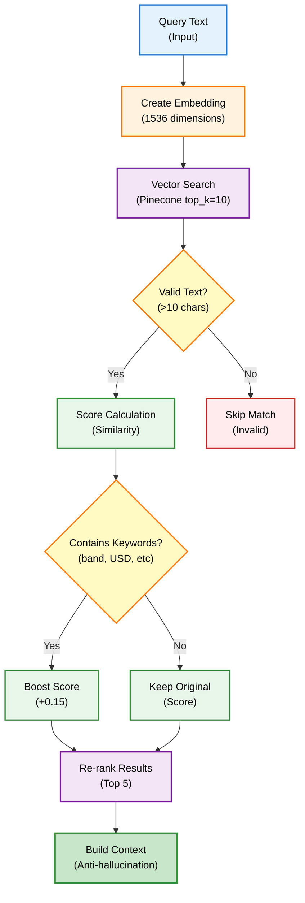
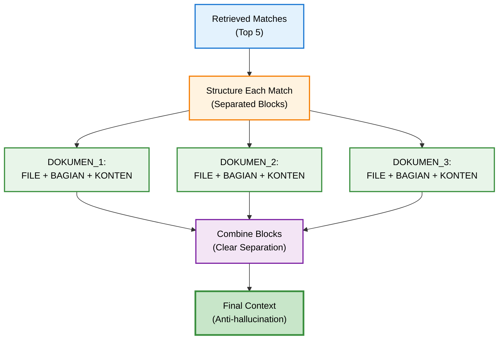
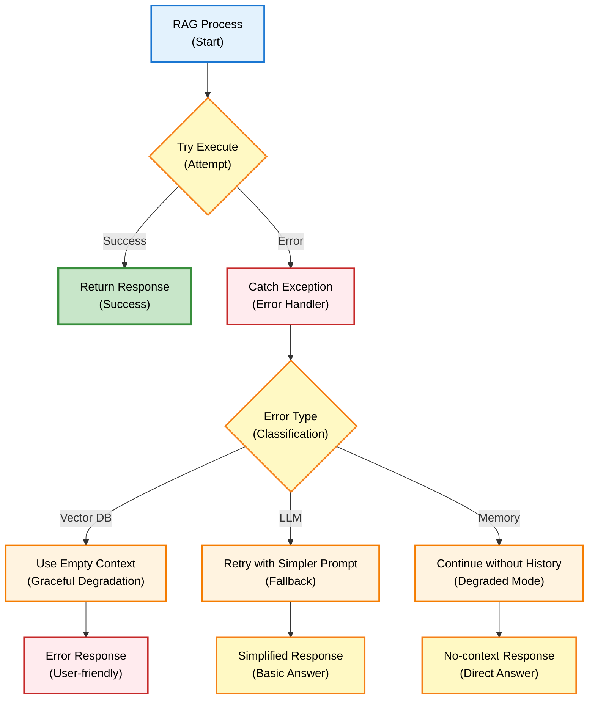
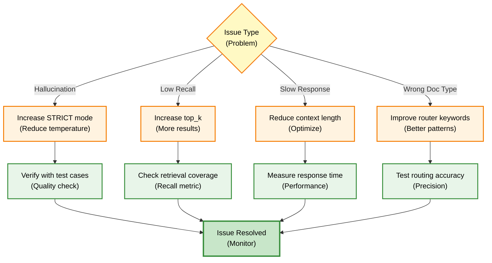

# RAG Engine - Developer Guide

## Overview

DENAI RAG (Retrieval-Augmented Generation) Engine menggunakan **Hybrid Architecture** dengan anti-hallucination measures dan intelligent document routing untuk hasil yang akurat dan dapat dipercaya.

## Architecture



## Core Components

### 1. Question Rephrasing

Mengubah follow-up questions menjadi standalone questions dengan mempertahankan konteks penting.

```mermaid
sequenceDiagram
    participant U as User<br/>(Follow-up)
    participant R as Rephraser<br/>(LLM)
    participant H as History<br/>(Context)
    participant Q as Query<br/>(Standalone)
    
    U->>H: "Bagaimana dengan rumah dinas?"
    Note over U,H: Follow-up question
    
    H->>R: Chat history (last 8)
    Note over H,R: Context extraction
    
    R->>R: Analyze context
    Note over R: Identify references
    
    R->>Q: "Bagaimana aturan rumah dinas untuk karyawan?"
    Note over R,Q: Standalone question
    
    Q->>Q: Ready for retrieval
    Note over Q: Context preserved
    
    style U fill:#e3f2fd,stroke:#1976d2,stroke-width:2px,color:#000
    style R fill:#fff3e0,stroke:#f57c00,stroke-width:2px,color:#000
    style H fill:#f3e5f5,stroke:#7b1fa2,stroke-width:2px,color:#000
    style Q fill:#c8e6c9,stroke:#388e3c,stroke-width:3px,color:#000
```

**Implementation:**

```python
def rephrase_question_with_context(question: str, history: list) -> str:
    """Enhanced rephrasing with context preservation"""
    
    if not history or len(history) < 2:
        return question
    
    recent_history = history[-8:]
    
    rephrase_prompt = f"""Ubah pertanyaan follow-up menjadi standalone.

ATURAN WAJIB:
1. Jika sudah lengkap, kembalikan persis seperti asli
2. WAJIB pertahankan konteks penting (rumah dinas, fasilitas, dll)
3. Gabungkan dengan topik dari chat history
4. JANGAN hilangkan detail penting
5. Gunakan bahasa Indonesia natural

RIWAYAT:
{history_text}

PERTANYAAN:
{question}

PERTANYAAN STANDALONE:"""
    
    response = llm.invoke(rephrase_prompt)
    return response.content.strip()
```

### 2. Hard Rules Engine

Menegakkan kebijakan perusahaan yang tidak boleh dilanggar oleh AI.



**Implementation:**

```python
def apply_hard_rules(question: str) -> Optional[str]:
    """Hard rules untuk policy enforcement"""
    q = question.lower()
    
    # Rule: Lembur hanya Band 5
    match = re.search(r"band\s*(\d+)", q)
    if match and "lembur" in q:
        band = match.group(1)
        if band not in ALLOWED_LEMBUR_BANDS:
            return """Berdasarkan ketentuan SOP perusahaan, 
            hanya karyawan Band 5 yang berhak menerima 
            Upah Kerja Lembur."""
    
    return None  # Lanjut ke RAG
```

### 3. Document Router

Automatic document type detection untuk retrieval yang lebih presisi.



**Router Configuration:**

| Doc Type | Keywords | Confidence Weight |
|----------|----------|-------------------|
| `sop_lembur` | lembur, overtime | 1.5x exact match |
| `sop_perjalanan_dinas` | perjalanan, dinas, travel | 1.5x exact match |
| `sop_cuti` | cuti, leave | 1.5x exact match |
| `sop_rumah_dinas` | rumah dinas, housing | 1.5x exact match |

**Example:**

```python
def infer_doc_type(question: str) -> Optional[str]:
    """Conservative doc_type inference"""
    question_lower = question.lower()
    scores = defaultdict(float)
    
    for doc_type, keywords in keyword_mapping.items():
        for keyword in keywords:
            if keyword in question_lower:
                weight = len(keyword.split()) * 1.0
                if f" {keyword} " in f" {question_lower} ":
                    weight *= 1.5  # Exact word boundary
                scores[doc_type] += weight
    
    if scores:
        best_doc_type = max(scores, key=scores.get)
        best_score = scores[best_doc_type]
        
        if best_score >= 1.5:  # Conservative threshold
            return best_doc_type
    
    return None  # General search
```

### 4. Vector Retrieval

Multi-stage retrieval dengan smart re-ranking.



**Implementation:**

```python
def retrieve_context(query: str, top_k: int = 10, 
                     doc_type: Optional[str] = None):
    """Fixed retrieval with smart re-ranking"""
    
    # Create embedding
    query_vector = embedder.embed_query(query)
    
    # Vector search with optional filtering
    filter_dict = {"doc_type": doc_type} if doc_type else None
    res = index.query(
        vector=query_vector,
        top_k=top_k,
        include_metadata=True,
        filter=filter_dict
    )
    
    # Validate and re-rank
    valid_matches = []
    for match in res.get("matches", []):
        metadata = match.metadata
        text_content = metadata.get('text', '')
        
        # Skip invalid content
        if not text_content or len(text_content.strip()) < 10:
            continue
        
        match_dict = {
            'id': match.id,
            'score': match.score,
            'metadata': metadata
        }
        
        # Smart boosting
        text_lower = text_content.lower()
        if any(indicator in text_lower 
               for indicator in ['band 1', 'usd', 'rp', 'tarif']):
            match_dict['score'] += 0.15
        
        valid_matches.append(match_dict)
    
    # Re-rank and return top 5
    valid_matches = sorted(valid_matches, 
                          key=lambda x: x['score'], 
                          reverse=True)
    return valid_matches[:5]
```

### 5. Anti-Hallucination Context Building

Structured context untuk mencegah hallucination.



**Example Context Structure:**

```
DOKUMEN_1:
FILE: SKD_Kerja_Lembur.pdf
BAGIAN: Halaman 6
KONTEN_EKSPLISIT:
Upah Kerja Lembur hanya diberikan kepada karyawan Band 5.
Persetujuan dari Atasan minimal Band 1 diperlukan.
---

DOKUMEN_2:
FILE: SKD_Perjalanan_Dinas.pdf
BAGIAN: Halaman 3
KONTEN_EKSPLISIT:
Tarif akomodasi untuk Band 1: 150 USD per malam.
Maksimal 3 hari untuk perjalanan domestik.
---
```

### 6. LLM Generation

Zero-temperature generation dengan balanced prompting.

```mermaid
sequenceDiagram
    participant C as Context<br/>(Structured)
    participant P as Prompt<br/>(Template)
    participant L as LLM<br/>(GPT-4o-mini)
    participant V as Validator<br/>(Quality Check)
    participant R as Response<br/>(HTML)
    
    C->>P: Inject context
    Note over C,P: Anti-hallucination format
    
    P->>L: Generate (T=0)
    Note over P,L: Deterministic output
    
    L->>V: Raw response
    Note over L,V: Check quality
    
    V->>V: Validate facts
    Note over V: Numbers, names, exact
    
    V->>R: Clean HTML
    Note over V,R: Format & structure
    
    R->>R: Final response
    Note over R: Ready for user
    
    style C fill:#e3f2fd,stroke:#1976d2,stroke-width:2px,color:#000
    style P fill:#fff3e0,stroke:#f57c00,stroke-width:2px,color:#000
    style L fill:#f3e5f5,stroke:#7b1fa2,stroke-width:2px,color:#000
    style V fill:#fff9c4,stroke:#f57f17,stroke-width:2px,color:#000
    style R fill:#c8e6c9,stroke:#388e3c,stroke-width:3px,color:#000
```

**Prompt Strategy:**

```python
prompt = f"""Anda adalah Asisten SOP profesional.

ATURAN BALANCED ACCURACY:

STRICT PADA FAKTA (NON-NEGOTIABLE):
1. SEMUA angka, nominal HARUS persis sama dengan dokumen
2. TIDAK boleh menyebutkan jabatan/posisi yang TIDAK ada
3. TIDAK boleh menambahkan prosedur yang tidak ada
4. Jika tidak ada informasi, katakan "tidak disebutkan"

FLEXIBLE PADA PRESENTASI:
1. BOLEH menyusun informasi dengan struktur logis
2. BOLEH menggunakan bahasa yang mudah dipahami
3. BOLEH mengelompokkan informasi terkait
4. BOLEH membuat penjelasan user-friendly ASALKAN dari dokumen

KONTEKS SOP:
{context}

PERTANYAAN:
{question}

JAWABAN NATURAL & AKURAT:"""

# Generate with zero temperature
response = llm.invoke(prompt)  # temperature=0.0
```

## Configuration

### Model Settings

```python
from app.config import (
    LLM_MODEL,              # "gpt-4o-mini"
    LLM_TEMPERATURE,        # 0.0 for consistency
    LLM_MAX_TOKENS,         # 2000
    EMBEDDING_MODEL,        # "text-embedding-3-small"
    RAG_TOP_K,             # 5 results
    RAG_STRICT_MODE        # True for anti-hallucination
)
```

### Vector Database

```python
from app.config import (
    PINECONE_API_KEY,
    PINECONE_INDEX,        # SOP documents index
)

pc = Pinecone(api_key=PINECONE_API_KEY)
index = pc.Index(PINECONE_INDEX)
```

## Advanced Features

### Session Memory Integration

```mermaid
graph LR
    Query["User Query<br/>(New)"] --> History["Load History<br/>(Last 6 messages)"]
    History --> Rephrase["Rephrase with Context<br/>(Standalone)"]
    Rephrase --> RAG["RAG Pipeline<br/>(Retrieval + Generation)"]
    RAG --> Response["Generate Response<br/>(AI Answer)"]
    Response --> Save["Save to Memory<br/>(Supabase)"]
    
    style Query fill:#e3f2fd,stroke:#1976d2,stroke-width:2px,color:#000
    style History fill:#fff3e0,stroke:#f57c00,stroke-width:2px,color:#000
    style Rephrase fill:#f3e5f5,stroke:#7b1fa2,stroke-width:2px,color:#000
    style RAG fill:#e8f5e9,stroke:#388e3c,stroke-width:2px,color:#000
    style Response fill:#fff9c4,stroke:#f57f17,stroke-width:2px,color:#000
    style Save fill:#c8e6c9,stroke:#388e3c,stroke-width:3px,color:#000
```



### Error Handling



## Performance Optimization

### Caching Strategy

```python
# Router cache untuk fast startup
DOC_TYPE_CACHE_FILE = "cache/sop_doc_types.json"

# Load from cache on startup
def get_router():
    global _auto_router
    if _auto_router is None:
        _auto_router = ProductionSafeAutomaticRouter()
    return _auto_router
```

### Batch Processing

```python
# Process multiple queries efficiently
def batch_answer(questions: List[str], session_id: str):
    """Batch processing dengan shared context"""
    
    # Load history once
    history = get_recent_history(session_id)
    
    responses = []
    for question in questions:
        # Reuse history, no repeated DB calls
        response = answer_question(question, session_id, 
                                  cached_history=history)
        responses.append(response)
    
    return responses
```

## Best Practices

### DO's ✅

1. **Always validate input**
   ```python
   if not question or not question.strip():
       return "Pertanyaan tidak boleh kosong"
   ```

2. **Use hard rules for critical policies**
   ```python
   # Check hard rules BEFORE RAG
   hard_rule_response = apply_hard_rules(question)
   if hard_rule_response:
       return hard_rule_response
   ```

3. **Handle errors gracefully**
   ```python
   try:
       response = answer_question(question, session_id)
   except Exception as e:
       logger.error(f"RAG error: {e}")
       return user_friendly_error_message
   ```

### DON'Ts ❌

1. **Don't skip context validation**
   ```python
   # BAD: No validation
   context = build_context(matches)
   
   # GOOD: Validate first
   if not matches or len(matches) == 0:
       context = "Tidak ada informasi relevan"
   ```

2. **Don't use high temperature for factual queries**
   ```python
   # BAD: Creative but inaccurate
   llm = ChatOpenAI(temperature=0.7)
   
   # GOOD: Deterministic and accurate
   llm = ChatOpenAI(temperature=0.0)
   ```

3. **Don't ignore retrieval scores**
   ```python
   # BAD: Use all results
   for match in matches:
       use_match(match)
   
   # GOOD: Filter by quality
   for match in matches:
       if match['score'] >= 0.3:  # Minimum threshold
           use_match(match)
   ```

## Troubleshooting

### Common Issues



## Testing

### Unit Test Example

```python
def test_rag_engine():
    """Test RAG engine components"""
    
    # Test hard rules
    result = apply_hard_rules("band 3 bisa lembur?")
    assert "hanya karyawan Band 5" in result
    
    # Test retrieval
    matches = retrieve_context("aturan lembur")
    assert len(matches) > 0
    assert matches[0]['score'] > 0.3
    
    # Test generation
    response = answer_question("berapa jam maksimal lembur?", 
                              "test_session")
    assert "3 jam" in response
    
    print("✅ All RAG engine tests passed")
```

## Next Steps

**Related Documentation:**
- [Tool Integration](../developer/tool-integration.md) – Integrate HR and other tools
- [Authentication](../developer/authentication.md) – User role management
- [API Reference](../api/overview.md) – API endpoints overview

**Advanced Topics:**
- [RAG Engine](../developer/rag-engine.md) – Retrieval and prompt optimization
- [CSV Ingestion](../developer/csv-ingestion.md) – Data ingestion and preprocessing
- [Database Setup](../developer/database-setup.md) – Performance and scalability foundation