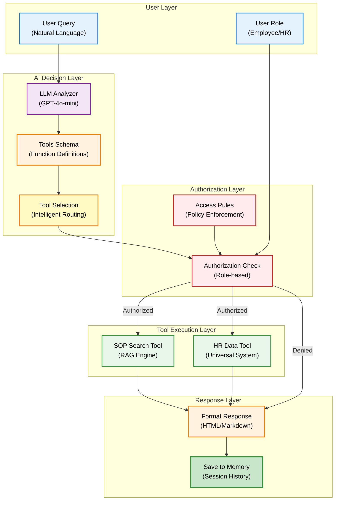
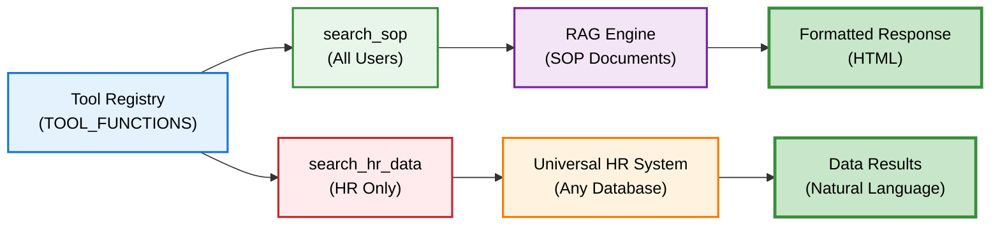
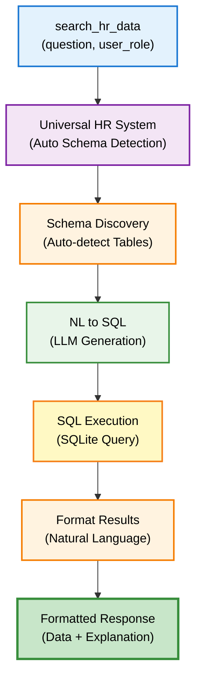
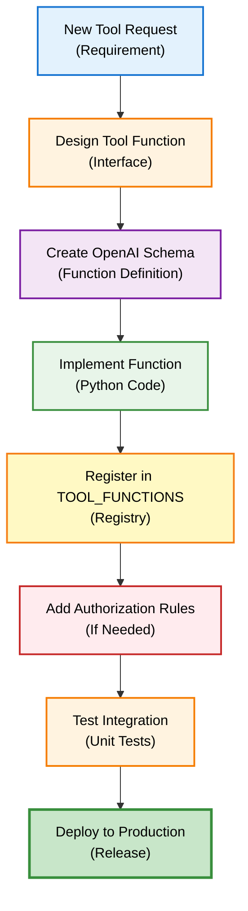

```mermaid
graph LR
    Call["search_sop<br/>(question, session_id)"] --> RAG["RAG Engine<br/>(answer_question)"]
    
    RAG --> Retrieve["Vector Retrieval<br/>(Pinecone)"]
    Retrieve --> Generate["LLM Generation<br/>(GPT-4o-mini)"]
    Generate --> Format["HTML Formatting<br/>(Clean Response)"]
    
    Format --> Response["Formatted Response<br/>(Ready)"]
    
    style Call fill:#e3f2fd,stroke:#1976d2,stroke-width:2px,color:#000
    style RAG fill:#f3e5f5,stroke:#7b1fa2,stroke-width:2px,color:#000
    style Retrieve fill:#e8f5e9,stroke:#388e3c,stroke-width:2px,color:#000
    style Generate fill:#fff3e0,stroke:#f57c00,stroke-width:2px,color:#000
    style Format fill:#fff9c4,stroke:#f57f17,stroke-width:2px,color:#000
    style Response fill:#c8e6c9,stroke:#388e3c,stroke-width:3px,color:#000
```

# Tool Integration - Developer Guide

## Overview

DENAI menggunakan **OpenAI Function Calling** untuk mengintegrasikan berbagai tools seperti SOP search dan HR data access. System ini memungkinkan AI untuk secara cerdas memilih dan memanggil tool yang tepat berdasarkan user query.

## Architecture



## Tool Registry

### Available Tools



**Tool Implementation:**

```python
# app/tools.py

TOOL_FUNCTIONS = {
    "search_sop": search_sop,
    "search_hr_data": search_hr_data,
}

# HR tools require authorization
HR_TOOLS = ["search_hr_data"]
```

## Tool Definitions (OpenAI Schema)

### SOP Search Tool

```python
{
    "type": "function",
    "function": {
        "name": "search_sop",
        "description": """🔍 SOP SEARCH: Search company SOP documents 
        using RAG engine. Covers procedures, policies, benefits, leave, 
        overtime, travel allowances, country rates, etc. 
        Available to all users.""",
        
        "parameters": {
            "type": "object",
            "properties": {
                "question": {
                    "type": "string",
                    "description": """Question about company procedures, 
                    policies, benefits, leave, overtime, travel allowances, etc."""
                }
            },
            "required": ["question"]
        }
    }
}
```

### HR Data Tool

```python
{
    "type": "function",
    "function": {
        "name": "search_hr_data",
        "description": """🤖 ENHANCED UNIVERSAL: Search employee database 
        using natural language. Works with ANY database structure automatically. 
        Can answer ANY question about employees - counts, distributions, lists, 
        complex filters, transfers, locations, etc.""",
        
        "parameters": {
            "type": "object",
            "properties": {
                "question": {
                    "type": "string",
                    "description": """ANY natural language question about employee data. 
                    Examples: 'berapa karyawan S2 di Jakarta?', 
                    'karyawan yang pindah company', 'distribusi band per lokasi'"""
                },
                "user_role": {
                    "type": "string",
                    "description": "User role for authorization - MUST be 'HR' for employee data access",
                    "enum": ["Employee", "HR"],
                    "default": "Employee"
                }
            },
            "required": ["question"]
        }
    }
}
```

## Tool Execution Flow

### Complete Execution Sequence

```mermaid
sequenceDiagram
    participant U as User<br/>(Query)
    participant A as API<br/>(Endpoint)
    participant L as LLM<br/>(Decision)
    participant Auth as Authz<br/>(Check)
    participant T as Tool<br/>(Execute)
    participant R as Response<br/>(Format)
    
    U->>A: "Berapa karyawan S2?"
    Note over U,A: User question
    
    A->>L: Analyze with tools schema
    Note over A,L: Function calling enabled
    
    L->>L: Decide tool to use
    Note over L: search_hr_data selected
    
    L->>Auth: Check authorization
    Note over L,Auth: User role = HR?
    
    Auth->>Auth: Validate user role
    Note over Auth: HR_TOOLS check
    
    Auth-->>T: Authorized ✅
    Note over Auth,T: Role = HR
    
    T->>T: Execute search_hr_data
    Note over T: Universal HR system
    
    T-->>R: Return results
    Note over T,R: Data + explanation
    
    R->>L: Feed to LLM
    Note over R,L: Generate natural response
    
    L-->>A: Final response
    Note over L,A: Formatted answer
    
    A-->>U: Display to user
    Note over A,U: Natural language + data
    
    style U fill:#e3f2fd,stroke:#1976d2,stroke-width:2px,color:#000
    style A fill:#fff3e0,stroke:#f57c00,stroke-width:2px,color:#000
    style L fill:#f3e5f5,stroke:#7b1fa2,stroke-width:2px,color:#000
    style Auth fill:#ffebee,stroke:#c62828,stroke-width:2px,color:#000
    style T fill:#e8f5e9,stroke:#388e3c,stroke-width:2px,color:#000
    style R fill:#fff9c4,stroke:#f57f17,stroke-width:2px,color:#000
```

### Implementation

```python
async def handle_tool_execution(
    tool_call, 
    session_id: str, 
    user_role: str, 
    original_question: str,
    mode: str = "chat"
):
    """Unified tool execution with mode awareness"""
    
    function_name = tool_call.function.name
    function_args = json.loads(tool_call.function.arguments)
    
    user = {"role": user_role or "Employee"}
    is_hr = is_hr_allowed(user)
    
    # Step 1: Authorization check
    if function_name in HR_TOOLS and not is_hr:
        return "🔒 Data karyawan hanya dapat diakses oleh tim HR."
    
    # Step 2: Execute function
    if function_name not in TOOL_FUNCTIONS:
        return "Maaf, fungsi tidak tersedia."
    
    try:
        tool_function = TOOL_FUNCTIONS[function_name]
        
        # Add session_id for SOP search
        if function_name == "search_sop":
            function_args["session_id"] = session_id
        
        tool_result = tool_function(**function_args)
        
        # Step 3: Handle direct response or LLM synthesis
        if function_name == "search_sop" and isinstance(tool_result, str):
            # SOP returns formatted HTML directly
            if mode == "call" and len(tool_result) > 150:
                return tool_result[:130] + "... Butuh detail lengkap?"
            return tool_result
        
        # Step 4: Get AI synthesis of tool result
        final_response = await run_chat_completion(
            messages=[
                {"role": "user", "content": original_question},
                {"role": "assistant", "content": None, 
                 "tool_calls": [tool_call]},
                {
                    "role": "tool",
                    "tool_call_id": tool_call.id,
                    "content": json.dumps(tool_result, ensure_ascii=False)
                }
            ],
            mode=mode
        )
        
        return final_response.choices[0].message.content
        
    except Exception as e:
        logger.error(f"Tool execution error: {e}")
        return "Maaf, terjadi gangguan sistem."
```

## Authorization System

### Role-Based Access Control

```mermaid
graph TB
    Request["Tool Request<br/>(Function Call)"] --> Check{"Is HR Tool?<br/>(search_hr_data)"}
    
    Check -->|"No"| Execute["Execute Directly<br/>(All Users)"]
    Check -->|"Yes"| Verify{"User Role?<br/>(Check)"}
    
    Verify -->|"HR"| Execute
    Verify -->|"Employee"| Block["BLOCK Access<br/>(Unauthorized)"]
    
    Execute --> Result["Return Result<br/>(Success)"]
    Block --> Error["Error Message<br/>(🔒 HR Only)"]
    
    style Request fill:#e3f2fd,stroke:#1976d2,stroke-width:2px,color:#000
    style Check fill:#fff9c4,stroke:#f57f17,stroke-width:2px,color:#000
    style Verify fill:#ffebee,stroke:#c62828,stroke-width:2px,color:#000
    style Execute fill:#e8f5e9,stroke:#388e3c,stroke-width:2px,color:#000
    style Block fill:#ffebee,stroke:#c62828,stroke-width:2px,color:#000
    style Result fill:#c8e6c9,stroke:#388e3c,stroke-width:3px,color:#000
    style Error fill:#ffebee,stroke:#c62828,stroke-width:3px,color:#000
```



**Implementation:**

```python
# app/rules.py

def is_hr_allowed(user: dict) -> bool:
    """Rule akses HR Mode"""
    return user.get("role") == "HR"

# Authorization in tool execution
user = {"role": user_role or "Employee"}
is_hr = is_hr_allowed(user)

if function_name in HR_TOOLS and not is_hr:
    return "🔒 Data karyawan hanya dapat diakses oleh tim HR."
```

## Tool-Specific Implementation

### SOP Search Tool



**Code:**

```python
def search_sop(question: str, session_id: str) -> str:
    """Search company SOP documents using RAG engine"""
    try:
        logger.info(f"🔍 SOP search: {question[:50]}...")
        
        if USE_SOP_ENGINE:
            result = answer_question(question, session_id)
            logger.info(f"✅ SOP search completed ({len(result)} chars)")
            return result
        else:
            return """
<h3>❌ Sistem Tidak Tersedia</h3>
<p>Sistem pencarian SOP sedang dalam pemeliharaan.</p>
"""
            
    except Exception as e:
        logger.error(f"❌ SOP search error: {e}")
        return f"""
<h3>❌ Error Pencarian SOP</h3>
<p>Terjadi kesalahan: {str(e)}</p>
"""
```

### HR Data Tool



**Code:**

```python
def search_hr_data(question: str, user_role: str = "Employee") -> str:
    """Search employee data using Enhanced Universal HR system"""
    try:
        logger.info(f"🤖 HR search: {question[:50]} (role: {user_role})")
        
        if USE_HR_ENGINE:
            result = search_hr_data_enhanced_universal(
                question=question,
                user_role=user_role,
                openai_api_key=OPENAI_API_KEY
            )
            logger.info("✅ Enhanced Universal HR system completed")
            return result
        else:
            return "❌ Sistem HR tidak tersedia."
            
    except Exception as e:
        logger.error(f"❌ HR system error: {e}")
        return f"❌ Error: {str(e)}"
```

## Adding New Tools

### Step-by-Step Guide



**Example: Adding a Calendar Tool**

```python
# Step 1: Implement the function
def search_calendar(date_range: str, user_id: str) -> str:
    """Search calendar events"""
    try:
        # Your implementation
        events = get_calendar_events(date_range, user_id)
        return format_calendar_response(events)
    except Exception as e:
        return f"Error: {str(e)}"

# Step 2: Register in tools.py
TOOL_FUNCTIONS = {
    "search_sop": search_sop,
    "search_hr_data": search_hr_data,
    "search_calendar": search_calendar,  # NEW
}

# Step 3: Add to schema
TOOLS_SCHEMA = [
    # ... existing tools ...
    {
        "type": "function",
        "function": {
            "name": "search_calendar",
            "description": "Search user calendar events",
            "parameters": {
                "type": "object",
                "properties": {
                    "date_range": {
                        "type": "string",
                        "description": "Date range (e.g., 'this week', 'next month')"
                    },
                    "user_id": {
                        "type": "string",
                        "description": "User identifier"
                    }
                },
                "required": ["date_range", "user_id"]
            }
        }
    }
]

# Step 4: Add authorization if needed
RESTRICTED_TOOLS = ["search_calendar"]  # Requires authentication
```

## Error Handling

### Tool Execution Errors

```mermaid
graph TB
    Execute["Execute Tool<br/>(Function Call)"] --> Try{"Try Execution<br/>(Attempt)"}
    
    Try -->|"Success"| Return["Return Result<br/>(Success)"]
    Try -->|"Error"| Catch["Catch Exception<br/>(Error Handler)"]
    
    Catch --> Type{"Error Type<br/>(Classification)"}
    
    Type -->|"Import Error"| Engine["Engine Not Available<br/>(Configuration Issue)"]
    Type -->|"Auth Error"| Auth["Authorization Failed<br/>(Access Denied)"]
    Type -->|"Execution Error"| Exec["Tool Execution Failed<br/>(Runtime Error)"]
    
    Engine --> Fallback1["User-friendly Message<br/>(System Unavailable)"]
    Auth --> Fallback2["Access Denied Message<br/>(🔒 Unauthorized)"]
    Exec --> Fallback3["Error Message<br/>(Try Again)"]
    
    style Execute fill:#e3f2fd,stroke:#1976d2,stroke-width:2px,color:#000
    style Try fill:#fff9c4,stroke:#f57f17,stroke-width:2px,color:#000
    style Return fill:#c8e6c9,stroke:#388e3c,stroke-width:3px,color:#000
    style Catch fill:#ffebee,stroke:#c62828,stroke-width:2px,color:#000
    style Type fill:#fff9c4,stroke:#f57f17,stroke-width:2px,color:#000
    style Engine fill:#ffebee,stroke:#c62828,stroke-width:2px,color:#000
    style Auth fill:#ffebee,stroke:#c62828,stroke-width:2px,color:#000
    style Exec fill:#ffebee,stroke:#c62828,stroke-width:2px,color:#000
    style Fallback1 fill:#fff3e0,stroke:#f57c00,stroke-width:2px,color:#000
    style Fallback2 fill:#fff3e0,stroke:#f57c00,stroke-width:2px,color:#000
    style Fallback3 fill:#fff3e0,stroke:#f57c00,stroke-width:2px,color:#000
```



## Best Practices

### DO's ✅

1. **Clear tool descriptions**
   ```python
   "description": """🔍 SOP SEARCH: Search company SOP documents. 
   Covers procedures, policies, benefits, etc. Available to all users."""
   ```

2. **Proper error handling**
   ```python
   try:
       result = tool_function(**args)
   except Exception as e:
       logger.error(f"Tool error: {e}")
       return user_friendly_message
   ```

3. **Authorization checks**
   ```python
   if function_name in HR_TOOLS and not is_hr:
       return "🔒 Access denied"
   ```

### DON'Ts ❌

1. **Don't expose sensitive data**
   ```python
   # BAD: Return raw database error
   return str(e)
   
   # GOOD: Return user-friendly message
   return "Terjadi kesalahan sistem"
   ```

2. **Don't skip validation**
   ```python
   # BAD: No validation
   result = execute_query(user_input)
   
   # GOOD: Validate first
   if not validate_input(user_input):
       return "Invalid input"
   ```

3. **Don't hardcode credentials**
   ```python
   # BAD: Hardcoded
   api_key = "sk-123456"
   
   # GOOD: From config
   from app.config import OPENAI_API_KEY
   ```

## Testing

```python
def test_tool_integration():
    """Test tool integration"""
    
    # Test SOP search
    result = search_sop("aturan lembur", "test_session")
    assert "lembur" in result.lower()
    
    # Test HR search (with HR role)
    result = search_hr_data("berapa total karyawan?", "HR")
    assert result is not None
    
    # Test HR search (without authorization)
    result = search_hr_data("berapa total karyawan?", "Employee")
    assert "🔒" in result
    
    print("✅ All tool integration tests passed")
```

## Next Steps

**Related Documentation:**
- [RAG Engine](../developer/rag-engine.md) – RAG implementation details
- [Authentication](../developer/authentication.md) – User authentication
- [API Reference](../api/overview.md) – API endpoints overview

**Advanced Topics:**
- [Tool Integration](../developer/tool-integration.md) – Build and integrate custom tools
- [Configuration](../getting-started/configuration.md) – Advanced system configuration