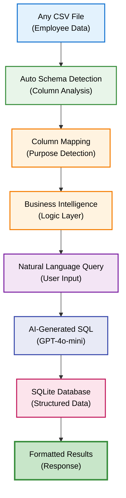
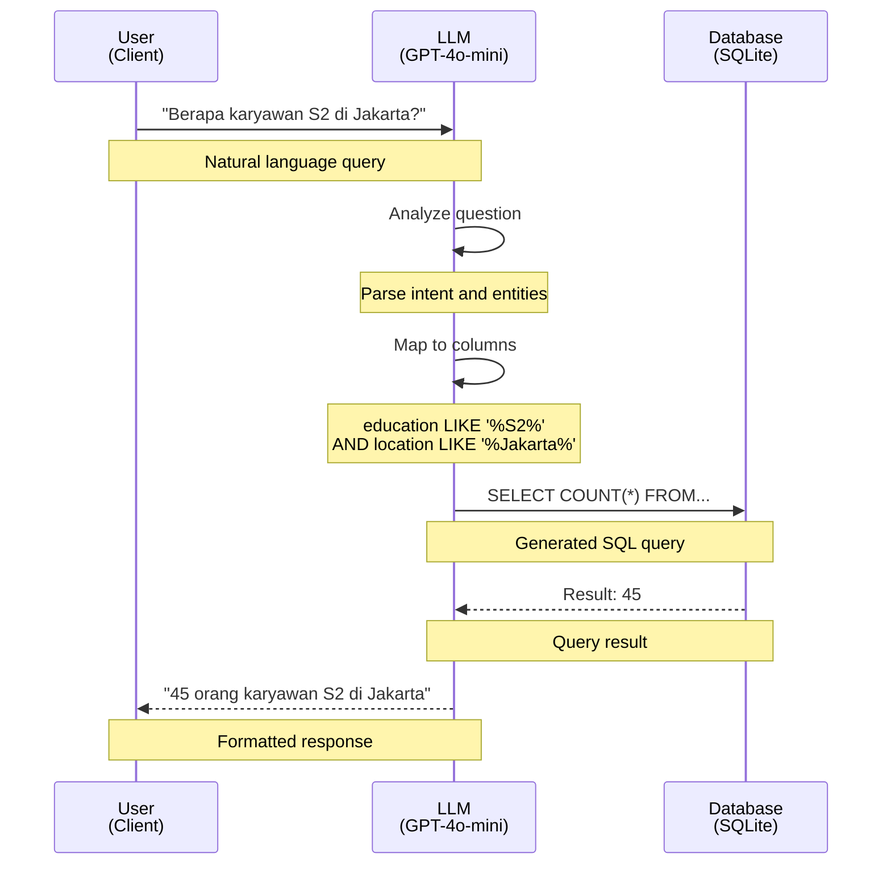
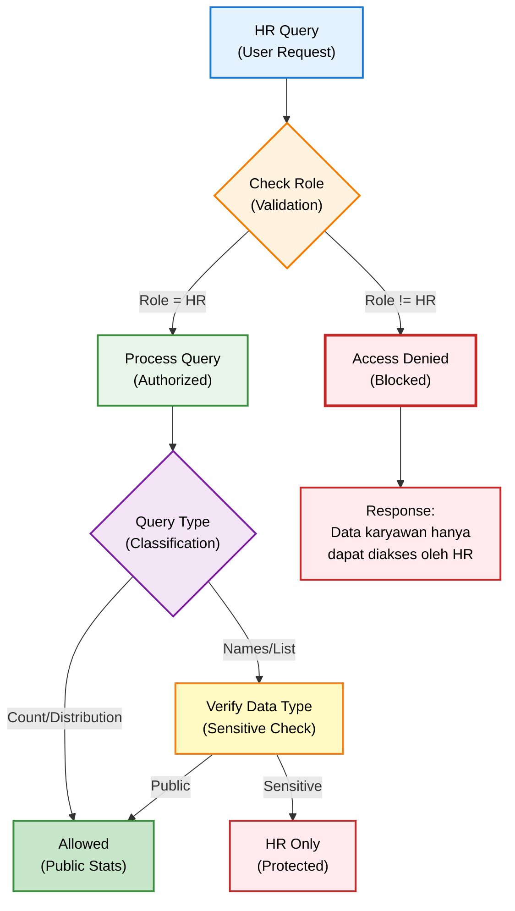

# Sistem HR Universal

## Overview

Sistem HR Universal adalah engine yang memungkinkan query data karyawan menggunakan natural language, dengan kemampuan **otomatis membaca struktur database apapun** tanpa perlu konfigurasi manual.

## Keunggulan Utama

### ✨ Universal Database Support



**Fitur:**
- 🎯 Zero-configuration setup
- 🧠 Automatic schema discovery
- 📊 Business intelligence integration
- 🔒 Role-based authorization
- 💡 Smart column purpose detection

## Cara Kerja

### 1. Auto Schema Discovery

System otomatis menganalisis struktur database dan mendeteksi purpose setiap column.

```python
# Example: Employee database
Columns Detected:
- employee_name → person_name (identification)
- home_company → location (work location)
- host_company → location (current assignment)
- status_kontrak → employment_status (contract type)
- education → education (qualification level)
- band → job_level (organizational level)
```

**Column Purpose Detection:**

| Pattern | Detected As | Business Context |
|---------|-------------|------------------|
| name, nama | person_name | Individual identification |
| company, location | location | Work location |
| status, kontrak | employment_status | Contract classification |
| education, pendidikan | education | Qualification level |
| band, level | job_level | Organizational level |
| salary, gaji | compensation | Monetary data |

### 2. Natural Language to SQL

AI mengkonversi pertanyaan natural language menjadi SQL query yang akurat.



**Example Queries:**

**Count Query:**
```
Q: "Berapa total karyawan di perusahaan?"

SQL Generated:
SELECT COUNT(*) FROM employees

Result:
📊 Total: 1,234 karyawan
```

**Distribution Query:**
```
Q: "Distribusi pendidikan karyawan?"

SQL Generated:
SELECT education, COUNT(*) as count 
FROM employees 
GROUP BY education

Result:
📊 Distribusi Pendidikan:
• S2: 456 orang (37%)
• S1: 678 orang (55%)
• D3: 100 orang (8%)
```

**Complex Filter:**
```
Q: "Karyawan yang pindah company?"

SQL Generated:
SELECT employee_name 
FROM employees 
WHERE home_company != host_company

Result:
📋 Karyawan yang pindah company:
1. John Doe
2. Jane Smith
...
```

### 3. Smart Value Matching

System menggunakan flexible matching untuk menangani variasi data real-world.

```python
# Flexible text matching
"Jakarta" matches:
- Jakarta
- JAKARTA
- DKI Jakarta
- Jakarta Pusat

# Education matching
"S2" matches:
- S2
- s2
- Magister
- S-2
```

**Strategi:**
- LIKE operator untuk text search
- Case-insensitive matching
- Partial pattern matching
- Synonym handling

### 4. Business Intelligence

System menambahkan business logic untuk analisis yang lebih meaningful.

```python
# Auto-detect company transfers
if location_columns >= 2:
    # Compare home vs host company
    transfers = home_company != host_company

# Auto-calculate distributions
GROUP BY education
ORDER BY COUNT(*) DESC
```

## Authorization System

### Role-Based Access Control



**Access Rules:**

| Query Type | Employee | HR |
|------------|----------|-----|
| COUNT queries | ❌ | ✅ |
| Distribution stats | ❌ | ✅ |
| Employee names | ❌ | ✅ |
| Specific person data | ❌ | ✅ |

## CSV Ingestion System

### Automatic Batch Processing

```bash
# Process single file (auto-naming)
python batch_csv_processor_final.py employees_2025.csv

# Process entire folder
python batch_csv_processor_final.py --batch csv/
```

**Process:**


```mermaid
graph LR
    A["CSV File<br/>(Raw Data)"] --> B["Universal Ingestor<br/>(Parser)"]
    B --> C["Schema Analysis<br/>(Structure Detection)"]
    C --> D["Type Detection<br/>(Data Types)"]
    D --> E["Batch Processing<br/>(Chunked Insert)"]
    E --> F["SQLite Database<br/>(Final Storage)"]
    
    style A fill:#e3f2fd,stroke:#1976d2,stroke-width:2px,color:#000
    style B fill:#fff3e0,stroke:#f57c00,stroke-width:2px,color:#000
    style C fill:#f3e5f5,stroke:#7b1fa2,stroke-width:2px,color:#000
    style D fill:#e8eaf6,stroke:#3949ab,stroke-width:2px,color:#000
    style E fill:#fff9c4,stroke:#f57f17,stroke-width:2px,color:#000
    style F fill:#c8e6c9,stroke:#388e3c,stroke-width:3px,color:#000
```

**Features:**
- ✅ Automatic database naming
- ✅ Smart INTEGER vs REAL detection
- ✅ Memory-efficient batch processing
- ✅ Configurable batch size
- ✅ Error handling & recovery

### Column Type Detection

```python
# Smart SQL type detection
if column_contains_only_integers:
    sql_type = "INTEGER"
elif column_contains_decimals:
    sql_type = "REAL"
elif column_looks_like_date:
    sql_type = "TEXT"  # Store as ISO string
else:
    sql_type = "TEXT"
```

## Usage Examples

### Example 1: Employee Count

**Query:**
```
Berapa total karyawan di perusahaan?
```

**Process:**
1. Parse question → Simple count
2. Generate SQL: `SELECT COUNT(*) FROM employees`
3. Execute query
4. Format result

**Response:**
```
📊 Total Karyawan Perusahaan

Hasil: 1,234 karyawan
```

### Example 2: Distribution Analysis

**Query:**
```
Distribusi karyawan per band?
```

**Process:**
1. Detect distribution query
2. Identify band column
3. Generate GROUP BY SQL
4. Calculate percentages

**Response:**
```
📊 Distribusi Karyawan per Band

• Band 5: 123 orang (10.0%)
• Band 4: 456 orang (37.0%)
• Band 3: 456 orang (37.0%)
• Band 2: 199 orang (16.1%)

Total: 1,234 karyawan
```

### Example 3: Complex Filter

**Query:**
```
Siapa karyawan S2 di Jakarta dengan Band 3?
```

**Process:**
1. Multi-condition query detected
2. Map to columns: education, location, band
3. Generate complex WHERE clause
4. Check authorization (requires HR role)

**Response (if HR):**
```
📋 Karyawan S2 di Jakarta dengan Band 3:

1. John Doe
2. Jane Smith
3. Ahmad Wijaya
...

Total: 45 karyawan
```

**Response (if not HR):**
```
🔒 Informasi ini hanya dapat diakses oleh HR personnel
```

## Configuration

### Database Settings

```python
# Database location
DB_FOLDER = "db/"

# Batch processing
BATCH_SIZE = 1000  # Rows per batch
```

### LLM Settings

```python
# For SQL generation
MODEL = "gpt-4o-mini"
TEMPERATURE = 0.1  # Low for accuracy
MAX_TOKENS = 500
```

## Best Practices

### For CSV Preparation

✅ **DO:**
- Use consistent column naming
- Keep column names descriptive
- Use standard formats (e.g., ISO dates)
- Remove empty columns

❌ **DON'T:**
- Use special characters in column names
- Mix data types in same column
- Use merged cells
- Have duplicate column names

### For Queries

✅ **DO:**
- Ask specific questions
- Use clear terminology
- Specify conditions explicitly
- Request summaries for large datasets

❌ **DON'T:**
- Ask vague questions
- Request excessive details
- Mix unrelated questions
- Assume implicit filters

## Troubleshooting

### Issue: Schema not detected

**Solution:**
```bash
# Force re-discovery
python -c "from app.sop_router import refresh_router_cache; refresh_router_cache()"

# Or delete cache
rm cache/sop_doc_types.json
```

### Issue: SQL generation error

**Debug:**
```python
# Enable verbose logging
FEATURE_VERBOSE_LOGGING = True

# Check generated SQL
result = hr_system.natural_language_to_sql(question, user_role)
print(result['sql_query'])
```

### Issue: Authorization fails

**Check:**
```python
# Verify user role
user = {"role": "HR"}  # Must be exactly "HR"
is_authorized = is_hr_allowed(user)
```

## API Integration

### REST Endpoint

```bash
POST /ask
Content-Type: application/json

{
  "question": "Berapa karyawan di Jakarta?",
  "session_id": "session_123",
  "user_role": "HR"  # REQUIRED for HR queries
}
```

**Response:**
```json
{
  "answer": "📊 Total: 345 karyawan di Jakarta",
  "session_id": "session_123",
  "tool_called": "search_hr_data",
  "authorized": true
}
```

## Performance Metrics

| Metric | Value |
|--------|-------|
| Schema Discovery | < 5 seconds |
| SQL Generation | < 1 second |
| Query Execution | < 500ms |
| Batch Ingestion | 1000 rows/second |

## Security Considerations

### Data Protection

```python
# 1. Role verification
if function_name in HR_TOOLS and user_role != "HR":
    return "🔒 Access denied"

# 2. SQL injection prevention
# Uses parameterized queries
cursor.execute(sql, params)

# 3. Read-only access
# Database opened in read-only mode
conn = sqlite3.connect(f"file:{db_file}?mode=ro", uri=True)
```

### Audit Logging

```python
# Log all HR queries
logger.info(f"HR Query: {question} by {user_role}")
```

## Next Steps

- [CSV Ingestion Guide](../developer/csv-ingestion.md)
- [Database Setup](../developer/database-setup.md)
- [API Reference](../api/chat-endpoints.md)