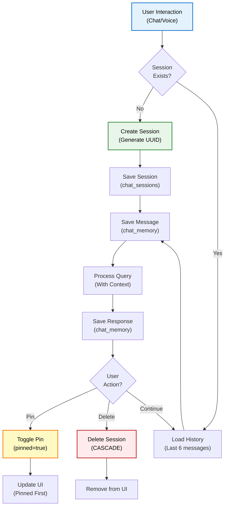
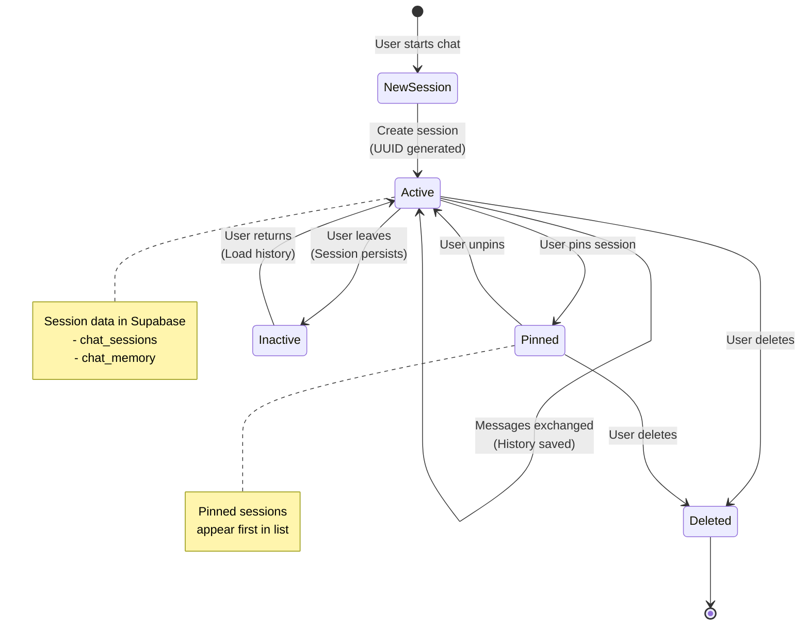

# Session Management

## Overview

Session Management di DENAI memungkinkan users untuk maintain conversation context, organize chat history, dan continue conversations across multiple sessions. Sistem menggunakan Supabase PostgreSQL untuk persistent storage dengan features pin/unpin dan delete.

## Architecture



## Database Schema

### Supabase Tables

```sql
-- 1. Chat Sessions (Metadata)
CREATE TABLE IF NOT EXISTS chat_sessions (
    session_id TEXT PRIMARY KEY,
    title TEXT NOT NULL,
    pinned BOOLEAN DEFAULT FALSE,
    created_at TIMESTAMP WITH TIME ZONE DEFAULT NOW()
);

-- 2. Chat Memory (Messages)
CREATE TABLE IF NOT EXISTS chat_memory (
    id BIGSERIAL PRIMARY KEY,
    session_id TEXT REFERENCES chat_sessions(session_id) ON DELETE CASCADE,
    role TEXT NOT NULL,  -- 'user' or 'assistant'
    message TEXT NOT NULL,
    created_at TIMESTAMP WITH TIME ZONE DEFAULT NOW()
);

-- Indexes for Performance
CREATE INDEX IF NOT EXISTS idx_chat_memory_session 
    ON chat_memory(session_id);

CREATE INDEX IF NOT EXISTS idx_chat_memory_created 
    ON chat_memory(created_at DESC);

CREATE INDEX IF NOT EXISTS idx_chat_sessions_pinned 
    ON chat_sessions(pinned DESC, created_at DESC);
```

### Row Level Security (RLS)

```sql
-- Enable RLS
ALTER TABLE chat_sessions ENABLE ROW LEVEL SECURITY;
ALTER TABLE chat_memory ENABLE ROW LEVEL SECURITY;

-- Policies (allow all for service role)
CREATE POLICY "Allow all for service role" ON chat_sessions
    FOR ALL USING (true);

CREATE POLICY "Allow all for service role" ON chat_memory
    FOR ALL USING (true);
```

## Core Features

### 1. Session Creation

**Automatic UUID Generation**

```python
import uuid
from datetime import datetime

def create_new_session(first_question: str) -> str:
    """Create new session with auto-generated ID"""
    
    # Generate unique session ID
    session_id = str(uuid.uuid4())  # e.g., "abc123-def456-..."
    
    # Extract title from first question (first 50 chars)
    title = first_question[:50] + ("..." if len(first_question) > 50 else "")
    
    # Save to Supabase
    save_session(session_id, title)
    
    return session_id
```

**Implementation**:

```python
# memory/memory_supabase.py
def save_session(session_id: str, title: str):
    """Create or update session record"""
    supabase.table("chat_sessions").upsert({
        "session_id": session_id,
        "title": title
    }).execute()
```

**Usage in API**:

```python
# app/api.py
@app.post("/ask")
async def ask_question(request: Request, req: QuestionRequest):
    # Auto-create session if not exists
    if not req.session_id:
        req.session_id = str(uuid.uuid4())
    
    # Check if session exists
    existing = get_recent_history(req.session_id, limit=1)
    if not existing:
        # New session - save with title
        title = req.question[:50] + "..."
        save_session(req.session_id, title)
    
    # Continue with query processing...
```

### 2. Message Storage

**Bi-Directional Conversation**

```python
def save_message(session_id: str, role: str, message: str):
    """Save message to chat history"""
    supabase.table("chat_memory").insert({
        "session_id": session_id,
        "role": role,          # 'user' or 'assistant'
        "message": message,
        # created_at auto-generated
    }).execute()
```

**Example Flow**:

```python
# Save user question
save_message(session_id, "user", "Berapa jam maksimal lembur?")

# Process query...

# Save assistant response
save_message(session_id, "assistant", "<h3>Informasi Kerja Lembur</h3>...")
```

**Data Structure**:

```python
# Stored in chat_memory table
{
    "id": 123,
    "session_id": "abc123-def456",
    "role": "user",
    "message": "Berapa jam maksimal lembur?",
    "created_at": "2025-01-15T10:30:00Z"
}

{
    "id": 124,
    "session_id": "abc123-def456",
    "role": "assistant",
    "message": "<h3>Informasi...</h3>",
    "created_at": "2025-01-15T10:30:05Z"
}
```

### 3. History Retrieval

**Context-Aware Conversation**

```python
def get_recent_history(session_id: str, limit: int = 6) -> List[Dict]:
    """Get recent messages for context"""
    
    res = (
        supabase
        .table("chat_memory")
        .select("role,message")
        .eq("session_id", session_id)
        .order("created_at", desc=True)
        .limit(limit)
        .execute()
    )
    
    # Reverse chronologically (oldest first)
    return list(reversed(res.data))
```

**Usage in RAG Engine**:

```python
# engines/sop/rag_engine.py
def answer_question(question: str, session_id: str):
    # Get conversation context
    history = get_recent_history(session_id, limit=6)
    
    # Build history text for prompt
    history_parts = []
    for h in history:
        role = h.get("role", "").upper()
        message = h.get("message", "")[:150]  # Truncate for context
        history_parts.append(f"{role}: {message}")
    
    history_text = "\n".join(history_parts)
    
    # Use in prompt
    prompt = f"""
RIWAYAT PERCAKAPAN:
{history_text}

KONTEKS SOP:
{context}

PERTANYAAN:
{question}
"""
```

**Example History**:

```python
[
    {"role": "user", "message": "Bagaimana prosedur lembur?"},
    {"role": "assistant", "message": "<h3>Informasi Kerja Lembur</h3>..."},
    {"role": "user", "message": "Berapa biayanya?"},
    {"role": "assistant", "message": "<h3>Biaya Lembur</h3>..."}
]
```

### 4. Session Listing

**Get All Sessions (Pinned First)**

```python
def get_sessions(limit: int = 30) -> List[Dict]:
    """Get sessions list with pinned first"""
    
    res = (
        supabase
        .table("chat_sessions")
        .select("session_id,title,pinned,created_at")
        .order("pinned", desc=True)      # Pinned first!
        .order("created_at", desc=True)  # Then by date
        .limit(limit)
        .execute()
    )
    
    return res.data
```

**Response Example**:

```json
[
    {
        "session_id": "xyz789",
        "title": "Prosedur perjalanan dinas...",
        "pinned": true,
        "created_at": "2025-01-10T09:00:00Z"
    },
    {
        "session_id": "abc123",
        "title": "Bagaimana prosedur lembur?",
        "pinned": false,
        "created_at": "2025-01-15T10:30:00Z"
    }
]
```

**API Endpoint**:

```python
@app.get("/sessions")
def list_sessions():
    """Get all sessions for sidebar"""
    try:
        return get_sessions()
    except Exception as e:
        raise HTTPException(status_code=500, detail=str(e))
```

### 5. Pin/Unpin Sessions

**Toggle Pin Status**

```python
def toggle_pin_session(session_id: str) -> bool:
    """Toggle pin status for a session"""
    try:
        # Get current status
        response = supabase.table("chat_sessions")\
            .select("pinned")\
            .eq("session_id", session_id)\
            .execute()
        
        if response.data:
            current_pinned = response.data[0].get("pinned", False)
            new_pinned = not current_pinned
            
            # Update pin status
            supabase.table("chat_sessions")\
                .update({"pinned": new_pinned})\
                .eq("session_id", session_id)\
                .execute()
            
            logger.info(f"📌 Session {session_id[:8]}... pinned={new_pinned}")
            return new_pinned
        
        return False
    except Exception as e:
        logger.error(f"❌ Error toggling pin: {e}")
        return False
```

**API Endpoint**:

```python
@app.post("/sessions/{session_id}/pin")
async def pin_session_endpoint(session_id: str):
    """Toggle pin status for a session"""
    try:
        pinned = toggle_pin_session(session_id)
        return {"success": True, "pinned": pinned}
    except Exception as e:
        raise HTTPException(status_code=500, detail=str(e))
```

**Frontend Integration**:

```javascript
async function togglePin(sessionId) {
    const response = await fetch(`/sessions/${sessionId}/pin`, {
        method: 'POST'
    });
    
    const data = await response.json();
    console.log('Session pinned:', data.pinned);
    
    // Update UI (move to top if pinned)
    reloadSessionList();
}
```

### 6. Delete Sessions

**Cascade Delete (Session + Messages)**

```python
def delete_session_and_messages(session_id: str):
    """Delete session and all its messages"""
    try:
        # Delete messages first (CASCADE also works)
        supabase.table("chat_memory")\
            .delete()\
            .eq("session_id", session_id)\
            .execute()
        
        # Delete session
        supabase.table("chat_sessions")\
            .delete()\
            .eq("session_id", session_id)\
            .execute()
        
        logger.info(f"🗑️ Session {session_id[:8]}... deleted successfully")
    except Exception as e:
        logger.error(f"❌ Error deleting session: {e}")
        raise
```

**API Endpoint**:

```python
@app.delete("/sessions/{session_id}")
async def delete_session_endpoint(session_id: str):
    """Delete session and all its messages"""
    try:
        delete_session_and_messages(session_id)
        return {
            "success": True, 
            "message": "Session deleted successfully"
        }
    except Exception as e:
        raise HTTPException(status_code=500, detail=str(e))
```

**Frontend Integration**:

```javascript
async function deleteSession(sessionId) {
    if (!confirm('Hapus session ini?')) return;
    
    const response = await fetch(`/sessions/${sessionId}`, {
        method: 'DELETE'
    });
    
    if (response.ok) {
        // Remove from UI
        removeSessionFromList(sessionId);
        
        // If current session, start new
        if (sessionId === currentSessionId) {
            startNewSession();
        }
    }
}
```

## Session Lifecycle

### Complete Flow Diagram



### State Transitions

**1. New Session**
```python
# State: None → Active
session_id = str(uuid.uuid4())
save_session(session_id, title)
# Status: Active, pinned=false
```

**2. Add Messages**
```python
# State: Active → Active (with history)
save_message(session_id, "user", question)
save_message(session_id, "assistant", response)
# History grows in chat_memory table
```

**3. Pin Session**
```python
# State: Active → Pinned
toggle_pin_session(session_id)
# Status: Active, pinned=true
# UI: Moves to top of list
```

**4. Unpin Session**
```python
# State: Pinned → Active
toggle_pin_session(session_id)
# Status: Active, pinned=false
# UI: Returns to chronological position
```

**5. Delete Session**
```python
# State: Active/Pinned → Deleted
delete_session_and_messages(session_id)
# All data removed (cascade)
# UI: Removed from list
```

## Context Management

### History Limits

**Configuration**:

```python
# app/config.py
MAX_HISTORY_LENGTH = 8  # Max messages to keep in context

# Memory functions
def get_recent_history(session_id: str, limit: int = 6):
    # Default: Last 6 messages
    # Can be overridden per call
```

**Why Limit History?**

1. **Token Efficiency**: Reduce LLM input tokens
2. **Relevance**: Recent messages more relevant
3. **Performance**: Faster context building
4. **Cost**: Lower API costs

### Question Rephrasing

**Context-Aware Follow-Ups**

```python
def rephrase_question_with_context(question: str, history: list) -> str:
    """Rephrase follow-up questions with context"""
    
    if not history or len(history) < 2:
        return question  # Standalone question
    
    # Get recent history
    recent_history = history[-8:]
    
    # Build history text
    history_parts = []
    for h in recent_history:
        role = h.get("role", "unknown")
        message = h.get("message", "")[:200]  # Truncate
        history_parts.append(f"{role}: {message}")
    
    history_text = "\n".join(history_parts)
    
    # Rephrase with LLM
    rephrase_prompt = f"""
Ubah pertanyaan follow-up menjadi pertanyaan standalone.

RIWAYAT PERCAKAPAN:
{history_text}

PERTANYAAN FOLLOW-UP:
{question}

PERTANYAAN STANDALONE:
"""
    
    response = llm.invoke(rephrase_prompt)
    return response.content.strip()
```

**Example**:

```python
# History
[
    {"role": "user", "message": "Bagaimana prosedur lembur?"},
    {"role": "assistant", "message": "Prosedur lembur memerlukan..."},
]

# Follow-up question
"Berapa biayanya?"

# Rephrased
"Berapa biaya untuk kerja lembur?"
```

## Session Cleanup

### Automatic Cleanup

```python
# memory/memory_supabase.py
from datetime import datetime, timedelta

def cleanup_old_sessions(days: int = None):
    """Delete sessions older than N days"""
    
    if days is None:
        days = SESSION_CLEANUP_DAYS  # From config
    
    try:
        cutoff_date = datetime.now() - timedelta(days=days)
        
        # Delete old sessions (CASCADE handles messages)
        result = supabase.table("chat_sessions")\
            .delete()\
            .lt("created_at", cutoff_date.isoformat())\
            .execute()
        
        logger.info(f"✅ Cleaned up sessions older than {days} days")
        
    except Exception as e:
        logger.error(f"❌ Error cleaning up sessions: {e}")
```

**Configuration**:

```python
# app/config.py
SESSION_CLEANUP_DAYS = 30  # Delete sessions older than 30 days
```

**Scheduled Job** (Optional):

```python
# Schedule with APScheduler or cron
from apscheduler.schedulers.background import BackgroundScheduler

scheduler = BackgroundScheduler()
scheduler.add_job(
    cleanup_old_sessions,
    'cron',
    hour=2,  # Run at 2 AM daily
    args=[30]  # Keep last 30 days
)
scheduler.start()
```

## UI Integration

### Session Sidebar

**HTML Structure**:

```html
<div class="session-sidebar">
    <div class="session-header">
        <h3>Chat History</h3>
        <button onclick="startNewSession()">+ New Chat</button>
    </div>
    
    <div class="session-list" id="sessionList">
        <!-- Dynamically loaded -->
    </div>
</div>
```

**JavaScript Implementation**:

```javascript
// Load sessions on page load
async function loadSessions() {
    const response = await fetch('/sessions');
    const sessions = await response.json();
    
    const sessionList = document.getElementById('sessionList');
    sessionList.innerHTML = '';
    
    sessions.forEach(session => {
        const div = document.createElement('div');
        div.className = 'session-item' + (session.pinned ? ' pinned' : '');
        div.innerHTML = `
            <div class="session-title" onclick="loadSession('${session.session_id}')">
                ${session.pinned ? '📌 ' : ''}${session.title}
            </div>
            <div class="session-actions">
                <button onclick="togglePin('${session.session_id}')">
                    ${session.pinned ? 'Unpin' : 'Pin'}
                </button>
                <button onclick="deleteSession('${session.session_id}')">Delete</button>
            </div>
        `;
        sessionList.appendChild(div);
    });
}

// Load session history
async function loadSession(sessionId) {
    currentSessionId = sessionId;
    
    const response = await fetch(`/history/${sessionId}`);
    const history = await response.json();
    
    // Display history in chat
    displayHistory(history);
}
```

### Visual Indicators

**CSS Styling**:

```css
/* Pinned sessions */
.session-item.pinned {
    background: #fff9c4;
    border-left: 3px solid #f57f17;
    font-weight: bold;
}

/* Active session */
.session-item.active {
    background: #e3f2fd;
    border-left: 3px solid #1976d2;
}

/* Session actions on hover */
.session-item:hover .session-actions {
    display: flex;
}
```

## Best Practices

### For Developers

✅ **DO**:
- Use UUIDs for session IDs (avoid sequential)
- Implement cascade delete (session → messages)
- Index frequently queried columns
- Limit history retrieval (6-8 messages)
- Handle deleted session gracefully
- Log session operations for debugging

❌ **DON'T**:
- Store sensitive data in session title
- Keep unlimited history in memory
- Fetch entire history for every request
- Ignore errors in session operations
- Skip cleanup of old sessions

### For System Design

✅ **DO**:
- Separate session metadata from messages
- Use foreign keys with CASCADE
- Implement Row Level Security (RLS)
- Create indexes for performance
- Plan for session archival
- Monitor database size

❌ **DON'T**:
- Mix session data with business data
- Skip database indexes
- Ignore database constraints
- Store binary data in sessions
- Allow unlimited session growth

## Performance Optimization

### Database Indexes

```sql
-- Speed up session listing
CREATE INDEX idx_sessions_pinned_date 
    ON chat_sessions(pinned DESC, created_at DESC);

-- Speed up message retrieval
CREATE INDEX idx_memory_session_date 
    ON chat_memory(session_id, created_at DESC);
```

### Query Optimization

```python
# BAD: Fetch all messages
messages = supabase.table("chat_memory")\
    .select("*")\
    .eq("session_id", session_id)\
    .execute()  # Could be thousands of rows

# GOOD: Limit to recent messages
messages = supabase.table("chat_memory")\
    .select("role,message")\
    .eq("session_id", session_id)\
    .order("created_at", desc=True)\
    .limit(6)\
    .execute()  # Only 6 rows
```

### Caching (Optional)

```python
from functools import lru_cache

@lru_cache(maxsize=100)
def get_session_info(session_id: str) -> Dict:
    """Cache session metadata"""
    res = supabase.table("chat_sessions")\
        .select("*")\
        .eq("session_id", session_id)\
        .execute()
    return res.data[0] if res.data else None
```

## Monitoring

### Session Metrics

```python
# Track session usage
SESSION_METRICS = {
    "total_sessions": 0,
    "active_sessions": 0,
    "pinned_sessions": 0,
    "avg_messages_per_session": 0.0,
    "sessions_created_today": 0
}

# Update metrics
def update_session_metrics():
    sessions = get_sessions(limit=1000)
    SESSION_METRICS["total_sessions"] = len(sessions)
    SESSION_METRICS["pinned_sessions"] = sum(1 for s in sessions if s["pinned"])
```

## Next Steps

- **[Multi-Modal Support →](multi-modal.md)**: Combining sessions with voice/files
- **[API Reference →](../api/session-endpoints.md)**: Session API documentation
- **[Database Setup →](../developer/database-setup.md)**: Supabase configuration

---

**Session management complete!** Persistent, organized conversations →