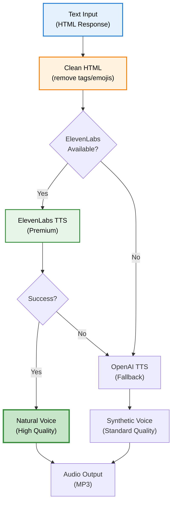
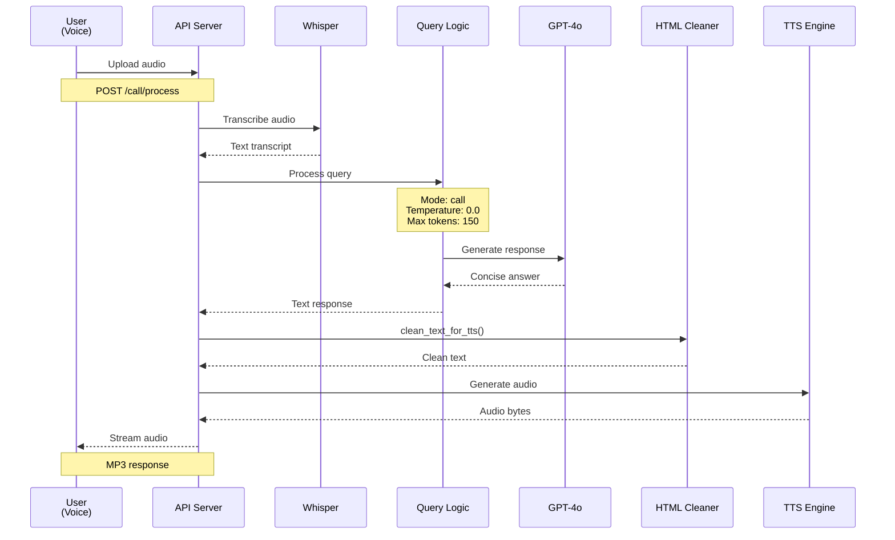

# Voice Interface

## Overview

DENAI Voice Interface memungkinkan interaksi hands-free dengan sistem menggunakan natural voice conversation dalam bahasa Indonesia. Fitur ini mengintegrasikan Speech-to-Text (STT) dan Text-to-Speech (TTS) premium untuk pengalaman yang natural dan responsif.

## Architecture

```mermaid
graph LR
    A["User Voice<br/>(Microphone)"] --> B["Browser<br/>(WebRTC)"]
    B --> C["API Server<br/>(/call/process)"]
    C --> D["Whisper STT<br/>(Transcription)"]
    D --> E["Query Processing<br/>(RAG/HR)"]
    E --> F["Response Generation<br/>(LLM)"]
    F --> G["HTML Cleaning<br/>(clean_text_for_tts)"]
    G --> H["TTS Generation<br/>(ElevenLabs)"]
    H -->|"Success"| I["Audio Response<br/>(Natural Voice)"]
    H -->|"Fallback"| J["OpenAI TTS<br/>(Backup)"]
    J --> I
    I --> K["Audio Playback<br/>(Speaker)"]
    
    style A fill:#e3f2fd,stroke:#1976d2,stroke-width:2px,color:#000
    style D fill:#fff3e0,stroke:#f57c00,stroke-width:2px,color:#000
    style E fill:#f3e5f5,stroke:#7b1fa2,stroke-width:2px,color:#000
    style H fill:#e8f5e9,stroke:#388e3c,stroke-width:2px,color:#000
    style I fill:#c8e6c9,stroke:#388e3c,stroke-width:3px,color:#000
```



## Key Components

### 1. Speech-to-Text (STT)

**Engine**: OpenAI Whisper
**Model**: whisper-1
**Language**: Indonesian (id)

#### Configuration

```python
# app/config.py
SPEECH_LANGUAGE_DEFAULT = "id"  # Indonesian

# STT processing
async def process_stt(audio_file_obj) -> str:
    transcript_response = await asyncio.to_thread(
        client.audio.transcriptions.create,
        model="whisper-1",
        file=audio_file_obj,
        language="id",  # Indonesian optimization
        response_format="text"
    )
    
    return transcript_response.strip()
```

#### Features

**Supported Audio Formats**:
- WAV (recommended)
- MP3
- M4A
- FLAC
- WebM

**Performance Metrics**:
- Accuracy: 90%+ for Indonesian
- Processing time: < 2 seconds for 10-second audio
- Max file size: 25MB
- Max duration: 10 minutes

**Example Usage**:

```python
# Endpoint: POST /speech/speech-to-text
@app.post("/speech/speech-to-text")
async def speech_to_text_optimized(
    request: Request,
    audio_file: UploadFile = File(...)
):
    # Read audio file
    audio_content = await audio_file.read()
    audio_file_obj = io.BytesIO(audio_content)
    audio_file_obj.name = audio_file.filename or "audio.wav"
    
    # Transcribe
    transcript = await process_stt(audio_file_obj)
    
    return {
        "transcript": transcript,
        "language": "id",
        "confidence": "high",
        "status": "success",
        "engine": "whisper"
    }
```

**Response Example**:
```json
{
    "transcript": "Berapa jam maksimal lembur per hari?",
    "language": "id",
    "confidence": "high",
    "status": "success",
    "engine": "whisper"
}
```

### 2. Text-to-Speech (TTS)

**Primary Engine**: ElevenLabs (Indonesian Natural Voice)
**Fallback Engine**: OpenAI TTS
**Strategy**: Try premium first, fallback to standard

#### ElevenLabs Configuration

```python
# app/config.py
ELEVENLABS_SETTINGS = {
    "model": "eleven_flash_v2_5",        # Fast, high-quality
    "stability": 0.6,                     # Voice consistency
    "similarity_boost": 0.8,              # Voice matching
    "style": 0.2,                         # Expressiveness
    "use_speaker_boost": True             # Audio enhancement
}

ELEVENLABS_VOICE_ID_INDONESIAN = "iWydkXKoiVtvdn4vLKp9"  # Cahaya voice
```

#### OpenAI TTS Configuration (Fallback)

```python
OPENAI_TTS_SETTINGS = {
    "voice": "nova",     # Female voice
    "speed": 0.95        # Slightly slower for clarity
}
```

#### TTS Generation Flow



#### HTML Cleaning for Natural Speech

**Critical Feature**: Clean HTML untuk natural voice output

```python
def clean_text_for_tts(html_text: str) -> str:
    """Clean HTML for natural TTS speech."""
    
    if not html_text or not FEATURE_NATURAL_TTS:
        return html_text
    
    text = html_text
    
    # Remove section titles (H3 headers)
    text = re.sub(r'<h3>.*?</h3>', '', text, flags=re.DOTALL)
    
    # Remove all HTML tags
    text = re.sub(r'<[^>]*>', ' ', text)
    
    # Clean whitespace
    text = re.sub(r'\s+', ' ', text)
    text = re.sub(r'\n+', '\n', text)
    
    # Remove bullet points
    text = re.sub(r'[•\-\*]\s*', '', text)
    
    # Remove emojis (problematic for TTS)
    for emoji in ['✅', '❌', '🔒', '⏰', '❓', '🌐', '📞', '💰', '🎯', '🚀', '🤖']:
        text = text.replace(emoji, '')
    
    # Remove document references
    text = re.sub(r'Rujukan Dokumen.*', '', text, flags=re.DOTALL)
    text = re.sub(r'Sumber:.*?(?=\n|$)', '', text)
    text = re.sub(r'Bagian:.*?(?=\n|$)', '', text)
    
    return text.strip()
```

**Example Transformation**:

```python
# Input (HTML)
html_response = """
<h3>Informasi Kerja Lembur</h3>
<p>Maksimal kerja lembur adalah <strong>3 jam per hari</strong>. ✅</p>

<h3>Ketentuan dan Syarat</h3>
<ul>
<li>Persetujuan dari atasan minimal Band 1</li>
<li>Upah lembur 1.5x gaji pokok per jam</li>
</ul>

<h3>Rujukan Dokumen</h3>
<ul>
<li><strong>Sumber:</strong> SKD_Kerja_Lembur.pdf</li>
<li><strong>Bagian:</strong> Halaman 6</li>
</ul>
"""

# Output (Clean for TTS)
clean_text = "Maksimal kerja lembur adalah 3 jam per hari. Persetujuan dari atasan minimal Band 1. Upah lembur 1.5x gaji pokok per jam."
```

#### TTS API Implementation

```python
async def generate_tts_audio(text: str):
    """Generate TTS audio with fallback strategy."""
    
    if not text or len(text.strip()) == 0:
        raise ValueError("No text to convert")
    
    # Try ElevenLabs (Primary)
    if TTS_PRIMARY_ENGINE == "elevenlabs" and ELEVENLABS_API_KEY:
        try:
            url = f"https://api.elevenlabs.io/v1/text-to-speech/{ELEVENLABS_VOICE_ID_INDONESIAN}"
            
            headers = {
                "xi-api-key": ELEVENLABS_API_KEY,
                "Content-Type": "application/json",
                "Accept": "audio/mpeg",
            }
            
            payload = {
                "text": text,
                "model_id": ELEVENLABS_SETTINGS["model"],
                "voice_settings": {
                    "stability": ELEVENLABS_SETTINGS["stability"],
                    "similarity_boost": ELEVENLABS_SETTINGS["similarity_boost"],
                    "style": ELEVENLABS_SETTINGS["style"],
                    "use_speaker_boost": ELEVENLABS_SETTINGS["use_speaker_boost"]
                }
            }
            
            response = requests.post(url, json=payload, headers=headers, timeout=API_TIMEOUT_TTS)
            
            if response.status_code == 200:
                logger.info(f"✅ ElevenLabs TTS success")
                return response.content, "elevenlabs"
                
        except Exception as e:
            logger.warning(f"ElevenLabs TTS failed: {e}")
    
    # Fallback to OpenAI TTS
    logger.info(f"🔄 Using OpenAI TTS fallback")
    
    response = await asyncio.to_thread(
        client.audio.speech.create,
        model="tts-1",
        voice=OPENAI_TTS_SETTINGS["voice"],
        input=text,
        response_format="mp3",
        speed=OPENAI_TTS_SETTINGS["speed"]
    )
    
    return response.content, "openai"
```

### 3. Call Mode (Integrated Voice Flow)

**Endpoint**: `POST /call/process`
**Purpose**: End-to-end voice interaction in single request

#### Complete Call Flow



#### Implementation

```python
@app.post("/call/process")
async def call_mode_natural(
    request: Request,
    audio_file: UploadFile = File(...),
    session_id: str = None,
    user_role: Optional[str] = None
):
    """Call mode with natural TTS and optimized flow."""
    
    # 1. STT: Audio → Text
    audio_content = await audio_file.read()
    audio_file_obj = io.BytesIO(audio_content)
    transcript = await process_stt(audio_file_obj)
    
    # 2. Setup session
    if not session_id:
        session_id = str(uuid.uuid4())
        save_session(session_id, "📞 Call")
    
    save_message(session_id, "user", transcript)
    
    # 3. Build concise prompt for call mode
    system_prompt = """DENAI, asisten AI perusahaan. Mode panggilan.

Jawaban: RINGKAS, SOPAN, NATURAL (max 2 kalimat).

Tools:
🚀 search_sop - Kebijakan perusahaan  
🤖 search_hr_data - Data HR (HR only)"""
    
    # 4. Get AI response with CALL MODE settings
    messages = build_messages(system_prompt, transcript, session_id)
    
    response = await run_chat_completion(
        messages=messages,
        tools=TOOLS_SCHEMA,
        mode="call"  # Special mode: temp=0.0, max_tokens=150
    )
    
    # 5. Handle tool calls or direct response
    message = response.choices[0].message
    if message.tool_calls:
        answer = await handle_tool_execution(
            tool_call=message.tool_calls[0],
            session_id=session_id,
            user_role=user_role,
            original_question=transcript,
            mode="call"
        )
    else:
        answer = message.content
    
    save_message(session_id, "assistant", answer)
    
    # 6. Clean text for natural speech
    clean_text = clean_text_for_tts(answer)
    
    # 7. Generate TTS audio
    audio_content, engine = await generate_tts_audio(clean_text)
    
    # 8. Stream audio response
    return StreamingResponse(
        io.BytesIO(audio_content),
        media_type="audio/mpeg",
        headers={
            "X-Session-ID": session_id,
            "X-Voice": "Indonesian-Natural",
            "X-Engine": engine,
            "X-Natural-TTS": "true"
        }
    )
```

#### Call Mode Optimization

**Key Differences from Chat Mode**:

| Setting | Chat Mode | Call Mode |
|---------|-----------|-----------|
| **Temperature** | 0.1 | 0.0 (deterministic) |
| **Max Tokens** | 2000 | 150 (concise) |
| **Timeout** | 30s | 15s (faster) |
| **Response Style** | Comprehensive | Brief, 2 sentences max |
| **HTML Cleaning** | Not needed | Required (TTS) |

```python
# Mode-specific constants
CALL_MODE_TEMPERATURE = 0.0        # Deterministic
CHAT_MODE_TEMPERATURE = 0.1        # Slightly creative

CALL_MODE_MAX_TOKENS = 150         # Concise
CHAT_MODE_MAX_TOKENS = 2000        # Comprehensive

# Usage in run_chat_completion
if mode == "call":
    actual_temperature = CALL_MODE_TEMPERATURE
    actual_max_tokens = CALL_MODE_MAX_TOKENS
    actual_timeout = API_TIMEOUT_CALL_MODE  # 15s
else:
    actual_temperature = temperature
    actual_max_tokens = max_tokens or CHAT_MODE_MAX_TOKENS
    actual_timeout = timeout  # 30s
```

## Frontend Integration

### Web Interface (HTML/JavaScript)

#### Audio Recording

```javascript
// Record audio from microphone
let mediaRecorder;
let audioChunks = [];

async function startRecording() {
    const stream = await navigator.mediaDevices.getUserMedia({ audio: true });
    mediaRecorder = new MediaRecorder(stream);
    
    mediaRecorder.ondataavailable = (event) => {
        audioChunks.push(event.data);
    };
    
    mediaRecorder.onstop = async () => {
        const audioBlob = new Blob(audioChunks, { type: 'audio/wav' });
        await sendAudioToServer(audioBlob);
        audioChunks = [];
    };
    
    mediaRecorder.start();
}

function stopRecording() {
    mediaRecorder.stop();
}
```

#### Send Audio to API

```javascript
async function sendAudioToServer(audioBlob) {
    const formData = new FormData();
    formData.append('audio_file', audioBlob, 'recording.wav');
    formData.append('session_id', currentSessionId);
    
    const response = await fetch('/call/process', {
        method: 'POST',
        body: formData
    });
    
    // Play audio response
    const audioResponse = await response.blob();
    const audioUrl = URL.createObjectURL(audioResponse);
    const audio = new Audio(audioUrl);
    audio.play();
}
```

#### STT Only (Text Output)

```javascript
async function transcribeAudio(audioBlob) {
    const formData = new FormData();
    formData.append('audio_file', audioBlob);
    
    const response = await fetch('/speech/speech-to-text', {
        method: 'POST',
        body: formData
    });
    
    const data = await response.json();
    console.log('Transcript:', data.transcript);
    
    // Use transcript for text chat
    sendMessage(data.transcript);
}
```

#### TTS Only (Audio from Text)

```javascript
async function speakText(text) {
    const response = await fetch('/speech/text-to-speech', {
        method: 'POST',
        headers: { 'Content-Type': 'application/x-www-form-urlencoded' },
        body: `text=${encodeURIComponent(text)}`
    });
    
    const audioBlob = await response.blob();
    const audioUrl = URL.createObjectURL(audioBlob);
    const audio = new Audio(audioUrl);
    audio.play();
}
```

## Performance Optimization

### 1. Timeout Configuration

```python
# Optimized timeouts for different scenarios
API_TIMEOUT_DEFAULT = 30      # Text chat
API_TIMEOUT_CALL_MODE = 15    # Voice call (faster)
API_TIMEOUT_TTS = 8           # TTS generation
```

### 2. Async Processing

```python
# Non-blocking audio processing
async def process_stt(audio_file_obj) -> str:
    return await asyncio.to_thread(
        client.audio.transcriptions.create,
        model="whisper-1",
        file=audio_file_obj
    )

# Non-blocking TTS
async def generate_tts_audio(text: str):
    response = await asyncio.to_thread(
        client.audio.speech.create,
        model="tts-1",
        voice="nova",
        input=text
    )
    return response.content
```

### 3. Streaming Response

```python
# Stream audio immediately (no buffering)
@app.post("/speech/text-to-speech")
async def text_to_speech_natural(text: str):
    audio_content, engine = await generate_tts_audio(text)
    
    def generate():
        yield audio_content
    
    return StreamingResponse(
        generate(),
        media_type="audio/mpeg",
        headers={"Cache-Control": "no-cache"}
    )
```

## Use Cases

### 1. Hands-Free SOP Query

**Scenario**: Karyawan di lapangan perlu info SOP tanpa typing

```
User: "Berapa jam maksimal lembur per hari?"
[Audio recorded → API processes → Audio response]
Assistant: "Maksimal kerja lembur adalah 3 jam per hari dengan persetujuan atasan minimal Band 1."
```

### 2. Voice-First HR Query

**Scenario**: HR staff perlu quick data tanpa buka dashboard

```
User: "Berapa karyawan S2 di Jakarta?"
Assistant: "Total 45 orang karyawan dengan pendidikan S2 di Jakarta."
```

### 3. Accessibility Support

**Scenario**: User dengan visual impairment atau mobility constraints

- Full conversation via voice
- No screen interaction required
- Natural Indonesian voice output

## Error Handling

### Audio Processing Errors

```python
try:
    transcript = await process_stt(audio_file_obj)
    if not transcript:
        error_response = "Maaf, saya tidak mendengar dengan jelas. Bisa diulangi?"
        clean_error = clean_text_for_tts(error_response)
        audio_content, _ = await generate_tts_audio(clean_error)
        return StreamingResponse(io.BytesIO(audio_content), media_type="audio/mpeg")
except Exception as e:
    logger.error(f"STT error: {e}")
    raise HTTPException(status_code=500, detail="Speech recognition failed")
```

### TTS Fallback Strategy

```python
# Always return audio (never fail silently)
try:
    # Try ElevenLabs
    audio, engine = elevenlabs_tts(text)
except:
    try:
        # Fallback to OpenAI
        audio, engine = openai_tts(text)
    except:
        # Last resort: error message audio
        audio, engine = generate_error_audio()

return audio
```

## Monitoring & Analytics

### Voice Metrics

```python
# Track voice usage
VOICE_METRICS = {
    "total_stt_requests": 0,
    "total_tts_requests": 0,
    "elevenlabs_success": 0,
    "openai_fallback": 0,
    "avg_stt_duration": 0.0,
    "avg_tts_duration": 0.0
}

# Log per request
logger.info(f"🎤 STT: {transcript[:50]}... ({duration}s)")
logger.info(f"🔊 TTS: {engine} ({len(audio)} bytes, {duration}s)")
```

## Best Practices

### For Developers

✅ **DO**:
- Always clean HTML before TTS
- Use streaming for audio responses
- Implement fallback strategies
- Handle empty/invalid audio gracefully
- Log voice interactions for debugging

❌ **DON'T**:
- Send HTML directly to TTS (sounds robotic)
- Block UI during audio processing
- Ignore timeout configurations
- Skip error handling on audio APIs

### For Users

✅ **DO**:
- Speak clearly and at normal pace
- Use quiet environment for best results
- Wait for response before speaking again
- Keep questions concise (call mode)

❌ **DON'T**:
- Speak over background noise
- Rush through multiple questions
- Expect instant response (2-3s normal)
- Use uncommon abbreviations

## Next Steps

- **[Session Management →](session-management.md)**: Managing voice conversations
- **[Multi-Modal Support →](multi-modal.md)**: Combining voice, text, and files
- **[API Reference →](../api/voice-endpoints.md)**: Voice API documentation

---

**Voice interface complete!** Natural Indonesian conversation powered by AI →