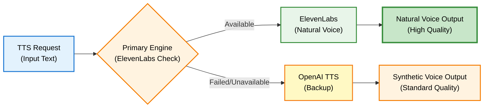

# Configuration Guide

Panduan lengkap konfigurasi DENAI untuk production dan development.

## Configuration File Structure

```
denai/
├── .env                    # Environment variables (MAIN CONFIG)
├── app/
│   └── config.py          # Python configuration
├── cache/
│   └── sop_doc_types.json # Router cache (auto-generated)
└── requirements.txt       # Dependencies
```

## Environment Variables (.env)

### Required Configuration

```ini
# ============================================
# REQUIRED - OpenAI API
# ============================================
OPENAI_API_KEY=sk-proj-...
LLM_MODEL=gpt-4o-mini
LLM_TEMPERATURE=0.1
LLM_MAX_TOKENS=2000
EMBEDDING_MODEL=text-embedding-3-small

# ============================================
# REQUIRED - Pinecone Vector Database
# ============================================
PINECONE_API_KEY=...
PINECONE_INDEX=denai-sop

# ============================================
# REQUIRED - Supabase (Session Storage)
# ============================================
SUPABASE_URL=https://...supabase.co
SUPABASE_ANON_KEY=eyJ...

# ============================================
# OPTIONAL - ElevenLabs (Premium Voice)
# ============================================
ELEVENLABS_API_KEY=...
ELEVENLABS_VOICE_ID_INDONESIAN=iWydkXKoiVtvdn4vLKp9
```

### Optional Configuration

```ini
# ============================================
# SPEECH CONFIGURATION
# ============================================
SPEECH_LANGUAGE_DEFAULT=id
TTS_PRIMARY_ENGINE=elevenlabs
TTS_FALLBACK_ENGINE=openai

# ElevenLabs Settings
ELEVENLABS_MODEL=eleven_flash_v2_5
ELEVENLABS_STABILITY=0.6
ELEVENLABS_SIMILARITY_BOOST=0.8
ELEVENLABS_STYLE=0.2
ELEVENLABS_USE_SPEAKER_BOOST=true

# OpenAI TTS Settings
OPENAI_TTS_VOICE=nova
OPENAI_TTS_SPEED=0.95

# ============================================
# TIMEOUT CONFIGURATION
# ============================================
API_TIMEOUT_DEFAULT=30
API_TIMEOUT_CALL_MODE=15
API_TIMEOUT_TTS=8

# ============================================
# FEATURE FLAGS
# ============================================
FEATURE_NATURAL_TTS=true
FEATURE_VERBOSE_LOGGING=false

# ============================================
# ENVIRONMENT
# ============================================
ENVIRONMENT=development  # or production
LOG_LEVEL=INFO  # DEBUG, INFO, WARNING, ERROR
USER_ROLE=Employee  # or HR
```

## Model Configuration

### LLM Models

**Available Models:**

| Model | Purpose | Speed | Cost |
|-------|---------|-------|------|
| gpt-4o-mini | **Recommended** | Fast | Low |
| gpt-4o | High quality | Medium | High |
| gpt-3.5-turbo | Legacy | Fastest | Lowest |

**Configuration:**
```ini
LLM_MODEL=gpt-4o-mini  # Balanced performance/cost
LLM_TEMPERATURE=0.1    # Low for consistency
LLM_MAX_TOKENS=2000    # Default response limit
```

### Embedding Models

```ini
# Recommended
EMBEDDING_MODEL=text-embedding-3-small  # 1536 dimensions

# Alternative
# EMBEDDING_MODEL=text-embedding-3-large  # 3072 dimensions (higher quality)
```

## Speech Configuration

### TTS Engine Selection



**Configuration:**
```ini
TTS_PRIMARY_ENGINE=elevenlabs    # Try ElevenLabs first
TTS_FALLBACK_ENGINE=openai       # Fallback to OpenAI
```

### Voice Quality Settings

**ElevenLabs (Natural):**
```ini
ELEVENLABS_MODEL=eleven_flash_v2_5
ELEVENLABS_STABILITY=0.6          # 0.0-1.0 (higher = more stable)
ELEVENLABS_SIMILARITY_BOOST=0.8   # 0.0-1.0 (voice similarity)
ELEVENLABS_STYLE=0.2              # 0.0-1.0 (expressiveness)
```

**OpenAI TTS (Fallback):**
```ini
OPENAI_TTS_VOICE=nova    # alloy, echo, fable, onyx, nova, shimmer
OPENAI_TTS_SPEED=0.95    # 0.25-4.0 (0.95 = slightly slower)
```

## Performance Tuning

### Timeout Configuration

```ini
# General API timeout
API_TIMEOUT_DEFAULT=30

# Voice call mode (faster)
API_TIMEOUT_CALL_MODE=15

# TTS generation
API_TIMEOUT_TTS=8
```

### Mode-Specific Settings

**Call Mode** (Voice):
- Temperature: 0.0 (deterministic)
- Max tokens: 150 (concise)
- Timeout: 15s

**Chat Mode** (Text):
- Temperature: 0.1 (slightly creative)
- Max tokens: 2000 (comprehensive)
- Timeout: 30s

## RAG Configuration

### Retrieval Settings

```python
# In app/config.py
RAG_TOP_K = 5           # Number of chunks to retrieve
RAG_STRICT_MODE = True  # Enable anti-hallucination
```

### Document Processing

```python
# In pdf ingestion
PAGES_PER_BATCH = 3     # Process 3 pages at a time
CHUNK_SIZE = 1000       # Characters per chunk
```

## Feature Flags

### Enable/Disable Features

```ini
# Natural TTS (recommended)
FEATURE_NATURAL_TTS=true

# Verbose logging (development only)
FEATURE_VERBOSE_LOGGING=false
```

## Security Configuration

### API Keys Protection

**Best Practices:**
```bash
# NEVER commit .env to git
echo ".env" >> .gitignore

# Use environment-specific files
.env.development
.env.production
.env.test

# Rotate keys regularly
# Set expiration dates
```

### Role-Based Access

```ini
# Default role for testing
USER_ROLE=Employee  # or HR

# In production, this should come from authentication system
```

## Database Configuration

### SQLite (HR Data)

```python
# Auto-configured in csv ingestion
DB_FOLDER = "db/"
BATCH_SIZE = 1000  # Rows per batch
```

### Supabase (Sessions)

```ini
SUPABASE_URL=https://xxx.supabase.co
SUPABASE_ANON_KEY=eyJ...

# Session cleanup
SESSION_CLEANUP_DAYS=30
MAX_HISTORY_LENGTH=8
```

## Environment Profiles

### Development

```ini
ENVIRONMENT=development
LOG_LEVEL=DEBUG
FEATURE_VERBOSE_LOGGING=true
USER_ROLE=HR  # Full access for testing
```

### Production

```ini
ENVIRONMENT=production
LOG_LEVEL=INFO
FEATURE_VERBOSE_LOGGING=false
# USER_ROLE determined by auth system
```

## Advanced Configuration

### Custom Prompts

Edit `engines/sop/rag_engine.py`:

```python
system_prompt = """
Your custom system prompt here...
"""
```

### Custom Tools

Edit `app/tools.py`:

```python
def custom_tool(param1, param2):
    """Your custom tool"""
    return result
```

## Monitoring Configuration

### Logging

```python
# In app/config.py
LOG_LEVEL = os.getenv("LOG_LEVEL", "INFO")

# Levels: DEBUG, INFO, WARNING, ERROR, CRITICAL
```

### Analytics

```yaml
# In mkdocs.yml (for docs)
extra:
  analytics:
    provider: google
    property: G-XXXXXXXXXX
```

## Configuration Validation

### Test Configuration

```bash
python -c "
from app.config import *
print('✅ OpenAI:', bool(OPENAI_API_KEY))
print('✅ Pinecone:', bool(PINECONE_API_KEY))
print('✅ Supabase:', bool(SUPABASE_URL))
print('✅ ElevenLabs:', bool(ELEVENLABS_API_KEY))
print('🎯 Environment:', ENVIRONMENT)
print('🎯 LLM Model:', LLM_MODEL)
"
```

### Health Check

```bash
curl http://localhost:8000/health
```

## Troubleshooting

### Configuration Not Loading

```bash
# Check .env file exists
ls -la .env

# Check file permissions
chmod 600 .env

# Verify dotenv is installed
pip install python-dotenv
```

### Invalid API Keys

```bash
# Test OpenAI
curl https://api.openai.com/v1/models \
  -H "Authorization: Bearer $OPENAI_API_KEY"

# Test Pinecone
python -c "from pinecone import Pinecone; Pinecone(api_key='YOUR_KEY').list_indexes()"
```

## Configuration Examples

### Minimal (Development)

```ini
OPENAI_API_KEY=sk-...
PINECONE_API_KEY=...
PINECONE_INDEX=denai-sop
SUPABASE_URL=https://...
SUPABASE_ANON_KEY=...
```

## Next Steps

- [Quick Start](quick-start.md) - Run DENAI
- [Developer Guide](../developer/database-setup.md) - Advanced setup
- [API Reference](../api/overview.md) - API configuration

---

**Configuration Complete!** Ready to start DENAI.