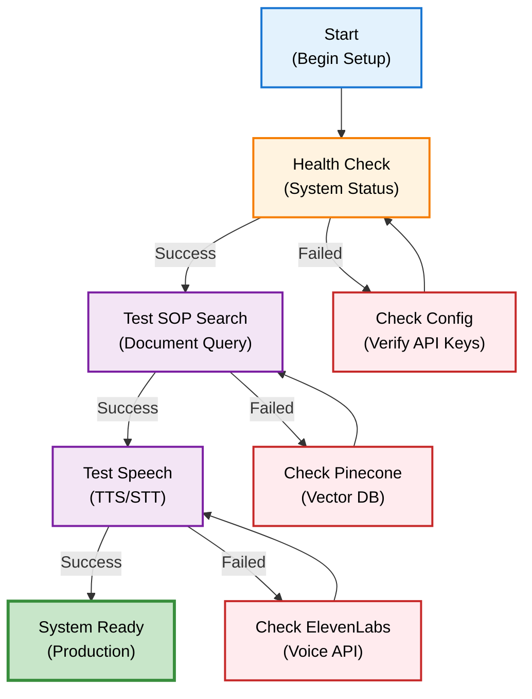
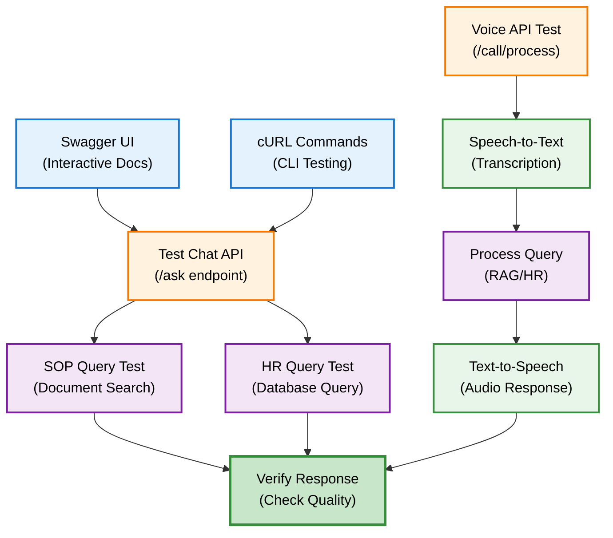
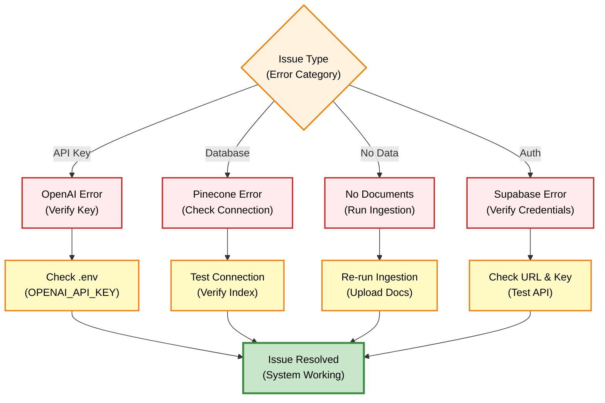

# Quick Start Guide

Panduan cepat untuk menjalankan DENAI dalam waktu kurang dari 10 menit.

## Prerequisites

Sebelum memulai, pastikan Anda memiliki:

- Python 3.11 atau lebih tinggi
- pip (Python package manager)
- Git
- API Keys yang diperlukan:
  - OpenAI API key
  - Pinecone API key
  - Supabase credentials
  - ElevenLabs API key (optional, untuk voice)

## Installation

### Step 1: Clone Repository

```bash
git clone https://github.com/your-org/denai.git
cd denai
```

### Step 2: Install Dependencies

```bash
# Buat virtual environment (recommended)
python -m venv venv

# Activate virtual environment
# Windows:
venv\Scripts\activate
# Mac/Linux:
source venv/bin/activate

# Install dependencies
pip install -r requirements.txt
```

### Step 3: Setup Environment Variables

```bash
# Copy template
cp .env.example .env

# Edit .env file
nano .env  # atau editor favorit Anda
```

**Required `.env` contents:**

```ini
# OpenAI (REQUIRED)
OPENAI_API_KEY=sk-...

# Pinecone (REQUIRED for SOP search)
PINECONE_API_KEY=...
PINECONE_INDEX=denai-sop

# Supabase (REQUIRED for sessions)
SUPABASE_URL=https://...supabase.co
SUPABASE_ANON_KEY=...

# ElevenLabs (OPTIONAL - for premium voice)
ELEVENLABS_API_KEY=...
ELEVENLABS_VOICE_ID_INDONESIAN=...

# User Role (for testing)
USER_ROLE=Employee  # or "HR"
```

### Step 4: Setup Database Structure

```bash
# Buat folder yang diperlukan
mkdir -p db documents cache

# Setup Supabase tables (run SQL in Supabase dashboard)
```

**Supabase SQL:**

```sql
-- Chat sessions table
CREATE TABLE chat_sessions (
    session_id TEXT PRIMARY KEY,
    title TEXT,
    pinned BOOLEAN DEFAULT FALSE,
    created_at TIMESTAMP DEFAULT NOW()
);

-- Chat memory table
CREATE TABLE chat_memory (
    id BIGSERIAL PRIMARY KEY,
    session_id TEXT REFERENCES chat_sessions(session_id),
    role TEXT,
    message TEXT,
    created_at TIMESTAMP DEFAULT NOW()
);

-- Indexes
CREATE INDEX idx_chat_memory_session ON chat_memory(session_id);
CREATE INDEX idx_chat_sessions_pinned ON chat_sessions(pinned DESC, created_at DESC);
```

## Running the Server

### Development Mode

```bash
# Run dengan auto-reload
uvicorn app.api:app --reload --host 0.0.0.0 --port 8000
```

Server akan berjalan di: `http://localhost:8000`

### Production Mode

```bash
# Run dengan Gunicorn (recommended untuk production)
gunicorn app.api:app -w 4 -k uvicorn.workers.UvicornWorker -b 0.0.0.0:8000
```

## Verification Flow



## First Steps

### 1. Check System Status

```bash
curl http://localhost:8000/health
```

**Expected Response:**

```json
{
  "status": "healthy",
  "version": "6.2.0",
  "config_status": {
    "openai_configured": true,
    "elevenlabs_configured": true,
    "model": "gpt-4o-mini"
  }
}
```

### 2. Test SOP Search

```bash
curl -X POST http://localhost:8000/ask \
  -H "Content-Type: application/json" \
  -d '{
    "question": "Bagaimana prosedur lembur?",
    "session_id": "test_session",
    "user_role": "Employee"
  }'
```

### 3. Test Speech Features

```bash
# Text-to-Speech
curl -X POST "http://localhost:8000/speech/text-to-speech?text=Halo,%20ini%20adalah%20test" \
  --output test.mp3

# Play audio
# Mac: afplay test.mp3
# Linux: mpg123 test.mp3
# Windows: start test.mp3
```

## Data Setup

### Document Ingestion Pipeline

```mermaid
graph LR
    PDF["PDF Files<br/>(Source Documents)"] --> Parse["Parse PDF<br/>(Extract Text)"]
    Parse --> Chunk["Chunk Text<br/>(Split Content)"]
    Chunk --> Embed["Generate Embeddings<br/>(OpenAI)"]
    Embed --> Upload["Upload Vectors<br/>(Pinecone)"]
    Upload --> Done["Ready for Search<br/>(Indexed)"]
    
    style PDF fill:#e3f2fd,stroke:#1976d2,stroke-width:2px,color:#000
    style Parse fill:#fff3e0,stroke:#f57c00,stroke-width:2px,color:#000
    style Chunk fill:#f3e5f5,stroke:#7b1fa2,stroke-width:2px,color:#000
    style Embed fill:#e8f5e9,stroke:#388e3c,stroke-width:2px,color:#000
    style Upload fill:#fff9c4,stroke:#f57f17,stroke-width:2px,color:#000
    style Done fill:#c8e6c9,stroke:#388e3c,stroke-width:3px,color:#000
```



### Ingest SOP Documents

```bash
# 1. Letakkan PDF di folder documents/
cp /path/to/sop/*.pdf documents/

# 2. Run ingestion
python ingest_docs.py
```

**Progress Output:**

```
🚀 CLEAN OPTIMIZED HYBRID PDF INGESTION
📋 FILE: SKD_Kerja_Lembur.pdf
   📄 Pages: 12
   🔄 Processing pages 1-3
      📊 Table found on page 2
      ✅ Batch uploaded: 15 chunks
🎉 COMPLETE!
```

### HR Data Ingestion Flow

```mermaid
graph LR
    CSV["CSV File<br/>(Employee Data)"] --> Validate["Validate Schema<br/>(Check Columns)"]
    Validate --> Process["Process Rows<br/>(Clean Data)"]
    Process --> Store["Store in SQLite<br/>(Database)"]
    Store --> Index["Index Schema<br/>(Cache)"]
    Index --> Ready["Ready for Queries<br/>(Available)"]
    
    style CSV fill:#e3f2fd,stroke:#1976d2,stroke-width:2px,color:#000
    style Validate fill:#fff3e0,stroke:#f57c00,stroke-width:2px,color:#000
    style Process fill:#f3e5f5,stroke:#7b1fa2,stroke-width:2px,color:#000
    style Store fill:#fce4ec,stroke:#c2185b,stroke-width:2px,color:#000
    style Index fill:#fff9c4,stroke:#f57f17,stroke-width:2px,color:#000
    style Ready fill:#c8e6c9,stroke:#388e3c,stroke-width:3px,color:#000
```



### Ingest HR Data

```bash
# 1. Prepare CSV file
# employees.csv with columns: name, company, status, education, band, etc.

# 2. Auto-ingest
python batch_csv_processor_final.py employees.csv

# Or batch process folder
python batch_csv_processor_final.py --batch csv/
```

**Output:**

```
📊 Processed: 1234/1234 rows
💾 Database: db/employees.db
📋 Table: employees
✅ Ready for HR queries!
```

## Testing the System

### API Testing Flow



### Test Chat Interface

Open browser: `http://localhost:8000/docs`

Interactive API documentation (Swagger UI) akan terbuka.

### Test dengan cURL

```bash
# Basic chat
curl -X POST http://localhost:8000/ask \
  -H "Content-Type: application/json" \
  -d '{
    "question": "Berapa jam maksimal lembur per hari?",
    "session_id": "quick_test"
  }'

# HR query (requires HR role)
curl -X POST http://localhost:8000/ask \
  -H "Content-Type: application/json" \
  -d '{
    "question": "Berapa total karyawan?",
    "session_id": "hr_test",
    "user_role": "HR"
  }'
```

### Test Voice Call

```bash
# Prepare audio file (WAV format)
curl -X POST http://localhost:8000/call/process \
  -F "audio_file=@test_audio.wav" \
  -F "session_id=voice_test" \
  --output response_audio.mp3
```

## Troubleshooting

### Common Issues & Solutions



### Issue 1: OpenAI API Error

**Error Message:**

```
Error: Incorrect API key provided
```

**Solution:**

```bash
# Verify API key
echo $OPENAI_API_KEY  # Should show your key

# Or check .env file
cat .env | grep OPENAI_API_KEY
```

### Issue 2: Pinecone Connection Failed

**Error Message:**

```
Error: Failed to connect to Pinecone
```

**Solution:**

```bash
# Test Pinecone connection
python -c "
from pinecone import Pinecone
pc = Pinecone(api_key='YOUR_KEY')
print(pc.list_indexes())
"
```

### Issue 3: No SOP Documents Found

**Error Message:**

```
Response: "Tidak ada informasi yang relevan"
```

**Solution:**

```bash
# Check if documents ingested
python -c "
from pinecone import Pinecone
pc = Pinecone(api_key='YOUR_KEY')
index = pc.Index('denai-sop')
stats = index.describe_index_stats()
print(f'Total vectors: {stats.total_vector_count}')
"

# If 0, re-run ingestion
python ingest_docs.py
```

### Issue 4: Supabase Connection Error

**Error Message:**

```
Error: Invalid Supabase credentials
```

**Solution:**

```bash
# Verify credentials
curl https://YOUR_PROJECT.supabase.co/rest/v1/ \
  -H "apikey: YOUR_ANON_KEY" \
  -H "Authorization: Bearer YOUR_ANON_KEY"

# Should return 200 OK
```

## System Verification Checklist

| Component | Check | Status |
|-----------|-------|--------|
| **API Server** | Health endpoint responds | ✅ |
| **OpenAI** | API key valid and working | ✅ |
| **Pinecone** | Index accessible and populated | ✅ |
| **Supabase** | Tables created and accessible | ✅ |
| **SOP Search** | Returns relevant results | ✅ |
| **HR Queries** | Database queries execute | ✅ |
| **Voice (TTS)** | Audio generation works | ✅ |
| **Voice (STT)** | Audio transcription works | ✅ |

## Next Steps

Setelah sistem berjalan, Anda bisa:

**Learn More:**
- [Explore Features](../features/sop-search.md) - Pelajari fitur-fitur lengkap
- [Understand Architecture](../architecture/overview.md) - Pahami cara kerja sistem
- [API Integration](../api/overview.md) - Integrasikan dengan aplikasi Anda

**Advanced Setup:**
- [Developer Guide](../developer/database-setup.md) - Setup advanced features
- [Docker Deployment](../developer/docker-deployment.md) - Container deployment
- [Vercel Deployment](../developer/vercel-deployment.md) - Serverless deployment
- [Security Guidelines](../developer/authentication.md) - Production security

## Getting Help

Jika mengalami masalah:

1. Check [Troubleshooting Guide](../troubleshooting.md)
2. Review [FAQ](../faq.md)
3. Contact IT Support: `it-support@company.com`

---

**Congratulations! 🎉** DENAI sudah siap digunakan.

Start chatting: `http://localhost:8000/docs`